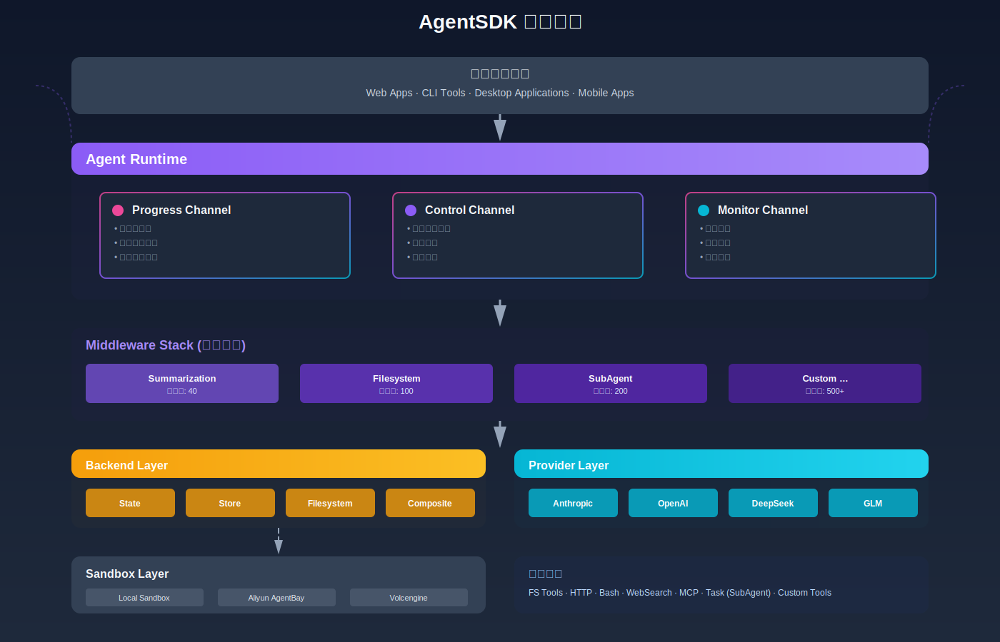
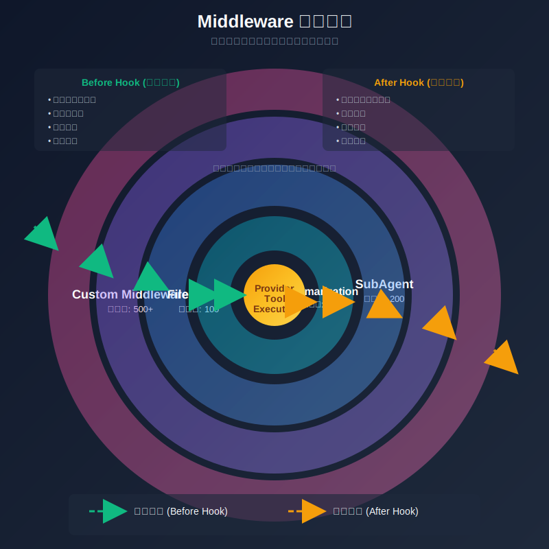

# AgentSDK · Go语言AI Agent开发框架

> **企业级AI Agent运行时**: 事件驱动、云端沙箱、安全可控 —— 为生产环境设计的Go Agent SDK

## 架构设计



### Middleware 洋葱模型



AgentSDK 采用洋葱模型的 Middleware 架构，每个请求和响应都会依次通过多层中间件。优先级数值越大的中间件位于越外层，越早处理请求，越晚处理响应。这种设计使得功能可以清晰地分层，便于扩展和维护。

## 特性

- **🎯 事件驱动架构**: Progress/Control/Monitor 三通道设计,清晰分离数据流、审批流、治理流
- **🔒 云端沙箱集成**: 原生支持阿里云AgentBay、火山引擎等云平台安全沙箱
- **⚡ 高性能并发**: 基于Go goroutine的并发模型,支持100+并发Agent
- **🔄 断点恢复**: 7段断点机制,会话中断后可无缝恢复
- **🛠️ 丰富工具生态**: 内置文件系统、Bash、Todo、HTTP请求、Web搜索,支持MCP协议扩展
- **👥 多Agent协作**: AgentPool和Room机制实现Agent间消息路由与协作
- **📊 可观测性**: 完整的事件审计、Token统计、工具执行追踪
- **🧩 Middleware系统**: 洋葱模型架构,支持自动上下文总结、工具拦截、自定义中间件
- **⚙️ Slash Commands**: 通用命令架构,支持自定义命令和技能注入
- **🌐 多Provider支持**: Anthropic、OpenAI、DeepSeek、GLM等多种大模型提供商

## 快速开始

### 安装

```bash
go get github.com/wordflowlab/agentsdk
```

### 基础示例

```go
package main

import (
    "context"
    "fmt"
    "log"
    "os"

    "github.com/wordflowlab/agentsdk/pkg/agent"
    "github.com/wordflowlab/agentsdk/pkg/provider"
    "github.com/wordflowlab/agentsdk/pkg/sandbox"
    "github.com/wordflowlab/agentsdk/pkg/store"
    "github.com/wordflowlab/agentsdk/pkg/tools"
    "github.com/wordflowlab/agentsdk/pkg/tools/builtin"
    "github.com/wordflowlab/agentsdk/pkg/types"
)

func main() {
    // 1. 创建工具注册表并注册内置工具
    toolRegistry := tools.NewRegistry()
    builtin.RegisterAll(toolRegistry)

    // 2. 创建依赖
    jsonStore, _ := store.NewJSONStore("./.agentsdk")
    deps := &agent.Dependencies{
        Store:            jsonStore,
        SandboxFactory:   sandbox.NewFactory(),
        ToolRegistry:     toolRegistry,
        ProviderFactory:  &provider.AnthropicFactory{},
        TemplateRegistry: agent.NewTemplateRegistry(),
    }

    // 3. 注册模板
    deps.TemplateRegistry.Register(&types.AgentTemplateDefinition{
        ID:           "assistant",
        SystemPrompt: "You are a helpful assistant with file and bash access.",
        Model:        "claude-sonnet-4-5",
        Tools:        []interface{}{"fs_read", "fs_write", "bash_run"},
    })

    // 4. 创建Agent
    ag, err := agent.Create(context.Background(), &types.AgentConfig{
        TemplateID: "assistant",
        ModelConfig: &types.ModelConfig{
            Provider: "anthropic",
            Model:    "claude-sonnet-4-5",
            APIKey:   os.Getenv("ANTHROPIC_API_KEY"),
        },
        Sandbox: &types.SandboxConfig{
            Kind:    types.SandboxKindLocal,
            WorkDir: "./workspace",
        },
    }, deps)
    if err != nil {
        log.Fatal(err)
    }
    defer ag.Close()

    // 5. 订阅事件
    eventCh := ag.Subscribe([]types.AgentChannel{types.ChannelProgress}, nil)
    go func() {
        for envelope := range eventCh {
            if evt, ok := envelope.Event.(types.EventType); ok {
                switch e := evt.(type) {
                case *types.ProgressTextChunkEvent:
                    fmt.Print(e.Delta) // 实时输出AI回复
                case *types.ProgressToolStartEvent:
                    fmt.Printf("\n[Tool] %s\n", e.Call.Name)
                }
            }
        }
    }()

    // 6. 同步对话
    result, err := ag.Chat(context.Background(), "请创建一个 hello.txt 文件,内容是 'Hello World'")
    if err != nil {
        log.Fatal(err)
    }
    fmt.Printf("\n\nFinal Result: %s\n", result.Text)
}
```

完整示例见 [examples/agent](./examples/agent)

### MCP 工具集成

```go
import "github.com/wordflowlab/agentsdk/pkg/tools/mcp"

// 1. 创建 MCP Manager
toolRegistry := tools.NewRegistry()
mcpManager := mcp.NewMCPManager(toolRegistry)

// 2. 添加 MCP Server
server, _ := mcpManager.AddServer(&mcp.MCPServerConfig{
    ServerID:        "my-mcp-server",
    Endpoint:        "http://localhost:8080/mcp",
    AccessKeyID:     os.Getenv("MCP_ACCESS_KEY"),
    AccessKeySecret: os.Getenv("MCP_SECRET_KEY"),
})

// 3. 连接并自动注册工具
ctx := context.Background()
mcpManager.ConnectServer(ctx, "my-mcp-server")

// 4. Agent 现在可以使用 MCP 工具了!
// 工具名称格式: {server_id}:{tool_name}
```

完整示例见 [examples/mcp](./examples/mcp)

### Middleware 系统

```go
import "github.com/wordflowlab/agentsdk/pkg/types"

// 启用 Summarization Middleware - 自动总结长对话
ag, err := agent.Create(context.Background(), &types.AgentConfig{
    TemplateID: "assistant",
    ModelConfig: &types.ModelConfig{
        Provider: "anthropic",
        Model:    "claude-sonnet-4-5",
        APIKey:   os.Getenv("ANTHROPIC_API_KEY"),
    },
    // 启用中间件
    Middlewares: []string{"summarization"},  // 当上下文超过 170k tokens 时自动总结
}, deps)

// 中间件会自动:
// 1. 监控消息历史的 token 数
// 2. 超过阈值时自动总结旧消息
// 3. 保留最近 6 条消息 + 总结
// 4. 拦截模型调用和工具执行 (洋葱模型)
```

详细文档见 [ARCHITECTURE.md](./ARCHITECTURE.md) 和 [docs/PHASE6C_MIDDLEWARE_INTEGRATION.md](./docs/PHASE6C_MIDDLEWARE_INTEGRATION.md)

## 核心概念

### 事件通道

| 通道 | 用途 | 典型订阅者 |
|------|------|-----------|
| **Progress** | 实时文本流、工具执行进度 | 前端UI、聊天界面 |
| **Control** | 工具审批请求、人机交互 | 审批服务、安全网关 |
| **Monitor** | 治理事件、错误、审计日志 | 监控系统、日志平台 |

### 沙箱类型

- **LocalSandbox**: 本地进程/Docker,适合开发测试
- **AliyunSandbox**: 阿里云AgentBay Computer Use,生产环境
- **VolcengineSandbox**: 火山引擎云沙箱,生产环境
- **MockSandbox**: 测试用模拟沙箱

### 安全机制

- **权限策略**: 工具级别的allow/deny/ask配置
- **Hook系统**: preToolUse/postToolUse生命周期拦截
- **沙箱隔离**: 所有代码执行在受限环境
- **审计日志**: 完整的工具调用记录和状态追踪

## 项目状态

🚧 **Alpha阶段** - 核心功能已完成

### Phase 1 - 基础架构 ✅
- [x] 项目架构设计
- [x] 核心类型定义 (Message, Event, Config)
- [x] 事件驱动系统 (EventBus 三通道)
- [x] 沙箱抽象层 (Local/Mock)
- [x] 存储抽象层 (JSONStore)

### Phase 2 - Agent 运行时 ✅
- [x] Agent 核心结构 (Create/Send/Chat/Subscribe)
- [x] 消息处理管道 (processMessages/runModelStep)
- [x] 工具系统 (Registry/Executor)
- [x] 内置工具 (fs_read/fs_write/bash_run)
- [x] Anthropic Provider 集成
- [x] 流式 API 处理
- [x] 单元测试
- [x] 完整示例

### Phase 3 - 云平台集成 ✅
- [x] 远程 Sandbox 基础架构
- [x] MCP 协议客户端
- [x] 阿里云 AgentBay Sandbox
- [x] 火山引擎 Sandbox
- [x] 云平台示例代码
- [ ] Docker Sandbox
- [ ] Kubernetes Sandbox

### Phase 4 - 多 Agent 协作 ✅
- [x] Pool - Agent 池管理
- [x] Room - 多 Agent 协作空间
- [x] Scheduler - 任务调度器
- [x] Permission - 权限管理系统

### Phase 5 - MCP 支持 ✅
- [x] MCP 协议实现
- [x] MCP Server 集成
- [x] MCP Tool 封装
- [x] MCP Manager (多 Server 管理)
- [x] MCP 工具适配器
- [x] 完整示例和文档

### Phase 6 - 高级功能 ✅

- [x] **Phase 6A**: Slash Commands 支持 (通用 Commands 架构)
- [x] **Phase 6B**: Skills 注入系统 (LLM Provider 能力查询)
- [x] **Phase 6B-1**: 网络工具 (HTTP 请求 + Web 搜索)
- [x] **Phase 6C**: Middleware 集成 (洋葱模型 + Summarization)
- [x] 多 Provider 支持 (Anthropic/OpenAI/DeepSeek/GLM)
- [x] 中间件注册表和栈管理
- [x] 自动上下文总结 (>170k tokens)
- [ ] Prompt Caching 优化

**当前代码量**: ~12,000+ LOC
**测试覆盖**: Agent 核心功能 + 云平台集成 + 多 Agent 协作 + MCP 集成 + Middleware 系统
**可运行状态**: ✅ 可在本地/阿里云/火山引擎运行 Agent,支持多 Agent 协作、任务调度、权限控制、MCP 工具集成、Slash Commands、Skills 注入和中间件系统

## License

MIT License - 详见 [LICENSE](LICENSE) 文件
