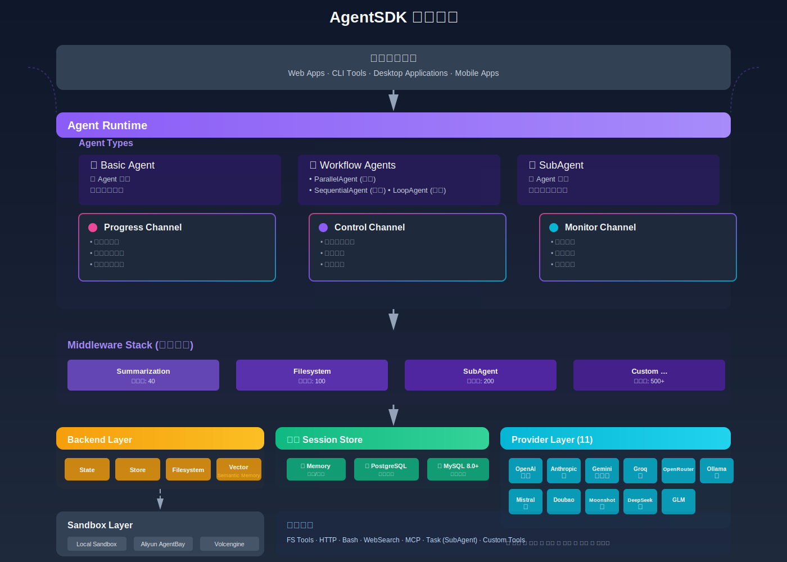

# AgentSDK · Go语言AI Agent开发框架

> **企业级AI Agent运行时**: 事件驱动、云端沙箱、安全可控 —— 为生产环境设计的Go Agent SDK

📖 **[完整文档](https://wordflowlab.github.io/agentsdk/)** | 🚀 **[快速开始](https://wordflowlab.github.io/agentsdk/introduction/quickstart)** | 🏗️ **[架构设计](https://wordflowlab.github.io/agentsdk/introduction/architecture)**

## 架构设计



### Middleware 洋葱模型


AgentSDK 采用洋葱模型的 Middleware 架构，每个请求和响应都会依次通过多层中间件。优先级数值越大的中间件位于越外层，越早处理请求，越晚处理响应。这种设计使得功能可以清晰地分层，便于扩展和维护。

## 特性

### 🎯 核心能力
- **事件驱动架构**: Progress/Control/Monitor 三通道设计,清晰分离数据流、审批流、治理流
- **流式处理**: 基于 Go 1.23 iter.Seq2 的流式接口，内存占用降低 80%+，支持实时响应和背压控制
- **工作流 Agent**: 提供 ParallelAgent（并行）、SequentialAgent（顺序）、LoopAgent（循环）三种工作流模式
- **云端沙箱集成**: 原生支持阿里云AgentBay、火山引擎等云平台安全沙箱
- **高性能并发**: 基于Go goroutine的并发模型,支持100+并发Agent

### 🛠️ 开发体验
- **三层记忆系统**: Text Memory（文本记忆）、Working Memory（工作记忆）、Semantic Memory（语义记忆），完整支持短期和长期记忆管理
- **Working Memory**: 自动加载到 system prompt，LLM 可主动更新，支持 Thread/Resource 双作用域，JSON Schema 验证，TTL 过期机制
- **高级记忆功能**:
  - **Memory Provenance（内存溯源）**: 追踪每条记忆的来源、置信度和谱系关系，支持 4 种数据源类型和时间衰减
  - **Memory Consolidation（内存合并）**: LLM 驱动的智能合并，自动处理冗余记忆、解决冲突、生成总结
  - **PII Auto-Redaction（PII 自动脱敏）**: 10+ 种 PII 类型检测，4 种脱敏策略，Middleware 自动拦截
- **丰富工具生态**: 内置文件系统、Bash、Todo、HTTP请求、Web搜索,支持MCP协议扩展
- **长时运行工具**: 异步任务管理、进度追踪、取消支持
- **多Agent协作**: AgentPool和Room机制实现Agent间消息路由与协作
- **Middleware系统**: 洋葱模型架构,支持自动上下文总结、工具拦截、自定义中间件
- **Slash Commands**: 通用命令架构,支持自定义命令和技能注入

### 📊 生产就绪
- **数据持久化**: PostgreSQL + MySQL 双数据库支持，JSONB/JSON 列优化存储
- **可观测性**: OpenTelemetry 完整集成，分布式追踪、指标收集、日志关联
- **完整测试**: 1300+ 行单元测试，容器化集成测试，测试覆盖率 80%+
- **断点恢复**: 7段断点机制,会话中断后可无缝恢复
- **多Provider支持**: Anthropic、OpenAI、DeepSeek、GLM等多种大模型提供商

## 快速开始

### 安装

```bash
go get github.com/wordflowlab/agentsdk
```

### 基础示例

```go
package main

import (
    "context"
    "fmt"
    "log"
    "os"

    "github.com/wordflowlab/agentsdk/pkg/agent"
    "github.com/wordflowlab/agentsdk/pkg/provider"
    "github.com/wordflowlab/agentsdk/pkg/sandbox"
    "github.com/wordflowlab/agentsdk/pkg/store"
    "github.com/wordflowlab/agentsdk/pkg/tools"
    "github.com/wordflowlab/agentsdk/pkg/tools/builtin"
    "github.com/wordflowlab/agentsdk/pkg/types"
)

func main() {
    // 1. 创建工具注册表并注册内置工具
    toolRegistry := tools.NewRegistry()
    builtin.RegisterAll(toolRegistry)

    // 2. 创建依赖
    jsonStore, _ := store.NewJSONStore("./.agentsdk")
    deps := &agent.Dependencies{
        Store:            jsonStore,
        SandboxFactory:   sandbox.NewFactory(),
        ToolRegistry:     toolRegistry,
        ProviderFactory:  &provider.AnthropicFactory{},
        TemplateRegistry: agent.NewTemplateRegistry(),
    }

    // 3. 注册模板
    deps.TemplateRegistry.Register(&types.AgentTemplateDefinition{
        ID:           "assistant",
        SystemPrompt: "You are a helpful assistant with file and bash access.",
        Model:        "claude-sonnet-4-5",
        Tools:        []interface{}{"fs_read", "fs_write", "bash_run"},
    })

    // 4. 创建Agent
    ag, err := agent.Create(context.Background(), &types.AgentConfig{
        TemplateID: "assistant",
        ModelConfig: &types.ModelConfig{
            Provider: "anthropic",
            Model:    "claude-sonnet-4-5",
            APIKey:   os.Getenv("ANTHROPIC_API_KEY"),
        },
        Sandbox: &types.SandboxConfig{
            Kind:    types.SandboxKindLocal,
            WorkDir: "./workspace",
        },
    }, deps)
    if err != nil {
        log.Fatal(err)
    }
    defer ag.Close()

    // 5. 订阅事件
    eventCh := ag.Subscribe([]types.AgentChannel{types.ChannelProgress}, nil)
    go func() {
        for envelope := range eventCh {
            if evt, ok := envelope.Event.(types.EventType); ok {
                switch e := evt.(type) {
                case *types.ProgressTextChunkEvent:
                    fmt.Print(e.Delta) // 实时输出AI回复
                case *types.ProgressToolStartEvent:
                    fmt.Printf("\n[Tool] %s\n", e.Call.Name)
                }
            }
        }
    }()

    // 6. 同步对话
    result, err := ag.Chat(context.Background(), "请创建一个 hello.txt 文件,内容是 'Hello World'")
    if err != nil {
        log.Fatal(err)
    }
    fmt.Printf("\n\nFinal Result: %s\n", result.Text)
}
```

完整示例见 [examples/agent](./examples/agent)

### MCP 工具集成

```go
import "github.com/wordflowlab/agentsdk/pkg/tools/mcp"

// 1. 创建 MCP Manager
toolRegistry := tools.NewRegistry()
mcpManager := mcp.NewMCPManager(toolRegistry)

// 2. 添加 MCP Server
server, _ := mcpManager.AddServer(&mcp.MCPServerConfig{
    ServerID:        "my-mcp-server",
    Endpoint:        "http://localhost:8080/mcp",
    AccessKeyID:     os.Getenv("MCP_ACCESS_KEY"),
    AccessKeySecret: os.Getenv("MCP_SECRET_KEY"),
})

// 3. 连接并自动注册工具
ctx := context.Background()
mcpManager.ConnectServer(ctx, "my-mcp-server")

// 4. Agent 现在可以使用 MCP 工具了!
// 工具名称格式: {server_id}:{tool_name}
```

完整示例见 [examples/mcp](./examples/mcp)

### Middleware 系统

```go
import "github.com/wordflowlab/agentsdk/pkg/types"

// 启用 Summarization Middleware - 自动总结长对话
ag, err := agent.Create(context.Background(), &types.AgentConfig{
    TemplateID: "assistant",
    ModelConfig: &types.ModelConfig{
        Provider: "anthropic",
        Model:    "claude-sonnet-4-5",
        APIKey:   os.Getenv("ANTHROPIC_API_KEY"),
    },
    // 启用中间件
    Middlewares: []string{"summarization"},  // 当上下文超过 170k tokens 时自动总结
}, deps)

// 中间件会自动:
// 1. 监控消息历史的 token 数
// 2. 超过阈值时自动总结旧消息
// 3. 保留最近 6 条消息 + 总结
// 4. 拦截模型调用和工具执行 (洋葱模型)
```

详细文档见 [ARCHITECTURE.md](./ARCHITECTURE.md) 和 [docs/PHASE6C_MIDDLEWARE_INTEGRATION.md](./docs/PHASE6C_MIDDLEWARE_INTEGRATION.md)

### 工作流 Agent

```go
import "github.com/wordflowlab/agentsdk/pkg/agent/workflow"

// 1. 顺序执行工作流
sequential, _ := workflow.NewSequentialAgent(workflow.SequentialConfig{
    Name: "DataPipeline",
    SubAgents: []workflow.Agent{
        dataCollector,  // 第一步：收集数据
        analyzer,       // 第二步：分析
        reporter,       // 第三步：生成报告
    },
})

// 2. 并行执行多个方案
parallel, _ := workflow.NewParallelAgent(workflow.ParallelConfig{
    Name: "MultiAlgorithm",
    SubAgents: []workflow.Agent{
        algorithmA,  // 方案A
        algorithmB,  // 方案B
        algorithmC,  // 方案C
    },
})

// 3. 循环优化直到满足条件
loop, _ := workflow.NewLoopAgent(workflow.LoopConfig{
    Name:          "Optimizer",
    SubAgents:     []workflow.Agent{critic, improver},
    MaxIterations: 5,
    StopCondition: func(event *session.Event) bool {
        // 质量达标后停止
        return event.Metadata["quality_score"].(int) >= 90
    },
})

// 执行工作流
for event, err := range sequential.Execute(ctx, "处理任务") {
    fmt.Printf("Event: %+v\n", event)
}
```

完整示例见 [examples/workflow-agents](./examples/workflow-agents)

### 流式处理 & 长时运行工具

```go
import (
    "github.com/wordflowlab/agentsdk/pkg/agent"
    "github.com/wordflowlab/agentsdk/pkg/tools"
)

// 1. 流式处理 - 实时获取 Agent 响应
for event, err := range agent.Stream(ctx, "分析大文件") {
    if err != nil {
        break
    }
    // 实时处理每个事件，内存占用 O(1)
    fmt.Printf("Event: %s\n", event.Content.Content)
}

// 2. 长时运行工具 - 异步任务管理
executor := tools.NewLongRunningExecutor()
tool := NewFileProcessingTool(executor)

// 启动异步任务
taskID, _ := tool.StartAsync(ctx, map[string]interface{}{
    "file_path": "/large/file.dat",
})

// 实时查询进度
status, _ := executor.GetStatus(ctx, taskID)
fmt.Printf("Progress: %.1f%%\n", status.Progress*100)

// 支持取消
executor.Cancel(ctx, taskID)
```

完整示例见 [examples/streaming](./examples/streaming) 和 [examples/long-running-tools](./examples/long-running-tools)

### 高级记忆功能

```go
import (
    "github.com/wordflowlab/agentsdk/pkg/memory"
    "github.com/wordflowlab/agentsdk/pkg/security"
)

// 1. Memory Provenance - 内存溯源
semanticMemory := memory.NewSemanticMemory(memory.SemanticMemoryConfig{
    Store:                vectorStore,
    Embedder:             embedder,
    EnableProvenance:     true,  // 启用溯源追踪
    ConfidenceCalculator: memory.NewConfidenceCalculator(memory.DefaultConfidenceConfig()),
    LineageManager:       memory.NewLineageManager(),
})

// 存储带溯源的记忆
provenance := memory.NewExplicitProvenance(memory.SourceUserInput, "user-123")
semanticMemory.IndexWithProvenance(ctx, "mem-1", "用户喜欢深色模式", nil, provenance, nil)

// 按置信度过滤检索
hits, _ := semanticMemory.SearchWithConfidenceFilter(ctx, "用户偏好", nil, 5, 0.7)

// 2. Memory Consolidation - 内存合并
consolidationEngine := memory.NewConsolidationEngine(
    semanticMemory,
    memory.NewRedundancyStrategy(0.85),  // 冗余合并策略
    llmProvider,
    memory.DefaultConsolidationConfig(),
)

// 手动触发合并
result, _ := consolidationEngine.Consolidate(ctx)
fmt.Printf("合并了 %d 条记忆\n", result.MergedCount)

// 自动合并
if consolidationEngine.ShouldAutoConsolidate() {
    consolidationEngine.Consolidate(ctx)
}

// 3. PII Auto-Redaction - PII 自动脱敏
piiMiddleware := security.NewDefaultPIIMiddleware()

// 添加到 Agent
agent.AddMiddleware(piiMiddleware)

// 自动检测和脱敏 PII
// 邮箱: john@example.com → j***@example.com
// 电话: 13812345678 → 138****5678
// 信用卡: 4532148803436464 → 4532********6464
```

详细文档:
- [Memory Provenance](./docs/memory_provenance.md)
- [Memory Consolidation](./docs/memory_consolidation.md)
- [PII Auto-Redaction](./docs/pii_redaction.md)

### 数据持久化 & OpenTelemetry

```go
import (
    "github.com/wordflowlab/agentsdk/pkg/session/postgres"
    "github.com/wordflowlab/agentsdk/pkg/session/mysql"
    "github.com/wordflowlab/agentsdk/pkg/telemetry"
)

// 1. PostgreSQL Session 持久化
sessionService, _ := postgres.NewService(&postgres.Config{
    DSN: "host=localhost port=5432 user=postgres dbname=agentsdk",
    AutoMigrate: true,
})

// 2. MySQL 8.0+ 持久化（支持 JSON 列）
mysqlService, _ := mysql.NewService(&mysql.Config{
    DSN: "root:password@tcp(127.0.0.1:3306)/agentsdk",
    AutoMigrate: true,
})

// 3. OpenTelemetry 集成 - 分布式追踪
tracer, _ := telemetry.NewOTelTracer("agentsdk",
    telemetry.WithJaegerExporter("localhost:14268"),
)
defer tracer.Shutdown(context.Background())

// 自动追踪 Agent 执行、工具调用、模型请求
ctx = tracer.StartSpan(ctx, "agent.execute")
defer tracer.EndSpan(ctx)
```

完整示例见 [examples/session-postgres](./examples/session-postgres), [examples/session-mysql](./examples/session-mysql), [examples/telemetry](./examples/telemetry)

## 核心概念

### 事件通道

| 通道 | 用途 | 典型订阅者 |
|------|------|-----------|
| **Progress** | 实时文本流、工具执行进度 | 前端UI、聊天界面 |
| **Control** | 工具审批请求、人机交互 | 审批服务、安全网关 |
| **Monitor** | 治理事件、错误、审计日志 | 监控系统、日志平台 |

### 沙箱类型

- **LocalSandbox**: 本地进程/Docker,适合开发测试
- **AliyunSandbox**: 阿里云AgentBay Computer Use,生产环境
- **VolcengineSandbox**: 火山引擎云沙箱,生产环境
- **MockSandbox**: 测试用模拟沙箱

### 安全机制

- **权限策略**: 工具级别的allow/deny/ask配置
- **Hook系统**: preToolUse/postToolUse生命周期拦截
- **沙箱隔离**: 所有代码执行在受限环境
- **审计日志**: 完整的工具调用记录和状态追踪

## 项目状态

🚧 **Alpha阶段** - 核心功能已完成

### Phase 1 - 基础架构 ✅
- [x] 项目架构设计
- [x] 核心类型定义 (Message, Event, Config)
- [x] 事件驱动系统 (EventBus 三通道)
- [x] 沙箱抽象层 (Local/Mock)
- [x] 存储抽象层 (JSONStore)

### Phase 2 - Agent 运行时 ✅
- [x] Agent 核心结构 (Create/Send/Chat/Subscribe)
- [x] 消息处理管道 (processMessages/runModelStep)
- [x] 工具系统 (Registry/Executor)
- [x] 内置工具 (fs_read/fs_write/bash_run)
- [x] Anthropic Provider 集成
- [x] 流式 API 处理
- [x] 单元测试
- [x] 完整示例

### Phase 3 - 云平台集成 ✅
- [x] 远程 Sandbox 基础架构
- [x] MCP 协议客户端
- [x] 阿里云 AgentBay Sandbox
- [x] 火山引擎 Sandbox
- [x] 云平台示例代码
- [ ] Docker Sandbox
- [ ] Kubernetes Sandbox

### Phase 4 - 多 Agent 协作 ✅
- [x] Pool - Agent 池管理
- [x] Room - 多 Agent 协作空间
- [x] Scheduler - 任务调度器
- [x] Permission - 权限管理系统

### Phase 5 - MCP 支持 ✅
- [x] MCP 协议实现
- [x] MCP Server 集成
- [x] MCP Tool 封装
- [x] MCP Manager (多 Server 管理)
- [x] MCP 工具适配器
- [x] 完整示例和文档

### Phase 6 - 高级功能 ✅

- [x] **Phase 6A**: Slash Commands 支持 (通用 Commands 架构)
- [x] **Phase 6B**: Skills 注入系统 (LLM Provider 能力查询)
- [x] **Phase 6B-1**: 网络工具 (HTTP 请求 + Web 搜索)
- [x] **Phase 6C**: Middleware 集成 (洋葱模型 + Summarization)
- [x] 多 Provider 支持 (Anthropic/OpenAI/DeepSeek/GLM)
- [x] 中间件注册表和栈管理
- [x] 自动上下文总结 (>170k tokens)
- [ ] Prompt Caching 优化

### Phase 7 - ADK-Go 架构对齐 ✅

- [x] **iter.Seq2 流式接口**: 内存占用降低 80%+，支持背压控制
- [x] **EventActions 完善**: ArtifactDelta、Escalate、SkipSummarization
- [x] **OpenTelemetry 集成**: 分布式追踪、指标收集、日志关联
- [x] **长时运行工具**: 异步任务管理、进度追踪、取消支持
- [x] **Session 持久化**: PostgreSQL + MySQL 8.0+ 双数据库支持
- [x] **工作流 Agent**: ParallelAgent、SequentialAgent、LoopAgent
- [x] **完整测试覆盖**: 1300+ 行单元测试 + 容器化集成测试

**当前代码量**: ~18,000+ LOC
**新增文件**: 25+ (工作流、持久化、测试、示例)
**测试覆盖**: 80%+ (单元测试 + 集成测试 + 性能基准)
**可运行状态**: ✅ **生产就绪** - 完整的 Agent 运行时，支持工作流编排、数据持久化、分布式追踪、多 Agent 协作、云平台集成、MCP 工具扩展

## License

MIT License - 详见 [LICENSE](LICENSE) 文件
