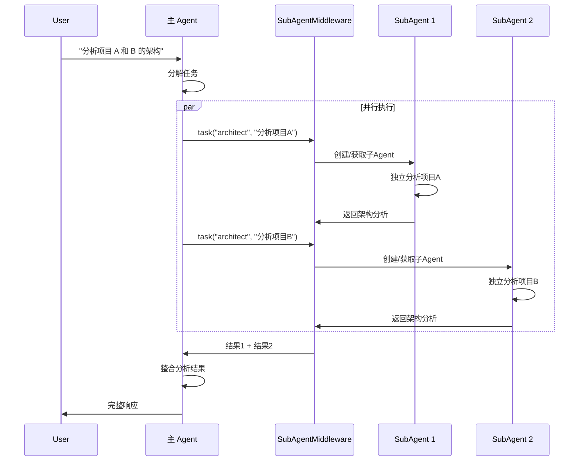

# SubAgent 系统

SubAgent 是 AgentSDK 的**任务委托和上下文隔离机制**，允许主 Agent 将复杂的、多步骤的任务委托给专门的子 Agent 执行，实现关注点分离和资源优化。

## 🎯 核心概念

### SubAgent vs 主 Agent

```
主 Agent (Main Agent)
├── 负责总体协调
├── 管理对话上下文
├── 决策任务分配
└── 整合子任务结果

SubAgent (子 Agent)
├── 专注单一任务
├── 独立上下文窗口
├── 隔离执行环境
└── 返回摘要结果
```

### 为什么需要 SubAgent？

**场景 1：上下文膨胀**

```
用户：分析三个大型代码库的安全漏洞

❌ 不使用 SubAgent：
   主 Agent 分析所有代码库
   → 上下文窗口被大量分析细节填满
   → Token 消耗巨大
   → 后续对话质量下降

✅ 使用 SubAgent：
   主 Agent → 启动3个子 Agent 并行分析
   → 每个子 Agent 独立分析一个代码库
   → 返回摘要报告
   → 主 Agent 整合结果，上下文保持简洁
```

**场景 2：专业化分工**

```
用户：编写文章、配图、排版

✅ 使用 SubAgent：
   主 Agent → 协调
   ├── writer SubAgent → 撰写文章
   ├── designer SubAgent → 设计配图
   └── formatter SubAgent → 格式排版
```

**场景 3：并行加速**

```
用户：研究三家公司的财报

❌ 顺序执行（慢）：
   研究 A → 研究 B → 研究 C
   耗时：3T

✅ 并行执行（快）：
   同时启动 3 个 SubAgent
   耗时：T
```

## 📐 SubAgent 架构

### 系统架构

```
┌─────────────────────────────────────────┐
│           主 Agent (Main Agent)          │
│  ┌───────────────────────────────────┐  │
│  │    SubAgentMiddleware             │  │
│  │  ┌─────────────────────────────┐  │  │
│  │  │  task 工具 (Task Tool)       │  │  │
│  │  │  - 启动子 Agent             │  │  │
│  │  │  - 传递任务描述             │  │  │
│  │  │  - 接收执行结果             │  │  │
│  │  └─────────────────────────────┘  │  │
│  │                                     │  │
│  │  SubAgent Pool:                    │  │
│  │  ┌──────┐ ┌──────┐ ┌──────┐       │  │
│  │  │ Sub1 │ │ Sub2 │ │ SubN │       │  │
│  │  └──────┘ └──────┘ └──────┘       │  │
│  └───────────────────────────────────┘  │
└─────────────────────────────────────────┘

每个 SubAgent：
┌─────────────────────┐
│   SubAgent          │
│  ┌───────────────┐  │
│  │ 专用提示词     │  │
│  ├───────────────┤  │
│  │ 独立工具集     │  │
│  ├───────────────┤  │
│  │ 独立上下文     │  │
│  ├───────────────┤  │
│  │ 独立会话状态   │  │
│  └───────────────┘  │
└─────────────────────┘
```

### 执行流程



## 🔧 SubAgent 定义

### SubAgentSpec 规格

```go
type SubAgentSpec struct {
    // 基本信息
    Name        string   // SubAgent 唯一标识
    Description string   // 功能描述
    Prompt      string   // 专用系统提示词

    // 工具配置
    Tools       []string // 工具列表（空则继承父 Agent）

    // 中间件配置
    InheritMiddlewares  bool         // 是否继承父 Agent 中间件
    MiddlewareOverrides []Middleware // 专用中间件（覆盖或追加）

    // 自定义配置
    Config      map[string]interface{}
}
```

### 创建 SubAgent

**方式 1：预定义 SubAgent**

```go
subagentMW, _ := middleware.NewSubAgentMiddleware(&middleware.SubAgentMiddlewareConfig{
    Factory: createSubAgentFactory(),
    Specs: []middleware.SubAgentSpec{
        {
            Name:        "code-reviewer",
            Description: "代码审查专家",
            Prompt:      "你是资深代码审查专家，专注于代码质量、安全性和最佳实践。",
            Tools:       []string{"fs_read", "grep", "bash_run"},
        },
        {
            Name:        "data-analyst",
            Description: "数据分析专家",
            Prompt:      "你是数据分析专家，精通数据处理、统计分析和可视化。",
            Tools:       []string{"python_exec", "pandas", "matplotlib"},
        },
    },
})
```

**方式 2：通用 SubAgent（默认启用）**

```go
// 自动启用 general-purpose SubAgent
subagentMW, _ := middleware.NewSubAgentMiddleware(&middleware.SubAgentMiddlewareConfig{
    Factory:              createSubAgentFactory(),
    EnableGeneralPurpose: true, // 默认 true
})

// general-purpose SubAgent 拥有所有工具，适用于大多数任务
```

## 🎮 使用 task 工具

### task 工具参数

```typescript
interface TaskInput {
    description: string;      // 任务描述（必需）
    subagent_type: string;    // SubAgent 类型（必需）
    context?: object;         // 父 Agent 上下文（可选）
}
```

### 调用示例

**单个任务**：

```go
// 主 Agent 使用 task 工具
result, _ := ag.Chat(ctx, `
请使用 task 工具分析 main.go 的代码质量：

tool_use:
  name: task
  parameters:
    description: |
      分析 main.go 文件的代码质量，检查：
      1. 错误处理是否完善
      2. 是否有安全漏洞
      3. 代码结构是否合理
      4. 返回详细的审查报告
    subagent_type: code-reviewer
`)
```

**并行任务**（重要！）：

```go
// 同时启动多个 SubAgent 并行执行
result, _ := ag.Chat(ctx, `
请并行分析三个项目：

tool_use:
  name: task
  parameters:
    description: "分析 project-a 的架构设计"
    subagent_type: architect

tool_use:
  name: task
  parameters:
    description: "分析 project-b 的架构设计"
    subagent_type: architect

tool_use:
  name: task
  parameters:
    description: "分析 project-c 的架构设计"
    subagent_type: architect
`)
```

## 📋 使用场景

### 1. 并行研究

**场景**：需要从多个来源收集信息

```go
// 用户：研究三种编程语言的优缺点

主 Agent:
  └─> 并行启动 3 个 SubAgent
      ├─> research-agent: "研究 Go 语言"
      ├─> research-agent: "研究 Python 语言"
      └─> research-agent: "研究 Rust 语言"

      收集结果 → 对比分析 → 给出建议
```

**优势**：
- ⚡ 速度快 3 倍（并行执行）
- 💰 Token 优化（每个子 Agent 只返回摘要）
- 🎯 上下文隔离（不互相污染）

### 2. 复杂任务分解

**场景**：大型任务需要多个步骤

```go
// 用户：为我的创业项目写商业计划书

主 Agent:
  └─> 顺序启动多个 SubAgent
      ├─> market-research: "市场调研"
      ├─> competitor-analysis: "竞争对手分析"
      ├─> financial-planning: "财务规划"
      └─> content-writer: "撰写商业计划书"

      每个 SubAgent 专注一个领域 → 主 Agent 整合
```

**优势**：
- 📚 专业化（每个 SubAgent 有专门提示词和工具）
- 🧹 上下文清晰（主 Agent 只看摘要）
- 🔄 可复用（SubAgent 可用于其他任务）

### 3. 上下文隔离

**场景**：防止主 Agent 上下文被污染

```go
// 用户：分析这个 10MB 的日志文件

主 Agent:
  └─> SubAgent("log-analyzer", "分析日志文件并返回异常摘要")
      ├─> SubAgent 读取和分析大量日志
      ├─> 在独立上下文中处理数据
      └─> 返回简洁的异常列表

主 Agent 上下文：
  ├─ 用户消息
  ├─ 异常摘要（< 1KB）
  └─ 后续对话保持轻量
```

**优势**：
- 💾 内存优化（主 Agent 不存储详细日志）
- ⚡ 响应速度（上下文小）
- 💰 成本降低（Token 使用少）

### 4. 专业化 Agent

**场景**：不同领域需要不同专家

```go
// 多领域内容创作系统

SubAgents:
  ├─> tech-writer: 技术文档专家
  ├─> marketing-copywriter: 营销文案专家
  ├─> legal-advisor: 法律顾问专家
  └─> translator: 翻译专家

主 Agent 根据任务类型选择合适的 SubAgent
```

## ⚙️ 高级配置

### 1. 中间件继承

**继承父 Agent 中间件**：

```go
SubAgentSpec{
    Name:               "data-processor",
    InheritMiddlewares: true, // 继承所有父 Agent 中间件
}
```

**不继承（独立中间件栈）**：

```go
SubAgentSpec{
    Name:               "isolated-agent",
    InheritMiddlewares: false, // 不继承
    MiddlewareOverrides: []Middleware{
        // 仅使用这些中间件
        customLogger,
        customSandbox,
    },
}
```

**覆盖特定中间件**：

```go
SubAgentSpec{
    Name:               "custom-agent",
    InheritMiddlewares: true,  // 继承
    MiddlewareOverrides: []Middleware{
        // 覆盖同名中间件
        customFilesystemMiddleware, // 覆盖父 Agent 的 filesystem
    },
}
```

### 2. 工具配置

**继承所有工具**：

```go
SubAgentSpec{
    Name:  "general-agent",
    Tools: nil, // 或 []string{} - 继承所有工具
}
```

**限定工具集**：

```go
SubAgentSpec{
    Name:  "read-only-agent",
    Tools: []string{"fs_read", "grep", "web_search"},
    // 只能使用这些工具，提高安全性
}
```

### 3. 上下文传递

**传递部分上下文**：

```go
result, _ := ag.Chat(ctx, `
tool_use:
  name: task
  parameters:
    description: "基于用户偏好推荐产品"
    subagent_type: recommender
    context:
      user_id: "12345"
      preferences:
        category: "electronics"
        price_range: "500-1000"
`)
```

**SubAgent 接收上下文**：

```go
func (a *RecommenderAgent) Execute(ctx context.Context, description string, parentContext map[string]interface{}) (string, error) {
    userID := parentContext["user_id"].(string)
    preferences := parentContext["preferences"].(map[string]interface{})

    // 使用上下文信息执行任务
    // ...
}
```

## 🚀 最佳实践

### 1. 并行化优先

**✅ 推荐**：

```go
// 并行启动多个任务（在一条消息中）
tool_use: task("research", "研究主题A")
tool_use: task("research", "研究主题B")
tool_use: task("research", "研究主题C")
// 速度快 3 倍！
```

**❌ 避免**：

```go
// 顺序执行（慢）
tool_use: task("research", "研究主题A")
// 等待结果...
tool_use: task("research", "研究主题B")
// 等待结果...
tool_use: task("research", "研究主题C")
```

### 2. 详细的任务描述

**✅ 推荐**：

```go
description: `
分析 main.go 文件的代码质量，请检查：
1. 错误处理：是否所有错误都被正确处理
2. 安全漏洞：检查 SQL 注入、XSS、CSRF 等
3. 代码结构：函数是否过长，是否需要重构
4. 性能问题：是否有明显的性能瓶颈

请返回详细的审查报告，包括：
- 问题列表（按严重程度排序）
- 每个问题的具体位置（文件名:行号）
- 修复建议
`
```

**❌ 避免**：

```go
description: "审查代码"  // 太简略，SubAgent 不知道要做什么
```

### 3. 选择合适的 SubAgent 类型

**专业化 SubAgent**（推荐）：

```go
// 针对特定任务使用专业 SubAgent
task("code-reviewer", "审查代码")
task("data-analyst", "分析数据")
task("content-writer", "撰写文档")
```

**通用 SubAgent**（备选）：

```go
// 任务不明确时使用通用 SubAgent
task("general-purpose", "执行复杂任务")
```

### 4. 何时使用 SubAgent

**✅ 应该使用**：

- 任务复杂且需要多个步骤
- 任务之间相互独立，可以并行
- 任务会消耗大量 Token/Context
- 需要专业化处理（不同领域）
- 需要上下文隔离

**❌ 不应该使用**：

- 任务非常简单（几个工具调用）
- 需要查看详细的中间步骤
- 任务之间强依赖，无法并行
- 委托反而增加复杂度

### 5. 信任 SubAgent 输出

SubAgent 是高效且可靠的，通常应该信任其输出：

```go
// ✅ 推荐
result := subagent.Execute(...)
// 直接使用结果

// ❌ 避免
result := subagent.Execute(...)
// 再次验证结果（除非有特殊需求）
```

## 🔄 SubAgent 生命周期

```
1. 创建 (Creation)
   ├─> 根据 SubAgentSpec 创建实例
   ├─> 初始化专用提示词
   ├─> 配置工具集
   └─> 设置中间件栈

2. 执行 (Execution)
   ├─> 接收任务描述
   ├─> 接收父 Agent 上下文（可选）
   ├─> 在独立上下文中执行
   └─> 返回摘要结果

3. 复用 (Reuse)
   ├─> SubAgent 实例可以复用
   └─> 处理多个相似任务

4. 关闭 (Close)
   ├─> 主 Agent 关闭时
   └─> 清理所有 SubAgent 资源
```

## 🎯 SubAgent vs Workflow Agent

| 特性 | SubAgent | Workflow Agent |
|------|---------|---------------|
| **用途** | 任务委托、上下文隔离 | 工作流编排 |
| **调用方式** | 主 Agent 调用 task 工具 | 直接创建 Workflow Agent |
| **执行方式** | 主 Agent 决定何时调用 | 预定义执行流程 |
| **灵活性** | 高（动态决策） | 中（固定流程） |
| **适用场景** | 动态任务委托 | 固定工作流程 |

**组合使用**：

```go
// Workflow Agent 中使用 SubAgent
SequentialAgent:
  ├─> Step 1: SubAgent("researcher", "研究背景")
  ├─> Step 2: SubAgent("analyst", "分析数据")
  └─> Step 3: SubAgent("writer", "撰写报告")
```

## 📚 相关资源

- [多 Agent 协作](/multi-agent/overview) - SubAgent 使用示例
- [Workflow Agent](/core-concepts/workflow-agents) - 工作流编排
- [中间件系统](/core-concepts/middleware) - 理解 SubAgentMiddleware
- [SubAgent API 参考](/api-reference/subagent) - 完整 API 文档
- [SubAgent 最佳实践](/best-practices/subagent) - 高级技巧

## ⚡ 快速开始

```go
package main

import (
    "context"
    "github.com/wordflowlab/agentsdk/pkg/agent"
    "github.com/wordflowlab/agentsdk/pkg/middleware"
)

func main() {
    ctx := context.Background()

    // 1. 创建 SubAgent 中间件
    subagentMW, _ := middleware.NewSubAgentMiddleware(&middleware.SubAgentMiddlewareConfig{
        Factory: yourSubAgentFactory,
        Specs: []middleware.SubAgentSpec{
            {
                Name:        "researcher",
                Description: "研究专家",
                Prompt:      "你是专业研究员...",
            },
        },
    })

    // 2. 创建主 Agent
    ag, _ := agent.Create(ctx, &types.AgentConfig{
        TemplateID: "assistant",
        Middlewares: []middleware.Middleware{subagentMW},
    }, deps)

    // 3. 使用 SubAgent
    ag.Chat(ctx, `
请使用 task 工具研究 AI Agent 的最新进展，
并撰写一份摘要报告。
    `)
}
```

---

**核心要点**：

1. ✅ **并行化**：在一条消息中同时启动多个 SubAgent
2. ✅ **上下文隔离**：每个 SubAgent 有独立上下文
3. ✅ **专业化**：使用专门的 SubAgent 处理不同领域任务
4. ✅ **Token 优化**：SubAgent 只返回摘要，节省主 Agent 上下文
5. ✅ **详细指令**：给 SubAgent 明确、详细的任务描述
