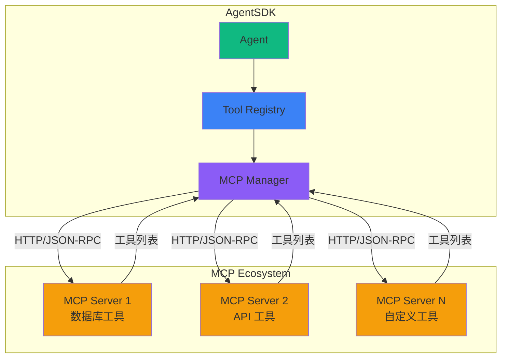
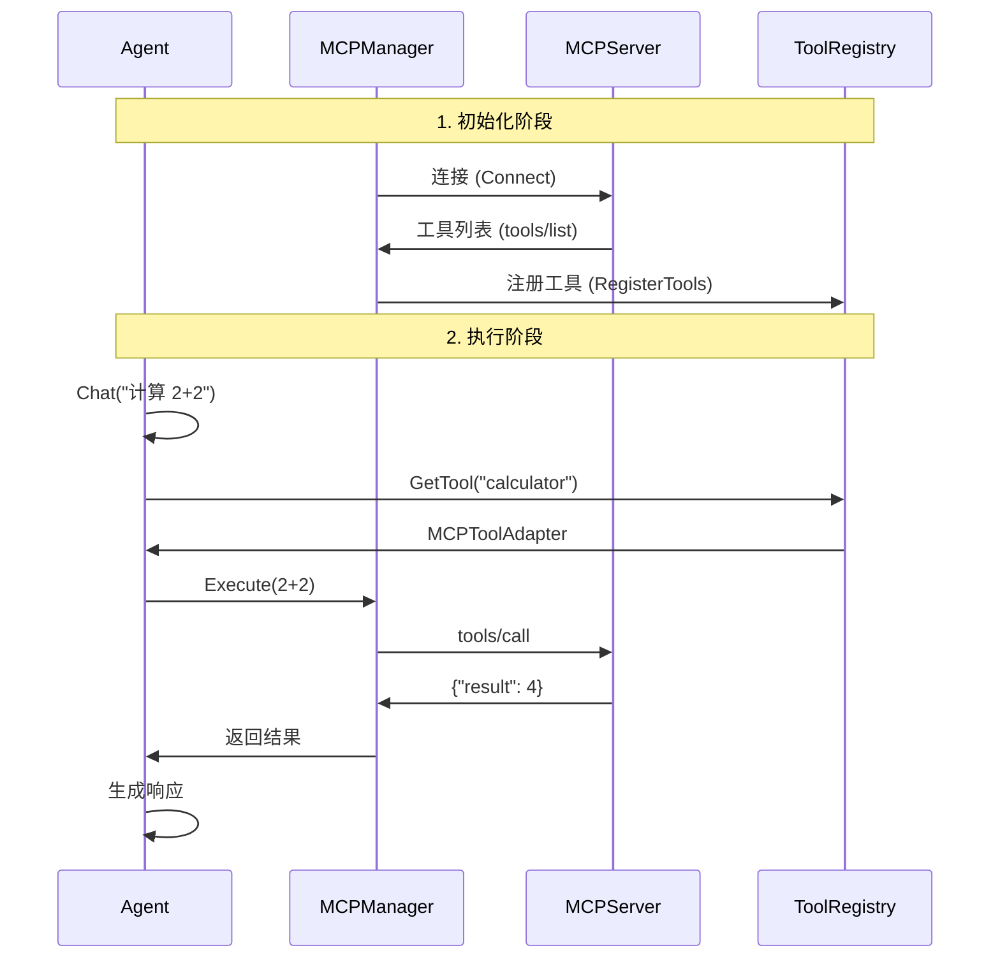

# MCP 工具集成示例

[Model Context Protocol (MCP)](https://modelcontextprotocol.io) 是一种标准协议，让 Agent 能够连接到外部工具服务器。AgentSDK 提供了完整的 MCP 集成支持。

[查看完整代码 →](https://github.com/wordflowlab/agentsdk/blob/main/examples/mcp/main.go)

## 🎯 MCP 优势

**为什么使用 MCP？**

| 特性 | 内置工具 | MCP 工具 |
|------|---------|----------|
| 扩展性 | 需要修改代码 | 动态添加 |
| 维护性 | SDK 内维护 | 独立维护 |
| 复用性 | 绑定到 SDK | 跨平台共享 |
| 部署 | 编译到应用 | 独立部署 |
| 更新 | 需要重新部署 | 热更新 |

**适用场景：**
- 🔌 连接第三方服务（数据库、API）
- 🌐 使用社区工具服务器
- 🔄 动态添加/移除工具
- 🏢 企业内部工具共享

## 🏗️ MCP 架构



### 工作流程



## 📋 完整示例

### 1. 创建 MCP Manager

```go
package main

import (
    "context"
    "fmt"
    "log"
    "os"

    "github.com/wordflowlab/agentsdk/pkg/agent"
    "github.com/wordflowlab/agentsdk/pkg/tools"
    "github.com/wordflowlab/agentsdk/pkg/tools/builtin"
    "github.com/wordflowlab/agentsdk/pkg/tools/mcp"
    "github.com/wordflowlab/agentsdk/pkg/types"
)

func main() {
    ctx := context.Background()

    // 1. 创建工具注册表
    toolRegistry := tools.NewRegistry()

    // 注册内置工具
    builtin.RegisterAll(toolRegistry)

    // 2. 创建 MCP Manager
    mcpManager := mcp.NewMCPManager(toolRegistry)

    // 3. 添加 MCP Server
    server, err := mcpManager.AddServer(&mcp.MCPServerConfig{
        ServerID:        "my-tools",
        Endpoint:        os.Getenv("MCP_ENDPOINT"),
        AccessKeyID:     os.Getenv("MCP_ACCESS_KEY"),
        AccessKeySecret: os.Getenv("MCP_SECRET_KEY"),
    })
    if err != nil {
        log.Fatalf("Failed to add MCP server: %v", err)
    }

    // 4. 连接并注册工具
    fmt.Println("Connecting to MCP Server...")
    err = mcpManager.ConnectServer(ctx, "my-tools")
    if err != nil {
        log.Fatalf("Failed to connect to MCP server: %v", err)
    }

    // 5. 显示已注册的工具
    tools := server.ListTools()
    fmt.Printf("✅ Connected! Registered %d tools:\n", len(tools))
    for _, tool := range tools {
        fmt.Printf("  - %s: %s\n", tool.Name, tool.Description)
    }

    // 6. 创建 Agent（可以使用 MCP 工具）
    createAgentWithMCPTools(ctx, toolRegistry, mcpManager)
}
```

### 2. 配置 Agent 使用 MCP 工具

```go
func createAgentWithMCPTools(ctx context.Context, toolRegistry *tools.Registry, mcpManager *mcp.MCPManager) {
    // 创建其他依赖...
    deps := createDependencies(toolRegistry)

    // 注册模板，声明可用工具（包括 MCP 工具）
    templateRegistry := agent.NewTemplateRegistry()
    templateRegistry.Register(&types.AgentTemplateDefinition{
        ID:    "mcp-assistant",
        Model: "claude-sonnet-4-5",
        SystemPrompt: "You are an assistant with access to both built-in and MCP tools.",
        Tools: []interface{}{
            // 内置工具
            "Read",
            "Write",
            "Bash",

            // MCP 工具（格式: {server_id}:{tool_name}）
            "my-tools:calculator",
            "my-tools:database_query",
            "my-tools:send_email",
        },
    })

    deps.TemplateRegistry = templateRegistry

    // 创建 Agent
    config := &types.AgentConfig{
        TemplateID: "mcp-assistant",
        ModelConfig: &types.ModelConfig{
            Provider: "anthropic",
            Model:    "claude-sonnet-4-5",
            APIKey:   os.Getenv("ANTHROPIC_API_KEY"),
        },
        Sandbox: &types.SandboxConfig{
            Kind:    types.SandboxKindLocal,
            WorkDir: "./workspace",
        },
    }

    ag, err := agent.Create(ctx, config, deps)
    if err != nil {
        log.Fatalf("Failed to create agent: %v", err)
    }
    defer ag.Close()

    // 测试 MCP 工具
    testMCPTools(ctx, ag)
}
```

### 3. 使用 MCP 工具

```go
func testMCPTools(ctx context.Context, ag *agent.Agent) {
    fmt.Println("\n=== 测试 MCP 工具 ===\n")

    // 测试 1: 使用 Calculator
    fmt.Println("--- 测试 1: Calculator ---")
    result, err := ag.Chat(ctx, "请计算 123 + 456")
    if err != nil {
        log.Printf("Chat failed: %v", err)
    } else {
        fmt.Printf("结果: %s\n\n", result.Text)
    }

    // 测试 2: 数据库查询
    fmt.Println("--- 测试 2: Database Query ---")
    result, err = ag.Chat(ctx, "请查询用户表中 ID 为 1 的用户信息")
    if err != nil {
        log.Printf("Chat failed: %v", err)
    } else {
        fmt.Printf("结果: %s\n\n", result.Text)
    }

    // 测试 3: 组合内置工具和 MCP 工具
    fmt.Println("--- 测试 3: 组合工具 ---")
    result, err = ag.Chat(ctx, "请查询数据库获取用户列表，并保存到 users.json 文件")
    if err != nil {
        log.Printf("Chat failed: %v", err)
    } else {
        fmt.Printf("结果: %s\n\n", result.Text)
    }
}
```

## 🛠️ MCP Manager API

### 基本操作

```go
// 创建 Manager
mcpManager := mcp.NewMCPManager(toolRegistry)

// 添加 Server
server, err := mcpManager.AddServer(&mcp.MCPServerConfig{
    ServerID:        "my-server",
    Endpoint:        "http://localhost:8080/mcp",
    AccessKeyID:     "your-key-id",
    AccessKeySecret: "your-key-secret",
})

// 连接单个 Server
err = mcpManager.ConnectServer(ctx, "my-server")

// 连接所有 Server
err = mcpManager.ConnectAll(ctx)

// 获取 Server
server := mcpManager.GetServer("my-server")

// 列出所有 Server ID
serverIDs := mcpManager.ListServers()

// 移除 Server
err = mcpManager.RemoveServer("my-server")

// 获取统计信息
serverCount := mcpManager.GetServerCount()
totalTools := mcpManager.GetTotalToolCount()
```

### Server 操作

```go
// 获取 Server 信息
serverID := server.GetServerID()
toolCount := server.GetToolCount()

// 列出工具
tools := server.ListTools()
for _, tool := range tools {
    fmt.Printf("%s: %s\n", tool.Name, tool.Description)
}

// 获取底层 MCP 客户端
client := server.GetClient()
```

## 🌐 创建简单的 MCP Server

如果你想测试 MCP 功能，可以创建一个简单的 MCP Server：

### Python 实现

```python
# simple_mcp_server.py
from flask import Flask, request, jsonify

app = Flask(__name__)

@app.route('/mcp', methods=['POST'])
def mcp_handler():
    req = request.json
    method = req.get('method')

    # 列出工具
    if method == 'tools/list':
        return jsonify({
            'jsonrpc': '2.0',
            'id': req['id'],
            'result': {
                'tools': [
                    {
                        'name': 'calculator',
                        'description': 'Simple calculator',
                        'inputSchema': {
                            'type': 'object',
                            'properties': {
                                'operation': {
                                    'type': 'string',
                                    'enum': ['add', 'subtract', 'multiply', 'divide']
                                },
                                'a': {'type': 'number'},
                                'b': {'type': 'number'}
                            },
                            'required': ['operation', 'a', 'b']
                        }
                    },
                    {
                        'name': 'echo',
                        'description': 'Echo back the input',
                        'inputSchema': {
                            'type': 'object',
                            'properties': {
                                'message': {'type': 'string'}
                            },
                            'required': ['message']
                        }
                    }
                ]
            }
        })

    # 调用工具
    elif method == 'tools/call':
        tool_name = req['params']['name']
        args = req['params'].get('arguments', {})

        if tool_name == 'calculator':
            a = args['a']
            b = args['b']
            op = args['operation']

            if op == 'add':
                result = a + b
            elif op == 'subtract':
                result = a - b
            elif op == 'multiply':
                result = a * b
            elif op == 'divide':
                result = a / b if b != 0 else 'Error: Division by zero'

            return jsonify({
                'jsonrpc': '2.0',
                'id': req['id'],
                'result': {
                    'output': f'{a} {op} {b} = {result}'
                }
            })

        elif tool_name == 'echo':
            return jsonify({
                'jsonrpc': '2.0',
                'id': req['id'],
                'result': {
                    'output': f"Echo: {args.get('message', '')}"
                }
            })

    # 未知方法
    return jsonify({
        'jsonrpc': '2.0',
        'id': req.get('id'),
        'error': {
            'code': -32601,
            'message': 'Method not found'
        }
    })

if __name__ == '__main__':
    app.run(host='0.0.0.0', port=8080)
```

运行 Server：

```bash
pip install flask
python simple_mcp_server.py
```

### Go 实现

```go
// simple_mcp_server.go
package main

import (
    "encoding/json"
    "fmt"
    "net/http"
)

type JSONRPCRequest struct {
    JSONRPC string                 `json:"jsonrpc"`
    ID      interface{}            `json:"id"`
    Method  string                 `json:"method"`
    Params  map[string]interface{} `json:"params"`
}

type JSONRPCResponse struct {
    JSONRPC string      `json:"jsonrpc"`
    ID      interface{} `json:"id"`
    Result  interface{} `json:"result,omitempty"`
    Error   interface{} `json:"error,omitempty"`
}

func mcpHandler(w http.ResponseWriter, r *http.Request) {
    var req JSONRPCRequest
    json.NewDecoder(r.Body).Decode(&req)

    var resp JSONRPCResponse
    resp.JSONRPC = "2.0"
    resp.ID = req.ID

    switch req.Method {
    case "tools/list":
        resp.Result = map[string]interface{}{
            "tools": []map[string]interface{}{
                {
                    "name":        "calculator",
                    "description": "Simple calculator",
                    "inputSchema": map[string]interface{}{
                        "type": "object",
                        "properties": map[string]interface{}{
                            "operation": map[string]interface{}{
                                "type": "string",
                                "enum": []string{"add", "subtract", "multiply", "divide"},
                            },
                            "a": map[string]interface{}{"type": "number"},
                            "b": map[string]interface{}{"type": "number"},
                        },
                        "required": []string{"operation", "a", "b"},
                    },
                },
            },
        }

    case "tools/call":
        name := req.Params["name"].(string)
        args := req.Params["arguments"].(map[string]interface{})

        if name == "calculator" {
            a := args["a"].(float64)
            b := args["b"].(float64)
            op := args["operation"].(string)

            var result float64
            switch op {
            case "add":
                result = a + b
            case "subtract":
                result = a - b
            case "multiply":
                result = a * b
            case "divide":
                if b != 0 {
                    result = a / b
                }
            }

            resp.Result = map[string]interface{}{
                "output": fmt.Sprintf("%.2f %s %.2f = %.2f", a, op, b, result),
            }
        }

    default:
        resp.Error = map[string]interface{}{
            "code":    -32601,
            "message": "Method not found",
        }
    }

    w.Header().Set("Content-Type", "application/json")
    json.NewEncoder(w).Encode(resp)
}

func main() {
    http.HandleFunc("/mcp", mcpHandler)
    fmt.Println("MCP Server running on :8080")
    http.ListenAndServe(":8080", nil)
}
```

运行 Server：

```bash
go run simple_mcp_server.go
```

## 🔧 配置选项

### Server 配置

```go
type MCPServerConfig struct {
    // Server 唯一 ID
    ServerID string

    // MCP 端点 URL
    Endpoint string

    // 可选：认证信息
    AccessKeyID     string
    AccessKeySecret string

    // 可选：超时配置
    Timeout time.Duration

    // 可选：重试配置
    RetryCount int
    RetryDelay time.Duration
}
```

### 环境变量配置

```bash
# MCP Server 端点
export MCP_ENDPOINT="http://localhost:8080/mcp"

# 认证信息（可选）
export MCP_ACCESS_KEY="your-access-key-id"
export MCP_SECRET_KEY="your-secret-key"

# 多个 Server（逗号分隔）
export MCP_ENDPOINTS="http://server1:8080/mcp,http://server2:8080/mcp"
```

## 💡 最佳实践

### 1. 工具命名

```go
// ✅ 好的命名：使用 server_id 前缀
"my-server:calculator"
"db-tools:query"
"api-tools:send_email"

// ❌ 不好的命名：容易冲突
"calculator"  // 可能与其他 server 的工具冲突
```

### 2. 错误处理

```go
// 连接 MCP Server 时处理错误
err := mcpManager.ConnectServer(ctx, "my-server")
if err != nil {
    log.Printf("⚠️  Failed to connect to MCP server: %v", err)
    log.Println("   Agent will work with built-in tools only")
    // 继续运行，使用内置工具
} else {
    log.Println("✅ MCP server connected successfully")
}
```

### 3. 工具发现

```go
// 列出所有可用工具（内置 + MCP）
allTools := toolRegistry.List()
fmt.Println("Available tools:")
for _, toolName := range allTools {
    fmt.Printf("  - %s\n", toolName)
}
```

### 4. 动态添加 Server

```go
// 运行时动态添加 MCP Server
func addMCPServerDynamically(mcpManager *mcp.MCPManager, endpoint string) {
    serverID := fmt.Sprintf("dynamic-%d", time.Now().Unix())

    _, err := mcpManager.AddServer(&mcp.MCPServerConfig{
        ServerID: serverID,
        Endpoint: endpoint,
    })
    if err != nil {
        log.Printf("Failed to add server: %v", err)
        return
    }

    err = mcpManager.ConnectServer(context.Background(), serverID)
    if err != nil {
        log.Printf("Failed to connect: %v", err)
        mcpManager.RemoveServer(serverID)
        return
    }

    log.Printf("✅ Added and connected to %s", endpoint)
}
```

## 🐛 故障排除

### 问题 1: 连接失败

```
⚠️  连接 MCP Server 失败: dial tcp: connection refused
```

**解决方案：**
1. 确保 MCP Server 正在运行
2. 检查端点 URL 是否正确
3. 验证网络连接和防火墙设置
4. 使用 curl 测试端点：
   ```bash
   curl -X POST http://localhost:8080/mcp \
     -H "Content-Type: application/json" \
     -d '{"jsonrpc":"2.0","id":1,"method":"tools/list"}'
   ```

### 问题 2: 认证失败

```
⚠️  MCP error: unauthorized (code: 401)
```

**解决方案：**
1. 检查 `AccessKeyID` 和 `AccessKeySecret`
2. 确认 MCP Server 的认证配置
3. 查看 Server 日志了解详细错误

### 问题 3: 工具未找到

```
Tool not found: my-server:calculator
```

**解决方案：**
1. 确认 Server 已连接: `mcpManager.GetServer("my-server")`
2. 列出已注册的工具: `server.ListTools()`
3. 检查工具名称格式: `{server_id}:{tool_name}`

### 问题 4: 工具调用超时

```
⚠️  Tool execution timeout: my-server:slow_query
```

**解决方案：**
```go
// 增加超时时间
server, _ := mcpManager.AddServer(&mcp.MCPServerConfig{
    ServerID: "my-server",
    Endpoint: endpoint,
    Timeout:  60 * time.Second,  // 增加到 60 秒
})
```

## 📊 监控与统计

```go
// 获取 MCP 统计信息
func printMCPStats(mcpManager *mcp.MCPManager) {
    fmt.Println("\n=== MCP 统计 ===")
    fmt.Printf("Server 数量: %d\n", mcpManager.GetServerCount())
    fmt.Printf("工具总数: %d\n", mcpManager.GetTotalToolCount())

    fmt.Println("\n详细信息:")
    for _, serverID := range mcpManager.ListServers() {
        server := mcpManager.GetServer(serverID)
        if server != nil {
            fmt.Printf("  📡 %s: %d tools\n", serverID, server.GetToolCount())
            for _, tool := range server.ListTools() {
                fmt.Printf("    - %s\n", tool.Name)
            }
        }
    }
}
```

## ❓ 常见问题

### Q: MCP 工具和内置工具有什么区别？

| 特性 | 内置工具 | MCP 工具 |
|------|---------|----------|
| 部署方式 | 编译到应用 | 独立服务 |
| 网络调用 | 否 | 是 |
| 性能 | 更快 | 稍慢（网络开销） |
| 扩展性 | 需要重新编译 | 动态添加 |
| 适用场景 | 基础功能 | 专业/第三方功能 |

### Q: 可以同时连接多个 MCP Server 吗？

可以！使用不同的 ServerID：

```go
mcpManager.AddServer(&mcp.MCPServerConfig{ServerID: "server1", ...})
mcpManager.AddServer(&mcp.MCPServerConfig{ServerID: "server2", ...})
mcpManager.ConnectAll(ctx)
```

### Q: 如何实现 MCP 工具的缓存？

MCP Adapter 内部已实现连接池和请求缓存，无需手动管理。

### Q: MCP Server 宕机了怎么办？

Agent 会捕获错误并继续运行：

```go
// 如果 MCP 工具调用失败，Agent 会报告错误
// 但不会崩溃，可以继续使用其他工具
```

## 🔗 相关资源

- [MCP 协议规范](https://modelcontextprotocol.io) - 官方文档
- [内置工具](/examples/tools/builtin) - 内置工具参考
- [自定义工具](/examples/tools/custom) - 创建自定义工具
- [完整示例代码](https://github.com/wordflowlab/agentsdk/blob/main/examples/mcp/main.go)
