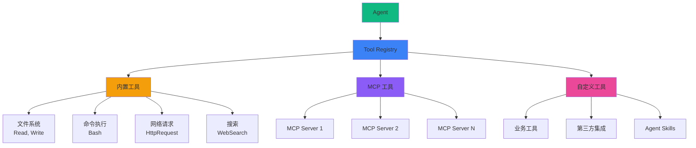
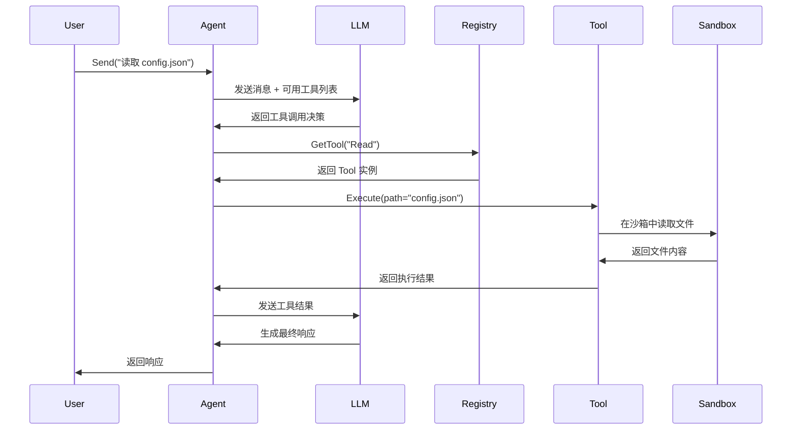

# 工具系统示例

AgentSDK 提供了强大的工具系统,让 Agent 能够与外部世界交互。本章节通过实际示例展示三种工具使用方式。

## 🎯 工具类型概览



## 📚 示例导航

### 🔧 内置工具

<div class="grid grid-cols-1 md:grid-cols-2 gap-4 my-6">
  <a href="/examples/tools/builtin" class="block p-4 border border-gray-200 dark:border-gray-700 rounded-lg hover:border-primary-500 transition-colors">
    <h3 class="font-semibold mb-2">内置工具使用</h3>
    <p class="text-sm text-gray-600 dark:text-gray-400">
      使用文件系统、Bash 命令、HTTP 请求、搜索等内置工具
    </p>
    <div class="mt-2 text-xs text-gray-500">
      ✅ 开箱即用 • 零配置 • 沙箱隔离
    </div>
  </a>
</div>

**包含工具：**
- `Read` / `Write` - 文件读写
- `Bash` - 命令执行
- `HttpRequest` - HTTP 请求
- `WebSearch` - 网络搜索

### 🔌 MCP 工具

<div class="grid grid-cols-1 md:grid-cols-2 gap-4 my-6">
  <a href="/examples/tools/mcp" class="block p-4 border border-gray-200 dark:border-gray-700 rounded-lg hover:border-primary-500 transition-colors">
    <h3 class="font-semibold mb-2">MCP 工具集成</h3>
    <p class="text-sm text-gray-600 dark:text-gray-400">
      集成 Model Context Protocol 服务器,扩展 Agent 能力
    </p>
    <div class="mt-2 text-xs text-gray-500">
      🔌 标准协议 • 🌐 远程工具 • 🔄 自动发现
    </div>
  </a>
</div>

**特性：**
- MCP 协议集成
- 自动工具发现
- 远程工具调用
- 多 Server 支持

### 🎨 自定义工具

<div class="grid grid-cols-1 md:grid-cols-2 gap-4 my-6">
  <a href="/examples/tools/custom" class="block p-4 border border-gray-200 dark:border-gray-700 rounded-lg hover:border-primary-500 transition-colors">
    <h3 class="font-semibold mb-2">自定义工具开发</h3>
    <p class="text-sm text-gray-600 dark:text-gray-400">
      创建业务专用工具和 Agent Skills
    </p>
    <div class="mt-2 text-xs text-gray-500">
      🎨 完全自定义 • 📦 Skills 系统 • ⚡ Slash Commands
    </div>
  </a>
</div>

**能力：**
- 实现 Tool 接口
- Slash Commands
- Agent Skills
- 业务逻辑封装

## 🏗️ 工具系统架构

### 工具注册与调用流程



### 核心组件

**1. Tool Registry (工具注册表)**
```go
type Registry interface {
    // 注册工具
    Register(name string, factory ToolFactory) error

    // 获取工具
    GetTool(name string, config map[string]interface{}) (Tool, error)

    // 列出所有工具
    List() []string
}
```

**2. Tool 接口**
```go
type Tool interface {
    // 工具名称
    Name() string

    // 工具描述（供 LLM 理解）
    Description() string

    // 输入参数 Schema（JSON Schema）
    InputSchema() map[string]interface{}

    // 执行工具逻辑
    Execute(ctx context.Context, input map[string]interface{}, tc *ToolContext) (interface{}, error)
}
```

**3. Tool Context (工具上下文)**
```go
type ToolContext struct {
    Sandbox      sandbox.Sandbox       // 沙箱实例
    AgentID      string                // Agent ID
    ConversationID string              // 会话 ID
    Metadata     map[string]interface{} // 元数据
}
```

## 💡 设计原则

### 1. 单一职责

每个工具只做一件事:

```go
// ✅ 好的设计
func (t *ReadTool) Execute(...) { /* 只负责读文件 */ }
func (t *WriteTool) Execute(...) { /* 只负责写文件 */ }

// ❌ 不好的设计
func (t *FsTool) Execute(...) {
    // 既读又写，职责不清
}
```

### 2. 明确的 Schema

提供清晰的输入 Schema:

```go
func (t *HttpRequestTool) InputSchema() map[string]interface{} {
    return map[string]interface{}{
        "type": "object",
        "properties": map[string]interface{}{
            "url": map[string]interface{}{
                "type":        "string",
                "description": "Request URL",
            },
            "method": map[string]interface{}{
                "type":        "string",
                "enum":        []string{"GET", "POST", "PUT", "DELETE"},
                "description": "HTTP method",
            },
        },
        "required": []string{"url"},
    }
}
```

### 3. 沙箱隔离

所有文件和命令操作都在沙箱中执行:

```go
func (t *BashTool) Execute(ctx context.Context, input map[string]interface{}, tc *ToolContext) (interface{}, error) {
    cmd := input["cmd"].(string)

    // 通过沙箱执行，而不是直接执行
    result, err := tc.Sandbox.Run(ctx, cmd)
    return result, err
}
```

### 4. 错误处理

提供清晰的错误信息:

```go
func (t *ReadTool) Execute(...) (interface{}, error) {
    if !fileExists(path) {
        return nil, fmt.Errorf("file not found: %s", path)
    }

    if !hasPermission(path) {
        return nil, fmt.Errorf("permission denied: %s", path)
    }

    // ...
}
```

## 🚀 快速开始

### 1. 使用内置工具

```go
// 注册所有内置工具
toolRegistry := tools.NewRegistry()
builtin.RegisterAll(toolRegistry)

// 在 Agent 模板中声明可用工具
templateRegistry.Register(&types.AgentTemplateDefinition{
    ID:    "assistant",
    Tools: []interface{}{"Read", "Write", "Bash"},
})

// Agent 自动拥有这些工具能力
agent, _ := agent.Create(ctx, config, deps)
agent.Chat(ctx, "请读取 config.json 文件")
```

### 2. 集成 MCP 工具

```go
// 创建 MCP Manager
mcpManager := mcp.NewMCPManager(toolRegistry)

// 添加 MCP Server
mcpManager.AddServer(&mcp.MCPServerConfig{
    ServerID: "my-tools",
    Endpoint: "http://localhost:8080/mcp",
})

// 连接并自动注册工具
mcpManager.ConnectAll(ctx)

// Agent 可以使用 MCP 工具: my-tools:calculator
```

### 3. 创建自定义工具

```go
// 实现 Tool 接口
type WeatherTool struct{}

func (t *WeatherTool) Name() string { return "weather" }
func (t *WeatherTool) Description() string {
    return "Get current weather for a city"
}
func (t *WeatherTool) InputSchema() map[string]interface{} {
    return map[string]interface{}{
        "type": "object",
        "properties": map[string]interface{}{
            "city": map[string]interface{}{"type": "string"},
        },
        "required": []string{"city"},
    }
}
func (t *WeatherTool) Execute(ctx context.Context, input map[string]interface{}, tc *ToolContext) (interface{}, error) {
    city := input["city"].(string)
    // 调用天气 API...
    return map[string]interface{}{"temp": 25, "condition": "sunny"}, nil
}

// 注册工具
toolRegistry.Register("weather", func(config map[string]interface{}) (tools.Tool, error) {
    return &WeatherTool{}, nil
})
```

## 📖 学习路径

建议按以下顺序学习：

1. **内置工具** - 理解工具系统基础
2. **MCP 集成** - 扩展工具能力
3. **自定义工具** - 创建业务工具

## 🔗 相关资源

- [Tool 接口规范](/api-reference/tools) - 详细 API 文档
- [Sandbox 执行环境](/core-concepts/sandbox) - 沙箱工作原理
- [Agent 模板](/core-concepts/agent-template) - 配置 Agent 工具

## ⚡ 性能优化

### 工具缓存

对于昂贵的工具调用可以实现缓存:

```go
type CachedWeatherTool struct {
    cache map[string]interface{}
    ttl   time.Duration
}

func (t *CachedWeatherTool) Execute(ctx context.Context, input map[string]interface{}, tc *ToolContext) (interface{}, error) {
    city := input["city"].(string)

    // 检查缓存
    if result, ok := t.cache[city]; ok {
        return result, nil
    }

    // 调用 API
    result := callWeatherAPI(city)

    // 缓存结果
    t.cache[city] = result
    return result, nil
}
```

### 并发执行

多个独立工具可以并发执行:

```go
// AgentSDK 内部自动处理工具并发
// 无需手动管理
```

## 🛡️ 安全考虑

1. **输入验证** - 验证所有输入参数
2. **权限控制** - 限制工具可访问的资源
3. **超时设置** - 防止长时间运行
4. **资源限制** - 限制内存、CPU 使用

详见 [安全最佳实践](/best-practices/security)。
