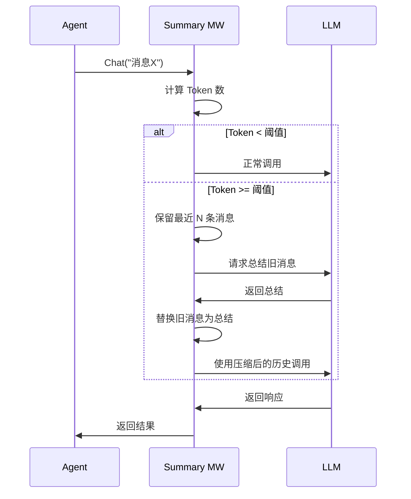
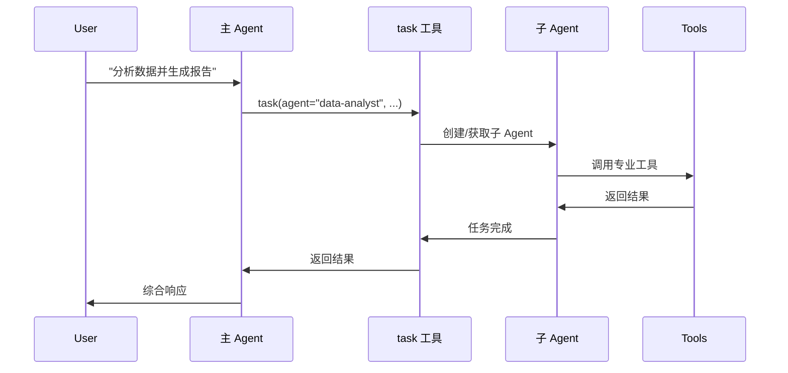

# 内置中间件使用指南

AgentSDK 提供了多个开箱即用的中间件，涵盖对话管理、文件操作、任务委托、人工审批等常见场景。

## 📦 中间件列表

| 中间件 | 优先级 | 功能 | 适用场景 |
|--------|--------|------|----------|
| [Summarization](#summarization) | 40 | 自动总结 | 长对话压缩 |
| [Filesystem](#filesystem) | 100 | 文件工具 | 文件读写操作 |
| [SubAgent](#subagent) | 200 | 子Agent | 复杂任务委托 |
| [AgentMemory](#memory) | 150 | 跨会话记忆 | 持久化记忆 |
| [HumanInTheLoop](#hitl) | 50 | 人工审批 | 敏感操作控制 |
| [TodoList](#todolist) | 120 | 任务跟踪 | 任务规划管理 |
| [PatchToolCalls](#patch) | 300 | 工具补丁 | 兼容性修复 |

## <a id="summarization"></a>📝 Summarization - 自动总结

**功能**: 自动监控对话历史，超过 Token 阈值时总结旧消息，释放上下文空间。

**使用场景**:
- 长时间对话（超过模型上下文窗口）
- 需要保留对话要点但减少 Token 使用
- 多轮交互的复杂任务

### 配置

```go
import "github.com/wordflowlab/agentsdk/pkg/middleware"

summaryMW, err := middleware.NewSummarizationMiddleware(&middleware.SummarizationMiddlewareConfig{
    MaxTokensBeforeSummary: 150000,  // 触发阈值（默认 170000）
    MessagesToKeep:         6,       // 保留最近消息数（默认 6）
    SummaryPrefix:          "## 对话历史总结:",  // 总结前缀
    TokenCounter:           customCounter,      // 自定义 Token 计数器（可选）
    Summarizer:             customSummarizer,   // 自定义总结器（可选）
})
```

### 参数说明

| 参数 | 类型 | 默认值 | 说明 |
|------|------|--------|------|
| MaxTokensBeforeSummary | int | 170000 | 触发总结的 Token 数阈值 |
| MessagesToKeep | int | 6 | 总结后保留的最近消息数 |
| SummaryPrefix | string | "## Previous conversation summary:" | 总结消息的前缀 |
| TokenCounter | func | 默认计数器 | 自定义 Token 计数函数 |
| Summarizer | func | 默认总结器 | 自定义总结生成函数 |

### 工作流程



### 使用示例

```go
func main() {
    // 创建中间件
    summaryMW, _ := middleware.NewSummarizationMiddleware(&middleware.SummarizationMiddlewareConfig{
        MaxTokensBeforeSummary: 100000,
        MessagesToKeep:         4,
    })

    // 注册到 Stack
    stack := middleware.NewStack()
    stack.Use(summaryMW)

    // 创建 Agent
    ag, _ := agent.Create(ctx, config, &agent.Dependencies{
        MiddlewareStack: stack,
        // ... 其他依赖
    })

    // 长对话示例
    for i := 0; i < 100; i++ {
        result, _ := ag.Chat(ctx, fmt.Sprintf("第 %d 轮对话", i))
        fmt.Printf("响应: %s\n", result.Text)
    }
    // → 超过阈值后自动总结，不会因上下文过长而失败
}
```

### 自定义总结器

```go
customSummarizer := func(ctx context.Context, messages []types.Message) (string, error) {
    // 自定义总结逻辑
    var summary strings.Builder
    summary.WriteString("## 对话要点:\n")

    for _, msg := range messages {
        if msg.Role == types.RoleUser {
            summary.WriteString(fmt.Sprintf("- 用户提问: %s\n", truncate(msg.Content)))
        }
    }

    return summary.String(), nil
}

summaryMW, _ := middleware.NewSummarizationMiddleware(&middleware.SummarizationMiddlewareConfig{
    Summarizer: customSummarizer,
})
```

---

## <a id="filesystem"></a>📁 Filesystem - 文件系统

**功能**: 注入文件操作工具，支持文件读写、目录遍历、内容搜索等。

**使用场景**:
- Agent 需要读写文件
- 处理大文件内容（自动驱逐大结果）
- 路径安全验证

### 配置

```go
import (
    "github.com/wordflowlab/agentsdk/pkg/middleware"
    "github.com/wordflowlab/agentsdk/pkg/backends"
)

filesMW := middleware.NewFilesystemMiddleware(&middleware.FilesystemMiddlewareConfig{
    Backend:              backends.NewLocalBackend("./workspace"),
    TokenLimit:           20000,         // 大结果驱逐阈值
    EnableEviction:       true,          // 启用自动驱逐
    AllowedPathPrefixes:  []string{"/workspace", "/tmp"},  // 允许的路径
    EnablePathValidation: true,          // 启用路径验证
})
```

### 注入的工具

| 工具名 | 功能 | 参数 |
|--------|------|------|
| `Read` | 读取文件 | path, offset?, limit? |
| `Write` | 写入文件 | path, content |
| `Edit` | 编辑文件 | path, old_string, new_string |
| `glob` | 文件模式匹配 | pattern |
| `grep` | 内容搜索 | pattern, path |

### 使用示例

```go
func main() {
    // 创建后端
    backend := backends.NewLocalBackend("./workspace")

    // 创建中间件
    filesMW := middleware.NewFilesystemMiddleware(&middleware.FilesystemMiddlewareConfig{
        Backend:    backend,
        TokenLimit: 15000,  // 超过 15k tokens 的结果保存到文件
    })

    stack := middleware.NewStack()
    stack.Use(filesMW)

    ag, _ := agent.Create(ctx, config, &agent.Dependencies{
        MiddlewareStack: stack,
    })

    // Agent 自动拥有文件操作能力
    ag.Chat(ctx, "请读取 config.json 文件")
    ag.Chat(ctx, "请在 data/ 目录创建 output.txt 文件")
    ag.Chat(ctx, "请查找所有包含 'error' 的日志文件")
}
```

### 大结果驱逐

当工具返回的内容超过 TokenLimit 时，自动保存到文件：

```go
// Agent 读取大文件
ag.Chat(ctx, "请读取 large-log.txt 文件")
// → Read 返回内容 > 20k tokens
// → 中间件自动保存到 .agent-outputs/output-xxx.txt
// → 返回给 LLM: "结果已保存到文件: .agent-outputs/output-xxx.txt，使用 Read 工具读取"
```

---

## <a id="subagent"></a>🤖 SubAgent - 子 Agent

**功能**: 提供 `task` 工具，允许主 Agent 委托任务给子 Agent 执行。

**使用场景**:
- 复杂任务分解
- 专业化分工（数据分析、代码审查等）
- 任务上下文隔离

### 配置

```go
subagentMW, _ := middleware.NewSubAgentMiddleware(&middleware.SubAgentMiddlewareConfig{
    Factory: mySubAgentFactory,  // 子 Agent 工厂函数
    EnableParallel: false,       // 是否支持并行（默认 false）
    EnableGeneralPurpose: true,  // 是否启用通用子 Agent（默认 true）
    Specs: []middleware.SubAgentSpec{
        {
            Name:        "data-analyst",
            Description: "数据分析专家，擅长处理和分析数据",
            Prompt:      "你是数据分析专家...",
            Tools:       []string{"python_exec", "pandas_query"},
        },
        {
            Name:        "code-reviewer",
            Description: "代码审查专家，检查代码质量和安全问题",
            Prompt:      "你是代码审查专家...",
            Tools:       []string{"Read", "grep"},
        },
    },
})
```

### 使用示例

```go
// 主 Agent 委托任务
ag.Chat(ctx, "请分析 sales-data.csv 文件，生成月度报告")
// → Agent 调用: task(
//     agent_name="data-analyst",
//     task="分析 sales-data.csv 并生成月度报告"
//   )
// → 子 Agent 独立执行任务
// → 返回结果给主 Agent
```

### 任务委托流程



---

## <a id="hitl"></a>👤 HumanInTheLoop - 人工审批

**功能**: 拦截指定工具的调用，要求人工审批后才执行。

**使用场景**:
- 敏感操作（删除文件、执行命令）
- 外部 API 调用需要确认
- 数据修改需要审核

### 配置

```go
hitlMW, _ := middleware.NewHumanInTheLoopMiddleware(&middleware.HumanInTheLoopMiddlewareConfig{
    InterruptOn: map[string]interface{}{
        "Bash":     true,  // 启用默认审批
        "HttpRequest": true,
        "Write": map[string]interface{}{
            "message": "文件写入需要审批",
            "allowed_decisions": []string{"approve", "reject", "edit"},
        },
    },
    ApprovalHandler: func(ctx context.Context, req *middleware.ReviewRequest) ([]middleware.Decision, error) {
        // 自定义审批逻辑
        for _, action := range req.ActionRequests {
            fmt.Printf("工具: %s\n", action.ToolName)
            fmt.Printf("参数: %+v\n", action.Input)
            fmt.Print("批准? (y/n): ")

            var answer string
            fmt.Scanln(&answer)

            if answer == "y" {
                return []middleware.Decision{{Type: middleware.DecisionApprove}}, nil
            }
            return []middleware.Decision{{Type: middleware.DecisionReject, Reason: "用户拒绝"}}, nil
        }
        return nil, fmt.Errorf("未知决策")
    },
})
```

### 决策类型

HITL 支持三种决策：

- **Approve (批准)**: 按原参数执行操作
- **Reject (拒绝)**: 取消操作执行
- **Edit (编辑)**: 修改参数后执行

### 审批流程

```go
ag.Chat(ctx, "请删除 /tmp/data.txt 文件")
// → Agent 调用 Bash("rm /tmp/data.txt")
// → HITL 中间件拦截
// → 显示审批请求给用户
// → 用户批准/拒绝/编辑
// → 根据决策执行或跳过
```

### 更多信息

- [HITL 详细文档](/middleware/builtin/human-in-the-loop) - 完整配置和 API
- [HITL 完整指南](/guides/advanced/human-in-the-loop) - 实战示例和最佳实践
- [HITL 示例代码](https://github.com/wordflowlab/agentsdk/tree/main/examples/human-in-the-loop)

---

## <a id="todolist"></a>✅ TodoList - 任务列表

**功能**: 注入 `write_todos` 工具，引导 Agent 进行任务规划和跟踪。

**使用场景**:
- 复杂多步骤任务
- 任务进度追踪
- 用户实时了解 Agent 进展

### 配置

```go
todoMW := middleware.NewTodoListMiddleware(&middleware.TodoListMiddlewareConfig{
    EnableSystemPrompt: true,  // 注入任务管理提示词
    StoreGetter: func() interface{} {
        // 从外部获取任务列表（可选）
        return currentTodos
    },
    StoreSetter: func(todos []middleware.TodoItem) {
        // 保存任务列表（可选）
        currentTodos = todos
    },
})
```

### 使用示例

```go
ag.Chat(ctx, "请创建一个完整的博客网站")
// → Agent 自动使用 write_todos 规划任务:
//   1. 设计网站结构
//   2. 创建 HTML 模板
//   3. 编写 CSS 样式
//   4. 实现路由逻辑
//   5. 测试网站功能

// → 执行过程中更新任务状态:
//   1. [completed] 设计网站结构
//   2. [in_progress] 创建 HTML 模板
//   3. [pending] 编写 CSS 样式
//   ...
```

### 任务状态

```go
type TodoStatus string

const (
    TodoStatusPending    TodoStatus = "pending"      // 待处理
    TodoStatusInProgress TodoStatus = "in_progress"  // 进行中
    TodoStatusCompleted  TodoStatus = "completed"    // 已完成
)
```

---

## <a id="memory"></a>🧠 AgentMemory - 跨会话记忆

**功能**: 通过普通文件+搜索的方式实现长期记忆，而不是向量/RAG。

**核心能力**:
- 从后端读取 `/agent.md`，作为基础“人格/长期指令”注入到 System Prompt。
- 提供 `memory_search` / `memory_write` 等工具，在指定目录下管理 Markdown 记忆文件。
- 完全基于 `grep + 文件`，所有记忆都是人类可读、可直接编辑的文本。

### 配置示例：基于文件+内存的记忆后端

```go
import (
    "github.com/wordflowlab/agentsdk/pkg/backends"
    "github.com/wordflowlab/agentsdk/pkg/middleware"
)

// 1. 构建组合 Backend
// - 默认使用 StateBackend（内存临时文件）
// - /memories/ 路径映射到本地磁盘，用于长期记忆
memoryBackend := backends.NewCompositeBackend(
    backends.NewStateBackend(),
    []backends.RouteConfig{
        {
            Prefix:  "/memories/",
            Backend: backends.NewLocalBackend("./memories"),
        },
    },
)

// 2. 创建 AgentMemory 中间件
memoryMW, err := middleware.NewAgentMemoryMiddleware(&middleware.AgentMemoryMiddlewareConfig{
    Backend:    memoryBackend,
    MemoryPath: "/memories/", // 所有长期记忆文件的根目录
})
if err != nil {
    log.Fatalf("create AgentMemoryMiddleware: %v", err)
}
```

> 提示：通常会同时启用 Filesystem 中间件，这样 Agent 既能对项目文件操作，又能直接查看 `/memories/` 下的记忆文件。

### 注入的记忆与工具

**1. /agent.md 注入 System Prompt**

- Agent 启动时，中间件会尝试从 backend 读取 `/agent.md`。
- 如果存在，其内容会被包装为：

```text
<agent_memory>
... /agent.md 内容 ...
</agent_memory>
```

- 这段内容会注入到 System Prompt 最前面，并附带一段“如何使用长期记忆”的指导文案。

**2. 新增工具：`memory_search` / `memory_write`**

启用 AgentMemoryMiddleware 后，会自动为 Agent 注入两个长期记忆工具：

- `memory_search`：在 `MemoryPath`（如 `/memories/`）下做全文搜索  
  - 默认大小写不敏感、按字面量匹配（内部用正则+grep，但对 LLM 暴露的是简单参数）。
  - 样例调用（伪 JSON）：

    ```json
    {
      "tool": "memory_search",
      "input": {
        "query": "Alice 的偏好",
        "namespace": "users/alice",      // 相对于基础命名空间; 若 Agent 配置了 user_id=alice, 也可以省略
        "glob": "*.md",
        "max_results": 20
      }
    }
    ```

- `memory_write`：向记忆文件写入/追加 Markdown 段落  
  - 所有内容都存成 `## 标题 + 正文` 的 section，便于人类查看。

    ```json
    {
      "tool": "memory_write",
      "input": {
        "file": "notes.md",
        "namespace": "users/alice",
        "mode": "append",
        "title": "2025-01-10: 偏好更新",
        "content": "Alice 喜欢简洁的代码 diff 和中文解释。"
      }
    }
    ```

  - `mode` 支持：
    - `"append"`（默认）：在文件末尾追加新 Note，保留历史。
    - `"overwrite"`：用一个新的 `## title` 段覆盖整个文件。

### 推荐的使用模式

- 把长期记忆都放在 `/memories/` 下，按“命名空间 + 文件名”拆分：
  - 命名空间示例：
    - `users/<user-id>`：用户偏好、约定、历史反馈（多用户隔离）。
    - `projects/<project-id>`：某个项目的约定、架构要点、踩坑记录。
    - `resources/article/<id>`、`resources/song/<id>`、`resources/ppt/<id>`：文章、小说、一首歌、一个 PPT 等不同资源级别上下文。
  - 组合示例（多级共享/隔离）：
    - `users/<user-id>/projects/<project-id>`：用户在某个项目下的专属背景。
    - 只用 `projects/<project-id>`：项目级共享记忆，多用户共享。
- 命名空间规则：
  - 当 Agent 配置了 `Metadata["user_id"]` 时，AgentMemory 会自动将基础命名空间设为 `users/<user-id>`。
    - 此时 `namespace: "projects/demo"` 实际落在 `/memories/users/<user-id>/projects/demo/...`。
  - 若希望写入全局/共享记忆，可使用以 `/` 开头的命名空间：
    - `namespace: "/projects/demo"` → 实际路径 `/memories/projects/demo/...`，不会叠加用户前缀。
- 让 Agent 遵循以下流程：
  1. 回答问题前先用 `memory_search` 在 `/memories/` 里查有没有相关记忆。
  2. 找到匹配时优先基于记忆回答，并引用关键片段。
  3. 当用户给出“应当记住”的信息时，用 `memory_write` 追加到合适的文件中。
- 所有记忆都是 Markdown 文本，你可以随时用 `Read`/`Grep` 或本地编辑器直接查看和重构。

---

## <a id="patch"></a>🔧 PatchToolCalls - 工具调用补丁

**功能**: 修复或增强工具调用的兼容性问题。

**使用场景**:
- LLM 生成的工具调用参数格式不正确
- 工具接口变更后的兼容性适配
- 自动修正常见错误

### 配置

```go
patchMW := middleware.NewPatchToolCallsMiddleware(&middleware.PatchToolCallsMiddlewareConfig{
    Patches: map[string]middleware.PatchFunc{
        "HttpRequest": func(input map[string]interface{}) (map[string]interface{}, error) {
            // 修正 URL 格式
            if url, ok := input["url"].(string); ok {
                if !strings.HasPrefix(url, "http") {
                    input["url"] = "https://" + url
                }
            }
            return input, nil
        },
    },
})
```

---

## 🎯 中间件组合最佳实践

### 完整功能 Agent

```go
stack := middleware.NewStack()

// 1. 人工审批（优先级最高，最先拦截）
stack.Use(hitlMW)  // Priority: 50

// 2. 自动总结（管理上下文）
stack.Use(summaryMW)  // Priority: 40

// 3. 文件系统（注入工具）
stack.Use(filesMW)  // Priority: 100

// 4. 任务列表（任务管理）
stack.Use(todoMW)  // Priority: 120

// 5. 记忆管理（持久化记忆）
stack.Use(memoryMW)  // Priority: 150

// 6. 子 Agent（任务委托）
stack.Use(subagentMW)  // Priority: 200

// 7. 工具补丁（最后执行）
stack.Use(patchMW)  // Priority: 300

// 创建 Agent
ag, _ := agent.Create(ctx, config, &agent.Dependencies{
    MiddlewareStack: stack,
})
```

### 轻量级 Agent

```go
stack := middleware.NewStack()

// 只使用必需的中间件
stack.Use(summaryMW)  // 防止上下文溢出
stack.Use(filesMW)    // 文件操作能力

ag, _ := agent.Create(ctx, config, &agent.Dependencies{
    MiddlewareStack: stack,
})
```

## 📊 监控中间件状态

```go
// 获取中间件统计
for _, mw := range stack.List() {
    fmt.Printf("中间件: %s (优先级: %d)\n", mw.Name(), mw.Priority())

    // 获取 Summarization 中间件统计
    if summaryMW, ok := mw.(*middleware.SummarizationMiddleware); ok {
        stats := summaryMW.Stats()
        fmt.Printf("  总结次数: %d\n", stats["summarization_count"])
    }
}
```

## ❓ 常见问题

### Q: 如何禁用某个中间件？

**方法 1**: 不添加到 Stack

```go
stack := middleware.NewStack()
// 不添加 summaryMW
stack.Use(filesMW)
stack.Use(subagentMW)
```

**方法 2**: 从 Stack 移除

```go
stack.Remove("summarization")
```

### Q: 中间件的执行顺序如何控制？

通过 `Priority()` 返回值控制，数值越小越先执行：

```go
func (m *MyMiddleware) Priority() int {
    return 50  // 在 Filesystem(100) 之前执行
}
```

### Q: 中间件会影响性能吗？

是的，每个中间件都会增加一定开销。建议：
- 只启用必需的中间件
- 避免在中间件中执行耗时操作
- 使用缓存优化重复操作

### Q: 可以动态添加/移除中间件吗？

不建议。中间件应在 Agent 创建时确定。如需动态调整，创建新的 Agent 实例。

## 🔗 相关资源

- [中间件系统概览](/examples/middleware) - 架构和设计
- [自定义中间件](/examples/middleware/custom) - 创建自己的中间件
- [API 参考](/api-reference/middleware) - 接口详细文档
