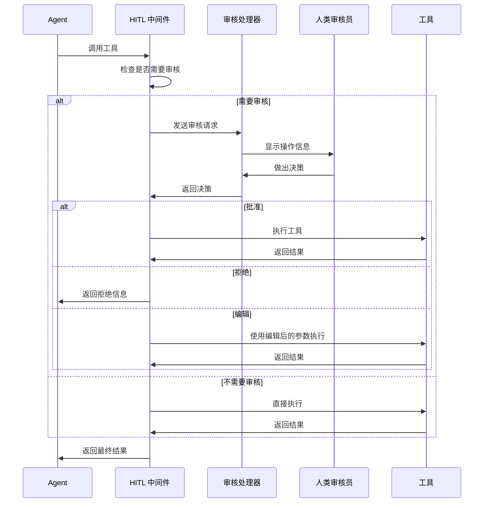

# Human-in-the-Loop (HITL) 中间件

人工在环（Human-in-the-Loop，简称 HITL）中间件允许在 Agent 执行敏感操作前进行人工审核、批准或修改，确保 AI 系统的安全性和可控性。

## 核心特性

- ✅ **灵活的审核配置** - 为不同工具设置不同的审核策略
- ✅ **三种决策类型** - 批准、拒绝、编辑参数
- ✅ **智能风险评估** - 支持自定义风险评估规则
- ✅ **批量审核** - 一次性审核多个操作
- ✅ **自定义审核处理器** - 支持命令行、Web UI、消息队列等多种审核方式

## 快速开始

### 基本配置

```go
import (
    "github.com/wordflowlab/agentsdk/pkg/middleware"
)

// 创建 HITL 中间件
hitlMW, err := middleware.NewHumanInTheLoopMiddleware(&middleware.HumanInTheLoopMiddlewareConfig{
    // 配置需要审核的工具
    InterruptOn: map[string]interface{}{
        "Bash":     true,  // Shell 命令需要审核
        "fs_delete":    true,  // 文件删除需要审核
        "HttpRequest": true,  // HTTP 请求需要审核
    },
    
    // 审核处理器
    ApprovalHandler: func(ctx context.Context, req *middleware.ReviewRequest) ([]middleware.Decision, error) {
        for _, action := range req.ActionRequests {
            fmt.Printf("工具: %s\n", action.ToolName)
            fmt.Printf("参数: %+v\n", action.Input)
            fmt.Print("批准? (y/n): ")
            
            var answer string
            fmt.Scanln(&answer)
            
            if answer == "y" {
                return []middleware.Decision{{
                    Type: middleware.DecisionApprove,
                }}, nil
            }
            return []middleware.Decision{{
                Type: middleware.DecisionReject,
            }}, nil
        }
        return nil, fmt.Errorf("no decision")
    },
})

// 注册到中间件栈
stack := middleware.NewStack()
stack.Use(hitlMW)
```

## 配置选项

### InterruptOn - 审核配置

支持三种配置方式：

#### 1. 布尔值（简单模式）

```go
InterruptOn: map[string]interface{}{
    "Bash": true,   // 启用默认审核
    "Read":  false,  // 不需要审核
}
```

#### 2. 详细配置

```go
InterruptOn: map[string]interface{}{
    "Write": map[string]interface{}{
        "message": "文件写入需要审核",
        "allowed_decisions": []string{"approve", "reject", "edit"},
    },
}
```

#### 3. InterruptConfig 结构体

```go
InterruptOn: map[string]interface{}{
    "database_update": &middleware.InterruptConfig{
        Enabled:          true,
        Message:          "数据库更新需要审核",
        AllowedDecisions: []middleware.DecisionType{
            middleware.DecisionApprove,
            middleware.DecisionReject,
        },
    },
}
```

### 决策类型

| 类型 | 说明 | 使用场景 |
|------|------|---------|
| `DecisionApprove` | 批准执行 | 操作安全，可以执行 |
| `DecisionReject` | 拒绝执行 | 操作不安全或不合理 |
| `DecisionEdit` | 编辑参数后执行 | 参数需要调整 |

### ApprovalHandler - 审核处理器

审核处理器负责获取人工决策，可以通过多种方式实现：

#### 命令行交互

```go
ApprovalHandler: func(ctx context.Context, req *middleware.ReviewRequest) ([]middleware.Decision, error) {
    action := req.ActionRequests[0]
    
    fmt.Printf("工具: %s\n参数: %+v\n", action.ToolName, action.Input)
    fmt.Print("选择 (approve/reject/edit): ")
    
    var choice string
    fmt.Scanln(&choice)
    
    switch choice {
    case "approve":
        return []middleware.Decision{{Type: middleware.DecisionApprove}}, nil
    case "reject":
        return []middleware.Decision{{Type: middleware.DecisionReject}}, nil
    case "edit":
        // 编辑参数...
        return []middleware.Decision{{
            Type:        middleware.DecisionEdit,
            EditedInput: editedParams,
        }}, nil
    }
    return nil, fmt.Errorf("invalid choice")
}
```

#### 基于风险的智能审核

```go
ApprovalHandler: func(ctx context.Context, req *middleware.ReviewRequest) ([]middleware.Decision, error) {
    action := req.ActionRequests[0]
    risk := assessRisk(action)
    
    switch risk {
    case RiskLow:
        // 低风险自动批准
        return []middleware.Decision{{Type: middleware.DecisionApprove}}, nil
        
    case RiskMedium:
        // 中风险需要确认
        return promptForConfirmation(action)
        
    case RiskHigh:
        // 高风险需要明确确认
        return promptForExplicitConfirmation(action)
    }
    
    return nil, nil
}
```

## 使用示例

### 示例 1: 保护敏感文件操作

```go
hitlMW, _ := middleware.NewHumanInTheLoopMiddleware(&middleware.HumanInTheLoopMiddlewareConfig{
    InterruptOn: map[string]interface{}{
        "fs_delete": map[string]interface{}{
            "message": "⚠️  文件删除操作需要审核",
            "allowed_decisions": []string{"approve", "reject"},
        },
        "Write": map[string]interface{}{
            "message": "📝 文件写入操作需要审核",
            "allowed_decisions": []string{"approve", "reject", "edit"},
        },
    },
    ApprovalHandler: fileOperationHandler,
})
```

### 示例 2: Shell 命令审核

```go
hitlMW, _ := middleware.NewHumanInTheLoopMiddleware(&middleware.HumanInTheLoopMiddlewareConfig{
    InterruptOn: map[string]interface{}{
        "Bash": true,
    },
    ApprovalHandler: func(ctx context.Context, req *middleware.ReviewRequest) ([]middleware.Decision, error) {
        action := req.ActionRequests[0]
        cmd := action.Input["command"].(string)
        
        // 检测危险命令
        if strings.Contains(cmd, "rm -rf") {
            fmt.Println("🚨 检测到危险命令！")
            fmt.Printf("命令: %s\n", cmd)
            fmt.Print("输入 'CONFIRM' 确认执行: ")
            
            var confirm string
            fmt.Scanln(&confirm)
            
            if confirm == "CONFIRM" {
                return []middleware.Decision{{Type: middleware.DecisionApprove}}, nil
            }
            return []middleware.Decision{{Type: middleware.DecisionReject}}, nil
        }
        
        // 普通命令简单确认
        fmt.Printf("命令: %s\n批准? (y/n): ", cmd)
        var answer string
        fmt.Scanln(&answer)
        
        if answer == "y" {
            return []middleware.Decision{{Type: middleware.DecisionApprove}}, nil
        }
        return []middleware.Decision{{Type: middleware.DecisionReject}}, nil
    },
})
```

### 示例 3: 参数编辑

```go
ApprovalHandler: func(ctx context.Context, req *middleware.ReviewRequest) ([]middleware.Decision, error) {
    action := req.ActionRequests[0]
    
    fmt.Printf("工具: %s\n", action.ToolName)
    fmt.Println("当前参数:")
    for key, value := range action.Input {
        fmt.Printf("  %s: %v\n", key, value)
    }
    
    fmt.Print("\n选择 (approve/reject/edit): ")
    var choice string
    fmt.Scanln(&choice)
    
    if choice == "edit" {
        editedInput := make(map[string]interface{})
        
        for key, value := range action.Input {
            fmt.Printf("编辑 %s (当前: %v, 回车保持): ", key, value)
            var newValue string
            fmt.Scanln(&newValue)
            
            if newValue != "" {
                editedInput[key] = newValue
            } else {
                editedInput[key] = value
            }
        }
        
        return []middleware.Decision{{
            Type:        middleware.DecisionEdit,
            EditedInput: editedInput,
            Reason:      "参数已编辑",
        }}, nil
    }
    
    // ... 处理其他选择
}
```

## API 参考

### HumanInTheLoopMiddlewareConfig

```go
type HumanInTheLoopMiddlewareConfig struct {
    // InterruptOn 配置哪些工具需要审核
    InterruptOn map[string]interface{}
    
    // ApprovalHandler 审核处理器
    ApprovalHandler ApprovalHandler
    
    // DefaultAllowedDecisions 默认允许的决策类型
    DefaultAllowedDecisions []DecisionType
}
```

### InterruptConfig

```go
type InterruptConfig struct {
    Enabled          bool           // 是否启用审核
    AllowedDecisions []DecisionType // 允许的决策类型
    Message          string         // 审核提示信息
}
```

### ReviewRequest

```go
type ReviewRequest struct {
    ActionRequests []ActionRequest   // 待审核的操作列表
    ReviewConfigs  []InterruptConfig // 每个操作的审核配置
}
```

### ActionRequest

```go
type ActionRequest struct {
    ToolCallID string                 // 工具调用 ID
    ToolName   string                 // 工具名称
    Input      map[string]interface{} // 工具输入参数
    Message    string                 // 审核提示信息
}
```

### Decision

```go
type Decision struct {
    Type        DecisionType           // 决策类型
    EditedInput map[string]interface{} // 编辑后的参数
    Reason      string                 // 决策理由
}
```

## 工作流程



## 最佳实践

### 1. 选择合适的工具进行审核

```go
// ✅ 推荐：只审核敏感操作
InterruptOn: map[string]interface{}{
    "Bash":     true,  // Shell 命令
    "fs_delete":    true,  // 文件删除
    "api_payment":  true,  // 付费 API
}

// ❌ 不推荐：审核所有操作（影响效率）
InterruptOn: map[string]interface{}{
    "Read":   true,  // 读取通常安全
    "calculate": true,  // 计算无副作用
}
```

### 2. 提供清晰的审核信息

```go
InterruptOn: map[string]interface{}{
    "email_send": map[string]interface{}{
        "message": `📧 邮件发送审核
请确认:
- 收件人地址是否正确
- 邮件内容是否合适`,
    },
}
```

### 3. 实现超时机制

```go
ApprovalHandler: func(ctx context.Context, req *middleware.ReviewRequest) ([]middleware.Decision, error) {
    ctx, cancel := context.WithTimeout(ctx, 5*time.Minute)
    defer cancel()
    
    select {
    case decision := <-getDecisionAsync(req):
        return []middleware.Decision{decision}, nil
    case <-ctx.Done():
        return nil, fmt.Errorf("审核超时")
    }
}
```

### 4. 记录审核日志

```go
func logApproval(action middleware.ActionRequest, decision middleware.Decision) {
    log := AuditLog{
        Timestamp: time.Now(),
        Tool:      action.ToolName,
        Input:     action.Input,
        Decision:  string(decision.Type),
        Reason:    decision.Reason,
    }
    saveToAuditLog(log)
}
```

## 与 System Prompt 配合

可以在 System Prompt 中告知 Agent HITL 机制：

```go
const HITL_SYSTEM_PROMPT = `## Human-in-the-Loop (HITL)

某些敏感操作需要人工批准才能执行。当你调用这些工具时:

1. 系统会暂停执行，等待人工审核
2. 人工审核员可以：批准、拒绝或编辑参数
3. 如果操作被拒绝，请尝试其他方法或向用户说明
4. 清楚解释为什么需要执行该操作
5. 不要重复尝试被拒绝的操作`

// 使用方式
config.SystemPrompt += "\n\n" + middleware.HITL_SYSTEM_PROMPT
```

## 性能考虑

- **优先级**: 50（较高优先级，及早拦截）
- **延迟**: 依赖人工响应时间，建议实现超时机制
- **资源消耗**: 低，主要是等待时间
- **并发**: 支持多个待审核请求

## 安全建议

1. **默认拒绝** - 无法获取决策时默认拒绝
2. **权限控制** - 基于角色控制审核权限
3. **审核日志** - 记录所有审核决策
4. **不可篡改** - 使用只追加日志

## 相关资源

- [HITL 完整指南](/guides/advanced/human-in-the-loop) - 详细教程和示例
- [HITL 示例代码](/examples/human-in-the-loop) - 完整可运行示例
- [中间件概览](/middleware) - 中间件系统架构
- [安全最佳实践](/best-practices/security) - Agent 安全指南

## 常见问题

### Q: HITL 会影响性能吗？

A: 是的，HITL 会引入延迟。建议只对敏感操作启用审核，并实现超时机制。

### Q: Agent 被拒绝后会怎样？

A: Agent 会收到拒绝信息，可以尝试其他方法或向用户说明情况。

### Q: 支持批量审核吗？

A: 支持。`ReviewRequest.ActionRequests` 可以包含多个待审核操作。

### Q: 如何实现 Web UI 审核？

A: 在 `ApprovalHandler` 中发送请求到 Web 服务，等待用户在浏览器中做出决策。参见 [完整指南](/guides/advanced/human-in-the-loop)。
