# 工作流 Agent

工作流 Agent 提供三种编排模式，用于构建复杂的多步骤、多分支 AI 任务流程。基于 Google ADK-Go 的设计，使用 Go 1.23 的 `iter.Seq2` 实现高效的流式处理。

## 🎯 三种工作流模式

### SequentialAgent - 顺序执行

按顺序依次执行多个子 Agent，适合流水线式处理。

**使用场景**:
- 数据处理流水线（收集 → 分析 → 报告）
- 多阶段任务（需求分析 → 方案设计 → 代码实现）
- 串行工作流（前一步的输出作为后一步的输入）

### ParallelAgent - 并行执行

同时执行多个子 Agent，收集所有结果。

**使用场景**:
- 多方案比较（算法A vs 算法B vs 算法C）
- 并行数据收集（同时从多个数据源获取）
- 候选生成（生成多个候选方案供选择）

### LoopAgent - 循环优化

重复执行子 Agent 直到满足终止条件。

**使用场景**:
- 迭代优化（代码质量提升循环）
- 多轮对话（直到用户满意）
- 任务重试（失败重试直到成功或达到上限）

## 📝 快速开始

### 1. SequentialAgent 示例

```go
package main

import (
    "context"
    "fmt"

    "github.com/wordflowlab/agentsdk/pkg/agent/workflow"
)

func main() {
    // 创建子 Agent
    collector := NewDataCollectorAgent()
    analyzer := NewAnalyzerAgent()
    reporter := NewReporterAgent()

    // 创建顺序工作流
    sequential, err := workflow.NewSequentialAgent(workflow.SequentialConfig{
        Name: "DataPipeline",
        SubAgents: []workflow.Agent{
            collector,  // 步骤1: 收集数据
            analyzer,   // 步骤2: 分析数据
            reporter,   // 步骤3: 生成报告
        },
    })
    if err != nil {
        panic(err)
    }

    // 执行工作流
    for event, err := range sequential.Execute(context.Background(), "处理用户数据") {
        if err != nil {
            fmt.Printf("错误: %v\n", err)
            break
        }

        fmt.Printf("步骤 %d/%d: %s\n",
            event.Metadata["sequential_step"],
            event.Metadata["total_steps"],
            event.Content.Content)
    }
}
```

### 2. ParallelAgent 示例

```go
package main

import (
    "context"
    "fmt"

    "github.com/wordflowlab/agentsdk/pkg/agent/workflow"
)

func main() {
    // 创建多个算法 Agent
    algorithmA := NewAlgorithmAgent("FastAlgorithm")
    algorithmB := NewAlgorithmAgent("AccurateAlgorithm")
    algorithmC := NewAlgorithmAgent("BalancedAlgorithm")

    // 创建并行工作流
    parallel, err := workflow.NewParallelAgent(workflow.ParallelConfig{
        Name: "MultiAlgorithm",
        SubAgents: []workflow.Agent{
            algorithmA,  // 方案A: 快速但粗糙
            algorithmB,  // 方案B: 慢但精确
            algorithmC,  // 方案C: 平衡
        },
    })
    if err != nil {
        panic(err)
    }

    // 并发执行，收集所有结果
    results := []string{}
    for event, err := range parallel.Execute(context.Background(), "求解优化问题") {
        if err != nil {
            fmt.Printf("Agent %s 错误: %v\n", event.AgentID, err)
            continue
        }

        fmt.Printf("方案 %s 结果: %s\n",
            event.AgentID,
            event.Content.Content)
        results = append(results, event.Content.Content)
    }

    fmt.Printf("收到 %d 个并行结果\n", len(results))
}
```

### 3. LoopAgent 示例

```go
package main

import (
    "context"
    "fmt"

    "github.com/wordflowlab/agentsdk/pkg/agent/workflow"
    "github.com/wordflowlab/agentsdk/pkg/session"
)

func main() {
    // 创建优化流程的子 Agent
    critic := NewCriticAgent()   // 评估当前方案
    improver := NewImproverAgent() // 提出改进建议

    // 创建循环工作流（最多5次迭代）
    loop, err := workflow.NewLoopAgent(workflow.LoopConfig{
        Name:          "OptimizationLoop",
        SubAgents:     []workflow.Agent{critic, improver},
        MaxIterations: 5,
        StopCondition: func(event *session.Event) bool {
            // 质量达到90分时停止
            if score, ok := event.Metadata["quality_score"].(int); ok {
                return score >= 90
            }
            return false
        },
    })
    if err != nil {
        panic(err)
    }

    // 执行循环优化
    iteration := 0
    for event, err := range loop.Execute(context.Background(), "优化代码质量") {
        if err != nil {
            fmt.Printf("错误: %v\n", err)
            break
        }

        // 追踪迭代次数
        if iterNum, ok := event.Metadata["loop_iteration"].(uint); ok {
            if uint(iteration) != iterNum {
                iteration = int(iterNum)
                fmt.Printf("\n=== 迭代 %d ===\n", iteration)
            }
        }

        fmt.Printf("[%s] %s\n", event.AgentID, event.Content.Content)

        // 显示质量分数
        if score, ok := event.Metadata["quality_score"].(int); ok {
            fmt.Printf("质量分数: %d/100\n", score)
        }
    }
}
```

## 🌳 嵌套工作流

工作流 Agent 可以嵌套使用，构建复杂的多层级任务编排：

```go
package main

import (
    "context"
    "github.com/wordflowlab/agentsdk/pkg/agent/workflow"
)

func main() {
    // 第一层：并行收集多个数据源
    dataCollectors := []workflow.Agent{
        NewDataSourceAgent("Source1"),
        NewDataSourceAgent("Source2"),
        NewDataSourceAgent("Source3"),
    }
    parallelCollector, _ := workflow.NewParallelAgent(workflow.ParallelConfig{
        Name:      "ParallelCollector",
        SubAgents: dataCollectors,
    })

    // 第二层：分析数据
    analyzer := NewAnalyzerAgent()

    // 第三层：生成报告
    reporter := NewReporterAgent()

    // 组合成顺序工作流（包含嵌套的并行流程）
    nestedWorkflow, err := workflow.NewSequentialAgent(workflow.SequentialConfig{
        Name: "NestedWorkflow",
        SubAgents: []workflow.Agent{
            parallelCollector, // 步骤1: 并行收集数据
            analyzer,          // 步骤2: 串行分析
            reporter,          // 步骤3: 串行报告
        },
    })
    if err != nil {
        panic(err)
    }

    // 执行嵌套工作流
    for event, err := range nestedWorkflow.Execute(context.Background(), "综合数据分析") {
        if err != nil {
            break
        }

        // 通过 Branch 字段追踪事件来源
        fmt.Printf("[%s] %s\n", event.Branch, event.Content.Content)
    }
}
```

**执行流程**:
```
NestedWorkflow
├── ParallelCollector (并行)
│   ├── Source1 ───┐
│   ├── Source2 ───┼─→ 同时执行
│   └── Source3 ───┘
├── Analyzer (串行) → 等待 ParallelCollector 完成
└── Reporter (串行) → 等待 Analyzer 完成
```

## 📊 工作流执行对比

不同工作流模式的执行时序对比：

```mermaid
gantt
    title 工作流执行对比
    dateFormat X
    axisFormat %s

    section SequentialAgent
    SubAgent A :0, 3
    SubAgent B :3, 6
    SubAgent C :6, 9

    section ParallelAgent
    SubAgent A :0, 3
    SubAgent B :0, 4
    SubAgent C :0, 2

    section LoopAgent
    Iteration 1 Critic :0, 1
    Iteration 1 Improver :1, 2
    Iteration 2 Critic :2, 3
    Iteration 2 Improver :3, 4
    Iteration 3 Critic :4, 5
```



**性能分析**:
- **SequentialAgent**: 总时间 = Sum(子Agent耗时) = 9s
- **ParallelAgent**: 总时间 = Max(子Agent耗时) = 4s (最快的并行优势)
- **LoopAgent**: 总时间 = 迭代次数 × Sum(子Agent耗时) = 5s (3次迭代)

## 🔧 高级功能

### 1. 自定义 Agent 实现

实现 `workflow.Agent` 接口即可集成到工作流中：

```go
package main

import (
    "context"
    "fmt"
    "iter"
    "time"

    "github.com/wordflowlab/agentsdk/pkg/session"
    "github.com/wordflowlab/agentsdk/pkg/types"
)

// 自定义 Agent
type CustomAgent struct {
    name string
}

func NewCustomAgent(name string) *CustomAgent {
    return &CustomAgent{name: name}
}

// 实现 Name() 方法
func (a *CustomAgent) Name() string {
    return a.name
}

// 实现 Execute() 方法
func (a *CustomAgent) Execute(ctx context.Context, message string) iter.Seq2[*session.Event, error] {
    return func(yield func(*session.Event, error) bool) {
        // 模拟处理
        time.Sleep(100 * time.Millisecond)

        // 生成事件
        event := &session.Event{
            ID:        fmt.Sprintf("evt-%s-%d", a.name, time.Now().UnixNano()),
            Timestamp: time.Now(),
            AgentID:   a.name,
            Author:    "agent",
            Content: types.Message{
                Role:    types.RoleAssistant,
                Content: fmt.Sprintf("[%s] 处理: %s", a.name, message),
            },
            Metadata: map[string]interface{}{
                "custom_field": "custom_value",
            },
        }

        // 传递事件
        if !yield(event, nil) {
            return // 客户端取消
        }

        // 检查上下文取消
        if ctx.Err() != nil {
            yield(nil, ctx.Err())
        }
    }
}
```

### 2. 动态停止条件

LoopAgent 支持灵活的停止条件：

```go
// 方式1: 基于质量分数
StopCondition: func(event *session.Event) bool {
    return event.Metadata["quality_score"].(int) >= 90
}

// 方式2: 基于错误检测
StopCondition: func(event *session.Event) bool {
    return event.Metadata["error_count"].(int) == 0
}

// 方式3: 基于 Escalate 标志
StopCondition: func(event *session.Event) bool {
    return event.Actions.Escalate
}

// 方式4: 组合条件
StopCondition: func(event *session.Event) bool {
    score := event.Metadata["quality_score"].(int)
    attempts := event.Metadata["attempts"].(int)

    // 质量达标或尝试次数过多
    return score >= 90 || attempts >= 10
}
```

### 3. 事件元数据

工作流 Agent 会自动添加丰富的元数据：

```go
for event, err := range sequential.Execute(ctx, "任务") {
    // SequentialAgent 元数据
    step := event.Metadata["sequential_step"].(int)      // 当前步骤 (1-based)
    total := event.Metadata["total_steps"].(int)         // 总步骤数
    agentName := event.Metadata["sequential_agent"].(string) // Agent名称

    // ParallelAgent 元数据
    index := event.Metadata["parallel_index"].(int)      // 子Agent索引
    parallelName := event.Metadata["parallel_agent"].(string) // Agent名称

    // LoopAgent 元数据
    iteration := event.Metadata["loop_iteration"].(uint) // 当前迭代 (0-based)
    loopName := event.Metadata["loop_agent"].(string)    // Agent名称
    subIndex := event.Metadata["sub_agent_index"].(int)  // 子Agent索引

    // Branch 字段
    branch := event.Branch // 例如: "Pipeline.Analyzer.iter1"
}
```

## 📊 完整示例

完整可运行的示例代码：[examples/workflow-agents](https://github.com/wordflowlab/agentsdk/tree/main/examples/workflow-agents)

```bash
# 运行示例
cd examples/workflow-agents
go run main.go
```

**输出示例**:
```
=== 工作流 Agent 演示 ===

📝 示例 1: SequentialAgent - 多步骤流水线
开始顺序执行:
  ✓ [DataCollector] 收集数据 - 处理: 处理用户数据
    步骤: 1/3
  ✓ [Analyzer] 分析数据 - 处理: 处理用户数据
    步骤: 2/3
  ✓ [Reporter] 生成报告 - 处理: 处理用户数据
    步骤: 3/3

⚡ 示例 2: ParallelAgent - 并行比较方案
开始并行执行:
  ✓ [AlgorithmA] 方案A：快速但粗糙 - 处理: 求解问题
    并行索引: 0
  ✓ [AlgorithmB] 方案B：慢但精确 - 处理: 求解问题
    并行索引: 1
  ✓ [AlgorithmC] 方案C：平衡 - 处理: 求解问题
    并行索引: 2
收到 3 个并行结果

🔄 示例 3: LoopAgent - 迭代优化
开始循环优化:

--- 迭代 1 ---
  ✓ [Critic] 评估当前方案 - 处理: 优化代码质量
    迭代: 1
    质量分数: 85/100
  ✓ [Improver] 提出改进建议 - 处理: 优化代码质量
    迭代: 1

--- 迭代 2 ---
  ✓ [Critic] 评估当前方案 - 处理: 优化代码质量
    迭代: 2
    质量分数: 91/100  ← 达到90分，停止循环
```

## 🎓 最佳实践

### 1. 选择合适的工作流模式

| 场景 | 推荐模式 | 原因 |
|------|---------|------|
| 数据处理流水线 | SequentialAgent | 步骤间有依赖关系 |
| 多方案比较 | ParallelAgent | 需要同时评估多个选项 |
| 质量优化循环 | LoopAgent | 需要迭代改进 |
| 数据聚合 | Parallel → Sequential | 先并行收集，再串行汇总 |
| 多轮改进 | Sequential + Loop | 顺序执行多个优化循环 |

### 2. 性能优化

```go
// ✅ 推荐：使用 iter.Seq2 流式处理
for event, err := range workflow.Execute(ctx, msg) {
    // 实时处理事件，内存占用 O(1)
}

// ❌ 避免：收集所有结果再处理
var results []Event
for event, _ := range workflow.Execute(ctx, msg) {
    results = append(results, event)  // 内存占用 O(n)
}
```

### 3. 错误处理

```go
for event, err := range sequential.Execute(ctx, "任务") {
    if err != nil {
        // 记录错误
        log.Printf("Agent %s 错误: %v", event.AgentID, err)

        // 根据业务决定是否继续
        if isCriticalError(err) {
            break  // 中断工作流
        }
        continue  // 继续处理下一个事件
    }

    // 处理正常事件
    handleEvent(event)
}
```

### 4. 上下文取消

```go
// 设置超时
ctx, cancel := context.WithTimeout(context.Background(), 5*time.Minute)
defer cancel()

// 执行工作流
for event, err := range workflow.Execute(ctx, "任务") {
    if ctx.Err() != nil {
        fmt.Println("工作流被取消或超时")
        break
    }

    // 处理事件
}
```

## 🔗 相关资源

- [工作流 Agent 源码](https://github.com/wordflowlab/agentsdk/tree/main/pkg/agent/workflow)
- [完整示例代码](https://github.com/wordflowlab/agentsdk/tree/main/examples/workflow-agents)
- [Google ADK-Go 参考](https://github.com/googleapis/adk-go)
- [Go 1.23 iter.Seq2 文档](https://pkg.go.dev/iter)

## ❓ 常见问题

### Q1: SequentialAgent 和 LoopAgent(MaxIterations=1) 有什么区别？

A: 它们功能相同。SequentialAgent 实际上就是内部使用 LoopAgent(MaxIterations=1) 实现的。

### Q2: ParallelAgent 的子 Agent 执行顺序是什么？

A: 所有子 Agent 同时启动，但事件返回顺序不确定（取决于哪个 Agent 先完成）。如果需要确定顺序，使用 SequentialAgent。

### Q3: LoopAgent 如何避免无限循环？

A: 必须设置 `MaxIterations` 或 `StopCondition` 之一。建议同时设置两者：
```go
MaxIterations: 10,  // 最多10次迭代
StopCondition: func(event *session.Event) bool {
    return event.Metadata["success"].(bool)  // 或提前停止
}
```

### Q4: 如何调试嵌套工作流？

A: 使用 `event.Branch` 字段追踪事件来源：
```go
for event, _ := range nestedWorkflow.Execute(ctx, msg) {
    // Branch 示例: "Pipeline.ParallelCollector.Source1"
    fmt.Printf("[%s] %s\n", event.Branch, event.Content.Content)
}
```

### Q5: 工作流 Agent 是否支持持久化？

A: 是的，事件可以通过 Session 系统持久化到 PostgreSQL 或 MySQL。参见 [Session 持久化文档](/examples/session)。

## 🚀 下一步

- [Session 持久化](/examples/session) - 将工作流状态持久化到数据库
- [OpenTelemetry 集成](/best-practices/monitoring) - 追踪工作流执行链路
- [多 Agent 协作](/examples/multi-agent) - 构建更复杂的 Agent 系统
- [最佳实践](/best-practices) - 生产环境部署建议
