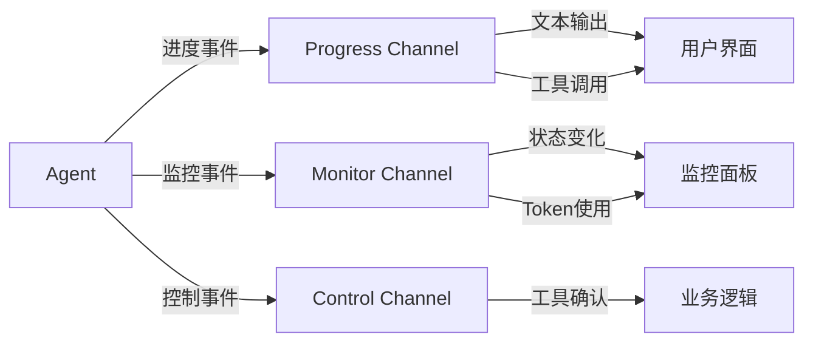

# 基础 Agent 示例

本示例展示如何创建一个完整的 Agent，包括：
- 🔧 依赖注入与配置
- 📡 事件订阅与处理
- 💬 与 Agent 对话
- 🛠️ 使用内置工具（文件系统、Bash）

## 📋 完整代码

[查看完整代码 →](https://github.com/wordflowlab/agentsdk/blob/main/examples/agent/main.go)

## 🎯 核心步骤

### 1. 准备依赖

创建 Agent 需要以下核心依赖：

```go
// 1. 创建工具注册表并注册内置工具
toolRegistry := tools.NewRegistry()
builtin.RegisterAll(toolRegistry)

// 2. 创建Sandbox工厂
sandboxFactory := sandbox.NewFactory()

// 3. 创建Provider工厂
providerFactory := &provider.AnthropicFactory{}

// 4. 创建Store
storePath := ".agentsdk"
jsonStore, err := store.NewJSONStore(storePath)
if err != nil {
    log.Fatalf("Failed to create store: %v", err)
}

// 5. 创建模板注册表
templateRegistry := agent.NewTemplateRegistry()
```

**关键点**：
- `ToolRegistry` - 管理所有可用工具
- `SandboxFactory` - 创建沙箱实例
- `ProviderFactory` - 创建 LLM Provider
- `Store` - 持久化存储消息和状态
- `TemplateRegistry` - 管理 Agent 模板

### 2. 注册 Agent 模板

定义 Agent 的行为和能力：

```go
templateRegistry.Register(&types.AgentTemplateDefinition{
    ID:   "simple-assistant",
    Model: "claude-sonnet-4-5",
    SystemPrompt: "You are a helpful assistant that can read and write files. When users ask you to read or write files, use the available tools.",
    Tools: []interface{}{"Read", "Write", "Bash"},
})
```

**模板字段说明**：
- `ID` - 模板唯一标识
- `Model` - 使用的模型名称
- `SystemPrompt` - 系统提示词，定义 Agent 角色
- `Tools` - 可用工具列表

### 3. 创建依赖对象

将所有依赖组装到一起：

```go
deps := &agent.Dependencies{
    Store:            jsonStore,
    SandboxFactory:   sandboxFactory,
    ToolRegistry:     toolRegistry,
    ProviderFactory:  providerFactory,
    TemplateRegistry: templateRegistry,
}
```

### 4. 配置 Agent

```go
config := &types.AgentConfig{
    TemplateID: "simple-assistant",
    ModelConfig: &types.ModelConfig{
        Provider: "anthropic",
        Model:    "claude-sonnet-4-5",
        APIKey:   os.Getenv("ANTHROPIC_API_KEY"),
    },
    Sandbox: &types.SandboxConfig{
        Kind:    types.SandboxKindLocal,
        WorkDir: "./workspace",
    },
}
```

**配置说明**：
- `TemplateID` - 使用的模板 ID
- `ModelConfig` - LLM 配置（Provider、模型、API Key）
- `Sandbox` - 沙箱配置（类型、工作目录）

### 5. 创建 Agent

```go
ag, err := agent.Create(ctx, config, deps)
if err != nil {
    log.Fatalf("Failed to create agent: %v", err)
}
defer ag.Close()

fmt.Printf("Agent created: %s\n", ag.ID())
```

### 6. 订阅事件

监听 Agent 的实时进度和状态变化：

```go
eventCh := ag.Subscribe([]types.AgentChannel{
    types.ChannelProgress,  // 进度事件（文本输出、工具调用等）
    types.ChannelMonitor,   // 监控事件（状态变化、Token使用等）
}, nil)

// 启动事件监听
go func() {
    for envelope := range eventCh {
        if evt, ok := envelope.Event.(types.EventType); ok {
            switch evt.Channel() {
            case types.ChannelProgress:
                handleProgressEvent(envelope.Event)
            case types.ChannelMonitor:
                handleMonitorEvent(envelope.Event)
            }
        }
    }
}()
```

### 7. 与 Agent 对话

发送消息并获取响应：

```go
// 测试1: 创建文件
result, err := ag.Chat(ctx, "Please create a file called test.txt with content 'Hello World'")
if err != nil {
    log.Fatalf("Chat failed: %v", err)
}
fmt.Printf("Assistant: %s\n", result.Text)

// 测试2: 读取文件
result, err = ag.Chat(ctx, "Please read the test.txt file")
if err != nil {
    log.Fatalf("Chat failed: %v", err)
}
fmt.Printf("Assistant: %s\n", result.Text)

// 测试3: 执行命令
result, err = ag.Chat(ctx, "Please run 'ls -la' command")
if err != nil {
    log.Fatalf("Chat failed: %v", err)
}
fmt.Printf("Assistant: %s\n", result.Text)
```

### 8. 处理事件

根据不同事件类型执行相应逻辑：

```go
func handleProgressEvent(event interface{}) {
    switch e := event.(type) {
    case *types.ProgressTextChunkEvent:
        fmt.Print(e.Delta)  // 流式输出文本
    case *types.ProgressToolStartEvent:
        fmt.Printf("\n[Tool Start] %s\n", e.Call.Name)
    case *types.ProgressToolEndEvent:
        fmt.Printf("[Tool End] %s - State: %s\n", e.Call.Name, e.Call.State)
    case *types.ProgressDoneEvent:
        fmt.Printf("\n[Done] Step %d\n", e.Step)
    }
}

func handleMonitorEvent(event interface{}) {
    switch e := event.(type) {
    case *types.MonitorStateChangedEvent:
        fmt.Printf("[State] %s\n", e.State)
    case *types.MonitorTokenUsageEvent:
        fmt.Printf("[Tokens] Input: %d, Output: %d\n",
            e.InputTokens, e.OutputTokens)
    }
}
```

## 🚀 运行示例

### 1. 设置环境变量

```bash
export ANTHROPIC_API_KEY=sk-ant-xxxxx
```

### 2. 运行程序

```bash
cd examples/agent
go run main.go
```

### 3. 预期输出

```
Agent created: agt-xxxxxx

--- Test 1: Create a test file ---
[Assistant] I'll create a file called test.txt with the content 'Hello World'.

[Tool Start] Write (ID: toolu_xxxxx)
[Tool End] Write - State: success

The file has been created successfully.

--- Test 2: Read the file back ---
[Assistant] I'll read the test.txt file.

[Tool Start] Read (ID: toolu_xxxxx)
[Tool End] Read - State: success

The content of test.txt is: Hello World

--- Test 3: Run a bash command ---
[Assistant] I'll run the 'ls -la' command.

[Tool Start] Bash (ID: toolu_xxxxx)
[Tool End] Bash - State: success

Here are the files in the directory:
...

Final Status:
  Agent ID: agt-xxxxxx
  State: idle
  Steps: 3
  Cursor: 42
```

## 💡 关键概念解析

### 依赖注入模式

AgentSDK 使用依赖注入来保持灵活性：

```go
type Dependencies struct {
    Store            store.Store              // 可替换存储
    SandboxFactory   sandbox.Factory          // 可替换沙箱
    ToolRegistry     tools.Registry           // 可扩展工具
    ProviderFactory  provider.Factory         // 可替换 LLM
    TemplateRegistry *agent.TemplateRegistry  // 可定制模板
}
```

**优势**：
- ✅ 易于测试（可注入 Mock 对象）
- ✅ 易于扩展（注册自定义实现）
- ✅ 配置灵活（生产/开发环境切换）

### 事件驱动架构

Agent 通过事件通道传递实时信息：



**事件类型**：

| 通道 | 事件类型 | 用途 |
|------|---------|------|
| Progress | TextChunkEvent | 流式文本输出 |
| Progress | ToolStartEvent | 工具调用开始 |
| Progress | ToolEndEvent | 工具调用结束 |
| Progress | DoneEvent | 步骤完成 |
| Monitor | StateChangedEvent | 状态变化 |
| Monitor | TokenUsageEvent | Token 使用统计 |
| Control | ToolApprovalEvent | 工具调用确认请求 |

### Agent 生命周期

```go
// 创建
ag, err := agent.Create(ctx, config, deps)

// 使用
result, err := ag.Chat(ctx, "消息")

// 暂停
ag.Pause()

// 恢复
ag.Resume()

// 关闭
ag.Close()
```

## 📚 相关文档

- [Agent 生命周期](/core-concepts/agent-lifecycle) - 深入理解 Agent 状态机
- [事件系统](/core-concepts/events) - 事件驱动架构详解
- [工具系统](/examples/tools) - 使用和扩展工具
- [沙箱执行](/core-concepts/sandbox) - 安全执行环境

## 🔗 扩展阅读

- [自定义工具](/examples/tools/custom) - 创建业务专用工具
- [中间件](/examples/middleware) - 添加洋葱模型中间件
- [多 Agent 协作](/examples/multi-agent) - Agent Pool 和 Scheduler

## ❓ 常见问题

### Q: 如何切换不同的 LLM Provider？

修改 `ModelConfig` 即可：

```go
config := &types.AgentConfig{
    ModelConfig: &types.ModelConfig{
        Provider: "openai",  // 改为 openai
        Model:    "gpt-4o",
        APIKey:   os.Getenv("OPENAI_API_KEY"),
    },
}
```

### Q: 如何使用云端沙箱？

修改 `SandboxConfig`：

```go
config := &types.AgentConfig{
    Sandbox: &types.SandboxConfig{
        Kind: types.SandboxKindAgentBay,  // 阿里云
        Config: map[string]interface{}{
            "accessKeyID":     os.Getenv("ALIYUN_ACCESS_KEY_ID"),
            "accessKeySecret": os.Getenv("ALIYUN_ACCESS_KEY_SECRET"),
            "endpoint":        os.Getenv("AGENTBAY_ENDPOINT"),
        },
    },
}
```

### Q: 如何持久化对话历史？

AgentSDK 自动通过 `Store` 持久化：

```go
// 创建时会加载历史消息
ag, err := agent.Create(ctx, config, deps)

// 每次 Chat 后自动保存
result, err := ag.Chat(ctx, "消息")

// 下次创建相同 AgentID 的 Agent 时会恢复历史
```

## 🎓 下一步

- [内置工具示例](/examples/tools/builtin) - 探索文件系统、HTTP、搜索等工具
- [MCP 工具集成](/examples/tools/mcp) - 连接外部 MCP 服务器
- [流式输出处理](/guides/streaming) - 实现打字机效果
