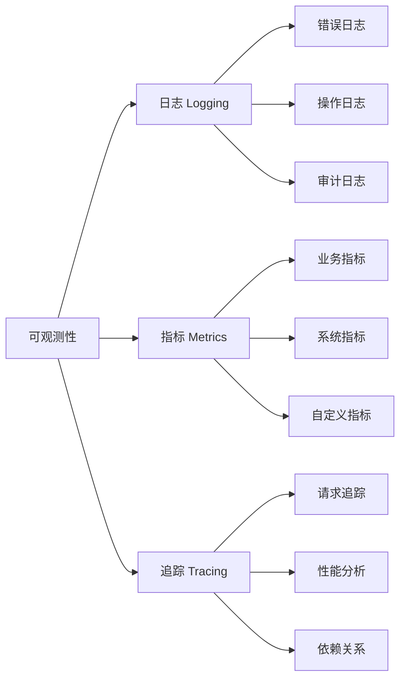
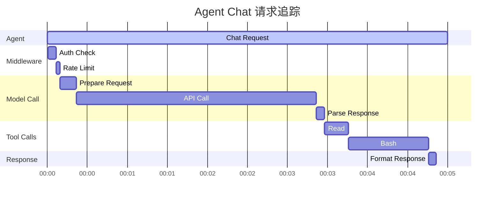

# 监控运维最佳实践

完善的监控系统是生产环境稳定运行的基础。

## 🎯 可观测性三支柱



## 📝 日志记录

### 结构化日志

```go
// ✅ 使用结构化日志库 (如 zap, logrus)
import "go.uber.org/zap"

// 初始化日志
func initLogger() *zap.Logger {
    config := zap.NewProductionConfig()
    config.OutputPaths = []string{"stdout", "/var/log/agent/app.log"}
    config.ErrorOutputPaths = []string{"stderr", "/var/log/agent/error.log"}

    logger, _ := config.Build()
    return logger
}

var logger = initLogger()

// 使用结构化字段
logger.Info("Agent created",
    zap.String("agent_id", agentID),
    zap.String("template_id", templateID),
    zap.String("user_id", userID),
    zap.Duration("init_time", initDuration),
)

logger.Error("Tool execution failed",
    zap.String("agent_id", agentID),
    zap.String("tool_name", toolName),
    zap.Error(err),
    zap.Any("input", toolInput),
)

// ❌ 非结构化日志
log.Printf("Agent %s created by user %s", agentID, userID)  // 难以解析
```

### 日志级别

```go
// 日志级别使用规范
type LogLevel int

const (
    DEBUG LogLevel = iota  // 调试信息，仅开发环境
    INFO                   // 重要事件，正常运行
    WARN                   // 警告，潜在问题
    ERROR                  // 错误，需要关注
    FATAL                  // 致命错误，程序退出
)

// 示例
func (ag *Agent) Chat(ctx context.Context, message string) (*types.ModelResponse, error) {
    // DEBUG - 详细的执行信息
    logger.Debug("Processing chat request",
        zap.String("agent_id", ag.ID()),
        zap.String("message", message[:min(50, len(message))]),
    )

    // INFO - 重要的业务事件
    logger.Info("Chat started",
        zap.String("agent_id", ag.ID()),
        zap.Int("message_count", ag.MessageCount()),
    )

    // WARN - 潜在问题
    if ag.TokenUsage() > 0.8*ag.TokenLimit() {
        logger.Warn("Token usage approaching limit",
            zap.String("agent_id", ag.ID()),
            zap.Int("used", ag.TokenUsage()),
            zap.Int("limit", ag.TokenLimit()),
        )
    }

    // ERROR - 需要处理的错误
    result, err := ag.callModel(ctx, message)
    if err != nil {
        logger.Error("Model call failed",
            zap.String("agent_id", ag.ID()),
            zap.Error(err),
        )
        return nil, err
    }

    return result, nil
}
```

### 日志上下文

```go
// ✅ 添加请求追踪 ID
type contextKey string

const (
    requestIDKey contextKey = "request_id"
    userIDKey    contextKey = "user_id"
    tenantIDKey  contextKey = "tenant_id"
)

// 生成请求 ID
func withRequestID(ctx context.Context) context.Context {
    requestID := uuid.New().String()
    return context.WithValue(ctx, requestIDKey, requestID)
}

// 从上下文中提取字段
func logWithContext(ctx context.Context, msg string, fields ...zap.Field) {
    contextFields := []zap.Field{
        zap.String("request_id", getRequestID(ctx)),
        zap.String("user_id", getUserID(ctx)),
        zap.String("tenant_id", getTenantID(ctx)),
    }
    allFields := append(contextFields, fields...)
    logger.Info(msg, allFields...)
}

// 使用
func handleRequest(ctx context.Context) {
    ctx = withRequestID(ctx)

    logWithContext(ctx, "Request started")
    // 所有日志自动包含 request_id, user_id, tenant_id
}
```

### 日志采样

```go
// ✅ 高频日志采样，避免日志洪水
import "go.uber.org/zap/zapcore"

// 配置采样日志
func newSampledLogger() *zap.Logger {
    config := zap.NewProductionConfig()

    // 每秒记录前 100 条，之后每 100 条记录 1 条
    config.Sampling = &zap.SamplingConfig{
        Initial:    100,
        Thereafter: 100,
    }

    logger, _ := config.Build()
    return logger
}

// 高频操作使用采样日志
sampledLogger := newSampledLogger()

for i := 0; i < 10000; i++ {
    sampledLogger.Debug("Tool call",  // 不会记录全部 10000 条
        zap.Int("index", i),
    )
}
```

## 📊 指标收集

### 核心指标

```go
// 指标类型
type MetricsCollector struct {
    // Counter - 计数器，只增不减
    agentCreated      prometheus.Counter
    toolCallsTotal    *prometheus.CounterVec
    errorsTotal       *prometheus.CounterVec

    // Gauge - 仪表盘，可增可减
    activeAgents      prometheus.Gauge
    poolSize          prometheus.Gauge
    memoryUsage       prometheus.Gauge

    // Histogram - 直方图，记录分布
    chatLatency       *prometheus.HistogramVec
    toolCallLatency   *prometheus.HistogramVec
    tokenUsage        *prometheus.HistogramVec

    // Summary - 摘要，计算百分位数
    requestDuration   *prometheus.SummaryVec
}

// 初始化指标
func NewMetricsCollector() *MetricsCollector {
    m := &MetricsCollector{
        // Counter
        agentCreated: prometheus.NewCounter(prometheus.CounterOpts{
            Name: "agent_created_total",
            Help: "Total number of agents created",
        }),

        toolCallsTotal: prometheus.NewCounterVec(
            prometheus.CounterOpts{
                Name: "agent_tool_calls_total",
                Help: "Total number of tool calls",
            },
            []string{"tool_name", "status"},  // Labels
        ),

        errorsTotal: prometheus.NewCounterVec(
            prometheus.CounterOpts{
                Name: "agent_errors_total",
                Help: "Total number of errors",
            },
            []string{"error_type", "agent_id"},
        ),

        // Gauge
        activeAgents: prometheus.NewGauge(prometheus.GaugeOpts{
            Name: "agent_active_count",
            Help: "Number of active agents",
        }),

        poolSize: prometheus.NewGauge(prometheus.GaugeOpts{
            Name: "agent_pool_size",
            Help: "Current size of agent pool",
        }),

        // Histogram
        chatLatency: prometheus.NewHistogramVec(
            prometheus.HistogramOpts{
                Name:    "agent_chat_latency_seconds",
                Help:    "Chat request latency",
                Buckets: []float64{0.1, 0.5, 1, 2, 5, 10, 30},  // 秒
            },
            []string{"agent_id", "template_id"},
        ),

        tokenUsage: prometheus.NewHistogramVec(
            prometheus.HistogramOpts{
                Name:    "agent_token_usage",
                Help:    "Token usage per request",
                Buckets: []float64{100, 500, 1000, 5000, 10000, 50000},
            },
            []string{"type"},  // input/output
        ),
    }

    // 注册所有指标
    prometheus.MustRegister(
        m.agentCreated,
        m.toolCallsTotal,
        m.errorsTotal,
        m.activeAgents,
        m.poolSize,
        m.chatLatency,
        m.tokenUsage,
    )

    return m
}

// 记录指标
func (m *MetricsCollector) RecordAgentCreated() {
    m.agentCreated.Inc()
    m.activeAgents.Inc()
}

func (m *MetricsCollector) RecordAgentClosed() {
    m.activeAgents.Dec()
}

func (m *MetricsCollector) RecordToolCall(toolName string, success bool, duration time.Duration) {
    status := "success"
    if !success {
        status = "failed"
    }
    m.toolCallsTotal.WithLabelValues(toolName, status).Inc()
}

func (m *MetricsCollector) RecordChatLatency(agentID, templateID string, duration time.Duration) {
    m.chatLatency.WithLabelValues(agentID, templateID).Observe(duration.Seconds())
}

func (m *MetricsCollector) RecordTokenUsage(inputTokens, outputTokens int) {
    m.tokenUsage.WithLabelValues("input").Observe(float64(inputTokens))
    m.tokenUsage.WithLabelValues("output").Observe(float64(outputTokens))
}
```

### 业务指标

```go
// 业务指标示例
type BusinessMetrics struct {
    // 用户活跃度
    dailyActiveUsers  prometheus.Gauge
    monthlyActiveUsers prometheus.Gauge

    // 成本指标
    dailyCost         prometheus.Counter
    costPerUser       *prometheus.GaugeVec

    // 质量指标
    successRate       *prometheus.GaugeVec
    avgResponseTime   *prometheus.GaugeVec

    // 容量指标
    concurrentUsers   prometheus.Gauge
    queueLength       prometheus.Gauge
}

// 记录业务指标
func recordBusinessMetrics(ag *agent.Agent, result *types.ModelResponse) {
    // 成本
    cost := calculateCost(result.InputTokens, result.OutputTokens)
    businessMetrics.dailyCost.Add(cost)

    userID := ag.UserID()
    businessMetrics.costPerUser.WithLabelValues(userID).Add(cost)

    // 质量
    if result.StopReason == "end_turn" {
        businessMetrics.successRate.WithLabelValues(ag.TemplateID()).Set(1.0)
    }

    // 响应时间
    businessMetrics.avgResponseTime.WithLabelValues(ag.TemplateID()).
        Set(result.Latency.Seconds())
}
```

### 自定义指标中间件

```go
// 指标收集中间件
type MetricsMiddleware struct {
    *middleware.BaseMiddleware
    collector *MetricsCollector
}

func NewMetricsMiddleware(collector *MetricsCollector) *MetricsMiddleware {
    return &MetricsMiddleware{
        BaseMiddleware: middleware.NewBaseMiddleware(
            "metrics",
            10,  // High priority
            []tools.Tool{},
        ),
        collector: collector,
    }
}

func (m *MetricsMiddleware) OnAgentStart(ctx context.Context, agentID string) error {
    m.collector.RecordAgentCreated()
    return nil
}

func (m *MetricsMiddleware) OnAgentStop(ctx context.Context, agentID string) error {
    m.collector.RecordAgentClosed()
    return nil
}

func (m *MetricsMiddleware) WrapModelCall(
    ctx context.Context,
    req *types.ModelRequest,
    handler middleware.ModelCallHandler,
) (*types.ModelResponse, error) {
    start := time.Now()

    resp, err := handler(ctx, req)

    duration := time.Since(start)
    m.collector.RecordChatLatency(req.AgentID, req.TemplateID, duration)

    if err != nil {
        m.collector.errorsTotal.WithLabelValues("model_call", req.AgentID).Inc()
    } else {
        m.collector.RecordTokenUsage(resp.InputTokens, resp.OutputTokens)
    }

    return resp, err
}

func (m *MetricsMiddleware) WrapToolCall(
    ctx context.Context,
    req *types.ToolCallRequest,
    handler middleware.ToolCallHandler,
) (*types.ToolCallResponse, error) {
    start := time.Now()

    resp, err := handler(ctx, req)

    duration := time.Since(start)
    success := err == nil
    m.collector.RecordToolCall(req.ToolName, success, duration)

    return resp, err
}
```

### 暴露指标端点

```go
import (
    "net/http"
    "github.com/prometheus/client_golang/prometheus/promhttp"
)

// 启动指标服务器
func startMetricsServer(port int) {
    http.Handle("/metrics", promhttp.Handler())

    // 健康检查端点
    http.HandleFunc("/health", func(w http.ResponseWriter, r *http.Request) {
        w.WriteHeader(http.StatusOK)
        w.Write([]byte("OK"))
    })

    // 就绪检查端点
    http.HandleFunc("/ready", func(w http.ResponseWriter, r *http.Request) {
        if isSystemReady() {
            w.WriteHeader(http.StatusOK)
            w.Write([]byte("Ready"))
        } else {
            w.WriteHeader(http.StatusServiceUnavailable)
            w.Write([]byte("Not Ready"))
        }
    })

    addr := fmt.Sprintf(":%d", port)
    log.Printf("Metrics server listening on %s", addr)
    http.ListenAndServe(addr, nil)
}

// 在 main 函数中启动
func main() {
    // 启动指标服务器
    go startMetricsServer(9090)

    // 启动应用...
}
```

## 🔍 分布式追踪

### OpenTelemetry 集成

```go
import (
    "go.opentelemetry.io/otel"
    "go.opentelemetry.io/otel/trace"
    "go.opentelemetry.io/otel/attribute"
)

// 初始化追踪
func initTracer() trace.Tracer {
    return otel.Tracer("agentsdk")
}

var tracer = initTracer()

// 在关键路径添加追踪
func (ag *Agent) Chat(ctx context.Context, message string) (*types.ModelResponse, error) {
    // 创建 Span
    ctx, span := tracer.Start(ctx, "Agent.Chat",
        trace.WithAttributes(
            attribute.String("agent.id", ag.ID()),
            attribute.String("agent.template", ag.TemplateID()),
            attribute.Int("message.length", len(message)),
        ),
    )
    defer span.End()

    // 业务逻辑
    result, err := ag.processChat(ctx, message)

    // 记录结果
    if err != nil {
        span.RecordError(err)
        span.SetStatus(codes.Error, err.Error())
    } else {
        span.SetAttributes(
            attribute.Int("tokens.input", result.InputTokens),
            attribute.Int("tokens.output", result.OutputTokens),
        )
    }

    return result, err
}

// 工具调用追踪
func (t *Tool) Execute(ctx context.Context, input map[string]interface{}, tc *tools.ToolContext) (interface{}, error) {
    ctx, span := tracer.Start(ctx, fmt.Sprintf("Tool.%s", t.Name()),
        trace.WithAttributes(
            attribute.String("tool.name", t.Name()),
            attribute.String("tool.input", fmt.Sprintf("%v", input)),
        ),
    )
    defer span.End()

    result, err := t.execute(ctx, input, tc)

    if err != nil {
        span.RecordError(err)
    }

    return result, err
}
```

### 追踪可视化



## 🔔 告警配置

### Prometheus 告警规则

```yaml
# prometheus-rules.yml
groups:
  - name: agent_alerts
    interval: 30s
    rules:
      # 错误率告警
      - alert: HighErrorRate
        expr: |
          rate(agent_errors_total[5m]) > 0.1
        for: 5m
        labels:
          severity: warning
        annotations:
          summary: "Agent error rate is high"
          description: "Error rate is {{ $value }} errors/sec for agent {{ $labels.agent_id }}"

      # 响应时间告警
      - alert: SlowResponse
        expr: |
          histogram_quantile(0.95, rate(agent_chat_latency_seconds_bucket[5m])) > 10
        for: 5m
        labels:
          severity: warning
        annotations:
          summary: "Agent response time is slow"
          description: "P95 latency is {{ $value }}s for template {{ $labels.template_id }}"

      # Token 使用告警
      - alert: HighTokenUsage
        expr: |
          rate(agent_token_usage_sum[1h]) > 1000000
        for: 30m
        labels:
          severity: info
        annotations:
          summary: "High token usage detected"
          description: "Token usage rate is {{ $value }} tokens/sec"

      # Agent Pool 容量告警
      - alert: PoolNearCapacity
        expr: |
          agent_pool_size / agent_pool_max_size > 0.9
        for: 10m
        labels:
          severity: warning
        annotations:
          summary: "Agent pool near capacity"
          description: "Pool is {{ $value | humanizePercentage }} full"

      # 内存使用告警
      - alert: HighMemoryUsage
        expr: |
          agent_memory_usage_bytes > 1e9
        for: 15m
        labels:
          severity: critical
        annotations:
          summary: "High memory usage"
          description: "Memory usage is {{ $value | humanize }}B"

      # API 调用失败
      - alert: APICallFailures
        expr: |
          increase(agent_tool_calls_total{status="failed"}[5m]) > 10
        labels:
          severity: warning
        annotations:
          summary: "Multiple API call failures"
          description: "{{ $value }} failed calls for tool {{ $labels.tool_name }}"
```

### AlertManager 配置

```yaml
# alertmanager.yml
global:
  resolve_timeout: 5m
  slack_api_url: 'https://hooks.slack.com/services/YOUR/WEBHOOK/URL'

route:
  group_by: ['alertname', 'severity']
  group_wait: 10s
  group_interval: 10s
  repeat_interval: 12h
  receiver: 'default'

  routes:
    # 严重告警立即发送
    - match:
        severity: critical
      receiver: 'pagerduty'
      continue: true

    # 警告发送到 Slack
    - match:
        severity: warning
      receiver: 'slack'

    # 信息只记录
    - match:
        severity: info
      receiver: 'log'

receivers:
  - name: 'default'
    slack_configs:
      - channel: '#alerts'
        title: 'Agent Alert'
        text: '{{ range .Alerts }}{{ .Annotations.summary }}\n{{ .Annotations.description }}\n{{ end }}'

  - name: 'pagerduty'
    pagerduty_configs:
      - service_key: 'YOUR_PAGERDUTY_KEY'

  - name: 'slack'
    slack_configs:
      - channel: '#agent-warnings'
        title: 'Agent Warning'

  - name: 'log'
    webhook_configs:
      - url: 'http://logger:8080/alerts'
```

### 自定义告警处理

```go
// 告警处理器
type AlertHandler struct {
    notifiers []Notifier
}

type Notifier interface {
    Notify(alert *Alert) error
}

type Alert struct {
    Name        string
    Severity    string
    Description string
    Labels      map[string]string
    Value       float64
    Timestamp   time.Time
}

// Slack 通知器
type SlackNotifier struct {
    webhookURL string
}

func (n *SlackNotifier) Notify(alert *Alert) error {
    message := map[string]interface{}{
        "text": fmt.Sprintf("🚨 *%s*\n%s\nValue: %.2f",
            alert.Name, alert.Description, alert.Value),
        "attachments": []map[string]interface{}{
            {
                "color": getSeverityColor(alert.Severity),
                "fields": []map[string]interface{}{
                    {"title": "Severity", "value": alert.Severity, "short": true},
                    {"title": "Time", "value": alert.Timestamp.Format(time.RFC3339), "short": true},
                },
            },
        },
    }

    // 发送到 Slack
    return sendSlackMessage(n.webhookURL, message)
}

// 告警规则引擎
type AlertRuleEngine struct {
    rules   []*AlertRule
    handler *AlertHandler
}

type AlertRule struct {
    Name      string
    Condition func(*MetricsSnapshot) bool
    Severity  string
    Message   func(*MetricsSnapshot) string
}

func (e *AlertRuleEngine) Evaluate(snapshot *MetricsSnapshot) {
    for _, rule := range e.rules {
        if rule.Condition(snapshot) {
            alert := &Alert{
                Name:        rule.Name,
                Severity:    rule.Severity,
                Description: rule.Message(snapshot),
                Timestamp:   time.Now(),
            }
            e.handler.NotifyAll(alert)
        }
    }
}

// 使用示例
func setupAlertRules() *AlertRuleEngine {
    engine := &AlertRuleEngine{
        handler: &AlertHandler{
            notifiers: []Notifier{
                &SlackNotifier{webhookURL: os.Getenv("SLACK_WEBHOOK")},
                &EmailNotifier{smtpConfig: emailConfig},
            },
        },
    }

    // 添加告警规则
    engine.AddRule(&AlertRule{
        Name:     "HighErrorRate",
        Severity: "warning",
        Condition: func(m *MetricsSnapshot) bool {
            return m.ErrorRate > 0.1
        },
        Message: func(m *MetricsSnapshot) string {
            return fmt.Sprintf("Error rate is %.2f%%", m.ErrorRate*100)
        },
    })

    return engine
}
```

## 📈 监控大盘

### Grafana Dashboard 配置

```json
{
  "dashboard": {
    "title": "Agent SDK Monitoring",
    "panels": [
      {
        "title": "Agent 创建速率",
        "targets": [
          {
            "expr": "rate(agent_created_total[5m])"
          }
        ],
        "type": "graph"
      },
      {
        "title": "活跃 Agent 数量",
        "targets": [
          {
            "expr": "agent_active_count"
          }
        ],
        "type": "stat"
      },
      {
        "title": "P95 响应时间",
        "targets": [
          {
            "expr": "histogram_quantile(0.95, rate(agent_chat_latency_seconds_bucket[5m]))"
          }
        ],
        "type": "graph"
      },
      {
        "title": "Token 使用量",
        "targets": [
          {
            "expr": "rate(agent_token_usage_sum[1h])",
            "legendFormat": "{{ type }}"
          }
        ],
        "type": "graph"
      },
      {
        "title": "工具调用分布",
        "targets": [
          {
            "expr": "sum(rate(agent_tool_calls_total[5m])) by (tool_name)"
          }
        ],
        "type": "piechart"
      },
      {
        "title": "错误率",
        "targets": [
          {
            "expr": "rate(agent_errors_total[5m])",
            "legendFormat": "{{ error_type }}"
          }
        ],
        "type": "graph"
      }
    ]
  }
}
```

## 🔧 问题排查

### 日志查询示例

```bash
# 查询特定 Agent 的日志
grep "agent_id=abc123" /var/log/agent/app.log

# 查询错误日志
jq 'select(.level == "error")' /var/log/agent/app.log

# 查询特定时间范围
jq 'select(.timestamp >= "2024-01-01T00:00:00Z" and .timestamp <= "2024-01-02T00:00:00Z")' \
   /var/log/agent/app.log

# 按错误类型分组统计
jq -r 'select(.level == "error") | .error_type' /var/log/agent/app.log | \
   sort | uniq -c | sort -nr
```

### 常见问题诊断

```go
// 诊断工具
type DiagnosticTool struct {
    pool      *core.Pool
    metrics   *MetricsCollector
    logger    *zap.Logger
}

// 生成诊断报告
func (d *DiagnosticTool) GenerateReport() *DiagnosticReport {
    report := &DiagnosticReport{
        Timestamp: time.Now(),
    }

    // 1. Agent 状态
    report.PoolSize = d.pool.Size()
    report.ActiveAgents = d.getActiveAgents()

    // 2. 资源使用
    var m runtime.MemStats
    runtime.ReadMemStats(&m)
    report.MemoryUsage = m.Alloc
    report.Goroutines = runtime.NumGoroutine()

    // 3. 错误统计
    report.RecentErrors = d.getRecentErrors(1 * time.Hour)

    // 4. 性能指标
    report.AvgLatency = d.getAverageLatency()
    report.P95Latency = d.getP95Latency()

    return report
}

// 健康检查
func (d *DiagnosticTool) HealthCheck() *HealthStatus {
    status := &HealthStatus{
        Healthy: true,
        Checks:  make(map[string]bool),
    }

    // 检查 Pool
    status.Checks["pool"] = d.pool.Size() < d.pool.MaxSize()

    // 检查内存
    var m runtime.MemStats
    runtime.ReadMemStats(&m)
    status.Checks["memory"] = m.Alloc < 2*1024*1024*1024  // < 2GB

    // 检查错误率
    errorRate := d.metrics.GetErrorRate()
    status.Checks["error_rate"] = errorRate < 0.1

    // 整体健康
    for _, check := range status.Checks {
        if !check {
            status.Healthy = false
            break
        }
    }

    return status
}
```

## ✅ 监控检查清单

### 上线前

- [ ] 配置结构化日志
- [ ] 设置日志轮转和归档
- [ ] 部署 Prometheus 和 Grafana
- [ ] 配置核心指标收集
- [ ] 设置告警规则
- [ ] 配置告警通知渠道
- [ ] 创建监控大盘
- [ ] 设置日志聚合（如 ELK）
- [ ] 配置分布式追踪（可选）
- [ ] 编写运维文档

### 日常运维

- [ ] 每日检查监控大盘
- [ ] 审查告警和错误日志
- [ ] 监控资源使用趋势
- [ ] 跟踪成本指标
- [ ] 定期生成诊断报告
- [ ] 优化慢查询和性能瓶颈
- [ ] 更新告警阈值

## 🔗 相关资源

- [错误处理](/best-practices/error-handling)
- [性能优化](/best-practices/performance)
- [部署实践](/best-practices/deployment)
- [Prometheus 文档](https://prometheus.io/docs/)
- [Grafana 文档](https://grafana.com/docs/)
- [OpenTelemetry 文档](https://opentelemetry.io/docs/)
