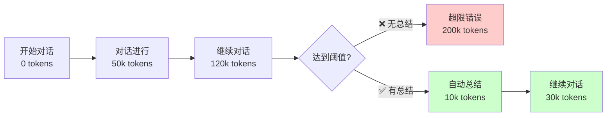

# 性能优化最佳实践

优化 Agent 应用的性能可以显著降低成本、提升用户体验。

## 🎯 优化目标

1. **降低成本** - 减少 Token 使用和 API 调用
2. **提升响应速度** - 减少延迟，提高吞吐量
3. **提高资源利用率** - 合理使用内存和 CPU
4. **保证稳定性** - 避免资源耗尽和性能抖动

## 📊 性能指标

### 关键指标

```go
// Token 使用指标
type TokenMetrics struct {
    InputTokens  int     // 输入 Token 数
    OutputTokens int     // 输出 Token 数
    TotalTokens  int     // 总 Token 数
    Cost         float64 // 成本（美元）
}

// 响应时间指标
type LatencyMetrics struct {
    ToolCallLatency   time.Duration // 工具调用延迟
    ModelLatency      time.Duration // 模型响应延迟
    TotalLatency      time.Duration // 总延迟
    TTFT              time.Duration // Time To First Token
}

// 资源使用指标
type ResourceMetrics struct {
    ActiveAgents      int           // 活跃 Agent 数量
    MemoryUsage       uint64        // 内存使用（字节）
    CacheHitRate      float64       // 缓存命中率
    ConcurrentCalls   int           // 并发调用数
}
```

### 监控示例

```go
// 记录 Token 使用
func recordTokenUsage(ag *agent.Agent) {
    metrics.Histogram("agent.tokens.input", float64(ag.InputTokens()))
    metrics.Histogram("agent.tokens.output", float64(ag.OutputTokens()))
    metrics.Histogram("agent.cost", ag.EstimateCost())
}

// 记录响应时间
func measureLatency(operation string, fn func() error) error {
    start := time.Now()
    err := fn()
    duration := time.Since(start)

    metrics.Histogram(fmt.Sprintf("agent.latency.%s", operation),
        float64(duration.Milliseconds()))

    return err
}

// 监控资源使用
func monitorResources(pool *core.Pool) {
    ticker := time.NewTicker(30 * time.Second)
    for range ticker.C {
        var m runtime.MemStats
        runtime.ReadMemStats(&m)

        metrics.Gauge("agent.pool.size", float64(pool.Size()))
        metrics.Gauge("agent.memory.alloc", float64(m.Alloc))
        metrics.Gauge("agent.goroutines", float64(runtime.NumGoroutine()))
    }
}
```

## 🔧 Token 优化策略

### 策略1: 自动总结（Summarization）

**问题**: 长对话导致 Token 超限

```go
// ❌ 不管理上下文，最终 Token 溢出
ag, _ := agent.Create(ctx, config, deps)
for {
    result, err := ag.Chat(ctx, userMessage)
    // Token 使用持续增长，最终超限
}
```

**解决方案**: 使用 Summarization 中间件

```go
// ✅ 自动总结历史对话
summaryMW, _ := middleware.NewSummarizationMiddleware(&middleware.SummarizationMiddlewareConfig{
    MaxTokensBeforeSummary: 150000,  // 达到 15 万 Token 时触发
    MessagesToKeep:         6,       // 保留最近 6 条消息
    SummaryPrompt: `请将以上对话总结为简洁的要点，保留：
1. 关键决策和结论
2. 重要的上下文信息
3. 待完成的任务`,
})

stack := middleware.NewStack()
stack.Use(summaryMW)

ag, _ := agent.Create(ctx, config, deps)
// Token 使用被控制在合理范围内
```

**效果对比**:



### 策略2: Prompt 优化

```go
// ❌ 冗长的 System Prompt
systemPrompt := `
你是一个非常非常有帮助的助手。你应该总是尽你最大的努力来帮助用户。
你需要认真思考用户的问题，并给出详细的、全面的、完整的回答。
你应该考虑所有可能的情况，并提供多种解决方案。
你还需要... (1000+ 字)
`

// ✅ 简洁的 System Prompt
systemPrompt := `你是数据分析专家，专注于：
1. Python/Pandas 数据处理
2. 可视化图表生成
3. 统计分析报告

回答简洁、准确，提供可执行的代码示例。`
```

**优化原则**:
- **删除冗余** - 去掉无用的客套话
- **明确职责** - 清晰定义 Agent 能做什么
- **结构化** - 使用列表代替长段落
- **示例优于描述** - 用 Few-shot 示例代替长篇说明

### 策略3: 输出控制

```go
// ❌ 不限制输出长度
config := &types.AgentConfig{
    // 默认可能生成很长的回复
}

// ✅ 限制输出长度
config := &types.AgentConfig{
    ModelConfig: &types.ModelConfig{
        MaxTokens: 2048,  // 限制单次输出
    },
    SystemPrompt: "回答限制在 500 字以内，重点突出、言简意赅。",
}
```

### 策略4: 工具调用优化

```go
// ❌ 每次都重新计算
result, _ := ag.Chat(ctx, "分析这个文件")
// Agent 读取文件 → 分析 → 返回
result2, _ := ag.Chat(ctx, "再看一下刚才的文件")
// Agent 又读取一次文件 ❌

// ✅ 使用 Filesystem 中间件缓存文件
filesMW, _ := middleware.NewFilesystemMiddleware(&middleware.FilesystemMiddlewareConfig{
    WorkDir: "./workspace",
    ReadOnly: true,  // 只读模式，安全且高效
})
stack.Use(filesMW)

// Agent 自动访问缓存的文件内容，无需重复读取
result, _ := ag.Chat(ctx, "分析这个文件")
result2, _ := ag.Chat(ctx, "再看一下刚才的文件")  // ✅ 从缓存读取
```

## 🚀 缓存策略

### 策略1: 工具结果缓存

```go
// 缓存工具实现
type CachedTool struct {
    underlying tools.Tool
    cache      *cache.Cache
    ttl        time.Duration
}

func (t *CachedTool) Execute(ctx context.Context, input map[string]interface{}, tc *tools.ToolContext) (interface{}, error) {
    // 生成缓存键
    key := generateCacheKey(t.underlying.Name(), input)

    // 检查缓存
    if cached, found := t.cache.Get(key); found {
        metrics.Increment("tool.cache.hit", 1)
        return cached, nil
    }

    // 执行工具
    result, err := t.underlying.Execute(ctx, input, tc)
    if err != nil {
        return nil, err
    }

    // 缓存结果
    t.cache.Set(key, result, t.ttl)
    metrics.Increment("tool.cache.miss", 1)

    return result, nil
}

// 使用示例
func wrapWithCache(tool tools.Tool, ttl time.Duration) tools.Tool {
    return &CachedTool{
        underlying: tool,
        cache:      cache.New(5*time.Minute, 10*time.Minute),
        ttl:        ttl,
    }
}

// 为搜索工具添加缓存
webSearchTool := wrapWithCache(
    builtin.NewWebSearchTool(),
    1*time.Hour,  // 搜索结果缓存 1 小时
)
toolRegistry.Register(webSearchTool)
```

### 策略2: Prompt 缓存（Prompt Caching）

Anthropic 的 Prompt Caching 功能可以缓存 System Prompt 和工具定义：

```go
// ✅ 启用 Prompt Caching
config := &types.AgentConfig{
    ModelConfig: &types.ModelConfig{
        Model:  "claude-sonnet-4-5",
        APIKey: os.Getenv("ANTHROPIC_API_KEY"),
        // Anthropic 自动缓存长 System Prompt
    },
    SystemPrompt: largeSystemPrompt,  // 大型 System Prompt 会被缓存
    Tools: []interface{}{
        "fs_read", "fs_write", "bash_run",  // 工具定义也会被缓存
    },
}

// 成本对比:
// 首次调用: 输入 10k tokens (正常计费) + 输出 2k tokens
// 后续调用: 输入 500 tokens (System Prompt 和工具定义从缓存) + 输出 2k tokens
// 节省: 90% 输入 Token 成本
```

### 策略3: Agent 实例复用

```go
// ❌ 每次请求创建新 Agent
func handleRequest(w http.ResponseWriter, r *http.Request) {
    ag, _ := agent.Create(ctx, config, deps)  // 每次都创建
    defer ag.Close()
    result, _ := ag.Chat(ctx, message)
    // 浪费初始化成本
}

// ✅ 使用 Agent Pool 复用实例
var pool = core.NewPool(&core.PoolOptions{
    Dependencies: deps,
    MaxAgents:    50,
    IdleTimeout:  10 * time.Minute,
})

func handleRequest(w http.ResponseWriter, r *http.Request) {
    agentID := getSessionID(r)

    // 尝试获取现有 Agent
    ag, err := pool.Get(agentID)
    if err != nil {
        // 不存在则创建
        ag, err = pool.Create(ctx, config)
        if err != nil {
            http.Error(w, "Failed to create agent", 500)
            return
        }
    }

    result, _ := ag.Chat(ctx, message)
    // Agent 保留在 Pool 中供后续使用
}
```

**效果对比**:

| 场景 | Agent 创建 | 平均响应时间 | Token 成本 |
|------|-----------|-------------|-----------|
| **每次创建** | 100 次/分钟 | 2000ms | 高 |
| **Pool 复用** | 10 次/分钟 | 500ms | 低（缓存生效）|

## ⚡ 并发控制

### 策略1: 限制并发数

```go
// ❌ 不限制并发，可能耗尽资源
func processBatch(messages []string) {
    var wg sync.WaitGroup
    for _, msg := range messages {  // 可能有 1000+ 消息
        wg.Add(1)
        go func(m string) {
            defer wg.Done()
            ag, _ := agent.Create(ctx, config, deps)
            ag.Chat(ctx, m)
            ag.Close()
        }(msg)
    }
    wg.Wait()
    // 创建了 1000+ 个 Agent，内存爆炸 ❌
}

// ✅ 使用 Worker Pool 限制并发
func processBatchOptimized(messages []string, maxWorkers int) {
    semaphore := make(chan struct{}, maxWorkers)
    var wg sync.WaitGroup

    for _, msg := range messages {
        wg.Add(1)
        semaphore <- struct{}{}  // 获取信号量

        go func(m string) {
            defer wg.Done()
            defer func() { <-semaphore }()  // 释放信号量

            ag, _ := pool.Get(getAgentID())
            ag.Chat(ctx, m)
        }(msg)
    }
    wg.Wait()
}

// 使用示例
processBatchOptimized(messages, 10)  // 最多 10 个并发
```

### 策略2: 速率限制

```go
// 速率限制中间件
type RateLimitMiddleware struct {
    *middleware.BaseMiddleware
    limiter *rate.Limiter
}

func NewRateLimitMiddleware(rps int) *RateLimitMiddleware {
    return &RateLimitMiddleware{
        BaseMiddleware: middleware.NewBaseMiddleware(
            "rate-limit",
            30,  // Priority
            []tools.Tool{},
        ),
        limiter: rate.NewLimiter(rate.Limit(rps), rps*2),
    }
}

func (m *RateLimitMiddleware) WrapModelCall(
    ctx context.Context,
    req *types.ModelRequest,
    handler middleware.ModelCallHandler,
) (*types.ModelResponse, error) {
    // 等待速率限制
    if err := m.limiter.Wait(ctx); err != nil {
        return nil, fmt.Errorf("rate limit: %w", err)
    }

    return handler(ctx, req)
}

// 使用示例
stack := middleware.NewStack()
stack.Use(NewRateLimitMiddleware(10))  // 限制 10 RPS
```

### 策略3: 请求合并（Batching）

```go
// 合并多个用户请求，减少 API 调用
type RequestBatcher struct {
    mu       sync.Mutex
    pending  []*Request
    timer    *time.Timer
    maxBatch int
    maxWait  time.Duration
}

func (b *RequestBatcher) Add(req *Request) <-chan *Response {
    b.mu.Lock()
    defer b.mu.Unlock()

    b.pending = append(b.pending, req)

    // 达到批次大小或超时后执行
    if len(b.pending) >= b.maxBatch {
        b.flush()
    } else if b.timer == nil {
        b.timer = time.AfterFunc(b.maxWait, b.flush)
    }

    return req.responseChan
}

func (b *RequestBatcher) flush() {
    b.mu.Lock()
    requests := b.pending
    b.pending = nil
    b.timer = nil
    b.mu.Unlock()

    // 批量处理
    go b.processBatch(requests)
}

func (b *RequestBatcher) processBatch(requests []*Request) {
    // 合并为单个 Agent 调用
    combined := combineRequests(requests)
    result, _ := ag.Chat(ctx, combined)

    // 分发结果
    results := splitResult(result, len(requests))
    for i, req := range requests {
        req.responseChan <- results[i]
    }
}
```

## 💾 资源管理

### 策略1: Agent 生命周期管理

```go
// ✅ 使用 Pool 自动管理 Agent 生命周期
pool := core.NewPool(&core.PoolOptions{
    Dependencies: deps,
    MaxAgents:    100,           // 最大 Agent 数
    IdleTimeout:  10 * time.Minute,  // 空闲超时
})

// Pool 会自动:
// 1. 限制最大 Agent 数量
// 2. 清理空闲 Agent
// 3. 复用 Agent 实例
// 4. 优雅关闭

// 监听 Agent 数量
go func() {
    ticker := time.NewTicker(30 * time.Second)
    for range ticker.C {
        metrics.Gauge("agent.pool.size", float64(pool.Size()))
        if pool.Size() > 80 {
            log.Printf("Warning: Pool size is %d, approaching limit", pool.Size())
        }
    }
}()
```

### 策略2: 内存管理

```go
// ✅ 定期清理不必要的数据
func cleanupAgent(ag *agent.Agent) error {
    // 1. 清理旧消息（保留摘要）
    if err := ag.Summarize(ctx); err != nil {
        return err
    }

    // 2. 清理工具缓存
    if cacheMW, ok := ag.GetMiddleware("cache").(*CacheMiddleware); ok {
        cacheMW.Evict(olderThan(1 * time.Hour))
    }

    // 3. 触发垃圾回收（可选）
    if ag.GetMemoryUsage() > 500*1024*1024 {  // > 500MB
        runtime.GC()
    }

    return nil
}

// 使用 Scheduler 定期清理
scheduler := core.NewScheduler(nil)
scheduler.EveryInterval(5*time.Minute, func(ctx context.Context) error {
    return pool.ForEach(func(ag *agent.Agent) error {
        return cleanupAgent(ag)
    })
})
```

### 策略3: 连接池管理

```go
// ✅ 复用 HTTP 连接
var httpClient = &http.Client{
    Timeout: 30 * time.Second,
    Transport: &http.Transport{
        MaxIdleConns:        100,              // 最大空闲连接
        MaxIdleConnsPerHost: 10,               // 每个主机的最大空闲连接
        IdleConnTimeout:     90 * time.Second,
        DisableKeepAlives:   false,            // 启用 Keep-Alive
    },
}

// HTTP Request 工具使用连接池
type HTTPRequestTool struct {
    client *http.Client
}

func (t *HTTPRequestTool) Execute(ctx context.Context, input map[string]interface{}, tc *tools.ToolContext) (interface{}, error) {
    req, _ := http.NewRequestWithContext(ctx, method, url, body)
    resp, err := t.client.Do(req)  // 复用连接
    // ...
}
```

## 📈 响应时间优化

### 策略1: 流式输出

```go
// ❌ 等待完整响应
result, err := ag.Chat(ctx, "写一篇 1000 字的文章")
// 用户等待 20 秒才看到结果

// ✅ 流式输出，逐步显示
eventChan := ag.Subscribe([]types.AgentChannel{
    types.ChannelProgress,
}, nil)

go func() {
    for event := range eventChan {
        if event.Type == types.EventTypeProgress {
            // 实时显示生成的内容
            fmt.Print(event.Data.(string))
        }
    }
}()

result, err := ag.ChatStream(ctx, "写一篇 1000 字的文章")
// 用户立即看到内容开始生成
```

### 策略2: 预热（Warm-up）

```go
// 在服务启动时预创建 Agent
func warmupPool(pool *core.Pool, count int) {
    log.Printf("Warming up pool with %d agents", count)

    var wg sync.WaitGroup
    for i := 0; i < count; i++ {
        wg.Add(1)
        go func() {
            defer wg.Done()
            ag, err := pool.Create(context.Background(), config)
            if err != nil {
                log.Printf("Failed to create agent: %v", err)
                return
            }
            // 执行一次空调用，触发 Prompt Caching
            ag.Chat(context.Background(), "hello")
        }()
    }
    wg.Wait()

    log.Printf("Pool warmed up, size: %d", pool.Size())
}

// 在 main 函数中
func main() {
    pool := core.NewPool(poolOptions)
    warmupPool(pool, 10)  // 预创建 10 个 Agent

    // 启动服务器
    startServer()
}
```

### 策略3: 并行工具调用

```go
// Agent 自动并行执行独立的工具调用

// 示例: Agent 需要调用 3 个独立的 API
result, _ := ag.Chat(ctx, `
请帮我获取：
1. 天气信息（weather API）
2. 新闻头条（news API）
3. 股票价格（stocks API）
`)

// AgentSDK 会自动并行执行这 3 个工具调用:
// ┌─────────────┐
// │   Agent     │
// └─────┬───────┘
//       │
//       ├──────> weather API  (并行)
//       ├──────> news API     (并行)
//       └──────> stocks API   (并行)
//
// 响应时间 = max(API1, API2, API3) 而不是 sum
```

## 🎨 性能优化模式

### 模式1: 懒加载

```go
// ✅ 按需加载工具
type LazyToolRegistry struct {
    tools   map[string]func() tools.Tool
    loaded  map[string]tools.Tool
    mu      sync.RWMutex
}

func (r *LazyToolRegistry) Get(name string) (tools.Tool, error) {
    // 先检查是否已加载
    r.mu.RLock()
    if tool, ok := r.loaded[name]; ok {
        r.mu.RUnlock()
        return tool, nil
    }
    r.mu.RUnlock()

    // 按需加载
    r.mu.Lock()
    defer r.mu.Unlock()

    factory, ok := r.tools[name]
    if !ok {
        return nil, fmt.Errorf("tool not found: %s", name)
    }

    tool := factory()
    r.loaded[name] = tool
    return tool, nil
}

// 注册工具工厂函数而不是实例
registry.RegisterFactory("expensive-tool", func() tools.Tool {
    // 只在第一次使用时创建
    return NewExpensiveTool()
})
```

### 模式2: 预计算

```go
// ✅ 预计算常用数据
type PrecomputedTool struct {
    cache map[string]interface{}
}

func (t *PrecomputedTool) Init() error {
    // 启动时预计算
    t.cache = make(map[string]interface{})

    // 预计算常用查询
    t.cache["popular_items"] = fetchPopularItems()
    t.cache["categories"] = fetchCategories()

    // 定期更新
    go func() {
        ticker := time.NewTicker(1 * time.Hour)
        for range ticker.C {
            t.cache["popular_items"] = fetchPopularItems()
        }
    }()

    return nil
}

func (t *PrecomputedTool) Execute(ctx context.Context, input map[string]interface{}, tc *tools.ToolContext) (interface{}, error) {
    query := input["query"].(string)

    // 优先使用预计算结果
    if result, ok := t.cache[query]; ok {
        return result, nil
    }

    // 实时计算
    return t.compute(ctx, query)
}
```

### 模式3: 降级策略

```go
// ✅ 响应时间优先，牺牲准确性
type AdaptiveTool struct {
    fastMode bool
}

func (t *AdaptiveTool) Execute(ctx context.Context, input map[string]interface{}, tc *tools.ToolContext) (interface{}, error) {
    deadline, ok := ctx.Deadline()
    if !ok {
        // 无超时限制，使用精确模式
        return t.executeAccurate(ctx, input)
    }

    remaining := time.Until(deadline)

    if remaining < 1*time.Second {
        // 时间紧迫，使用快速模式
        return t.executeFast(ctx, input)
    } else if remaining < 5*time.Second {
        // 中等时间，使用平衡模式
        return t.executeBalanced(ctx, input)
    } else {
        // 充足时间，使用精确模式
        return t.executeAccurate(ctx, input)
    }
}
```

## 📊 性能测试

### 压力测试示例

```go
func BenchmarkAgentChat(b *testing.B) {
    pool := setupTestPool()
    defer pool.Shutdown()

    b.ResetTimer()
    b.RunParallel(func(pb *testing.PB) {
        for pb.Next() {
            ag, _ := pool.Create(context.Background(), config)
            ag.Chat(context.Background(), "test message")
        }
    })

    b.ReportMetric(float64(pool.Size()), "agents")
}

func BenchmarkToolCall(b *testing.B) {
    tool := builtin.NewWebSearchTool()

    b.ResetTimer()
    for i := 0; i < b.N; i++ {
        tool.Execute(context.Background(), map[string]interface{}{
            "query": "test query",
        }, nil)
    }
}
```

### 性能分析

```go
// CPU Profiling
func main() {
    f, _ := os.Create("cpu.prof")
    defer f.Close()

    pprof.StartCPUProfile(f)
    defer pprof.StopCPUProfile()

    // 运行你的应用
    runApp()
}

// 分析结果
// go tool pprof cpu.prof
// (pprof) top 10
// (pprof) list functionName

// Memory Profiling
func main() {
    defer func() {
        f, _ := os.Create("mem.prof")
        defer f.Close()
        runtime.GC()
        pprof.WriteHeapProfile(f)
    }()

    runApp()
}

// 分析内存
// go tool pprof mem.prof
```

## ✅ 优化检查清单

部署前确保：

- [ ] 启用 Summarization 中间件控制 Token 使用
- [ ] 优化 System Prompt，删除冗余内容
- [ ] 限制单次输出 Token 数（MaxTokens）
- [ ] 为工具调用添加缓存
- [ ] 启用 Prompt Caching（Anthropic）
- [ ] 使用 Agent Pool 复用实例
- [ ] 限制并发数，避免资源耗尽
- [ ] 实现速率限制
- [ ] 监控关键性能指标
- [ ] 设置合理的超时时间
- [ ] 使用流式输出提升体验
- [ ] 进行压力测试

## 📈 成本优化对照表

| 优化措施 | Token 节省 | 响应时间 | 实现难度 |
|---------|-----------|---------|---------|
| **Summarization 中间件** | 60-80% | 持平 | 低 |
| **Prompt Caching** | 50-90% | -10% | 低 |
| **Agent Pool 复用** | 20-40% | -50% | 中 |
| **工具结果缓存** | 10-30% | -30% | 中 |
| **Prompt 优化** | 10-20% | +5% | 低 |
| **输出长度限制** | 5-15% | +10% | 低 |
| **并发控制** | 0% | 变化 | 中 |
| **流式输出** | 0% | -40%* | 低 |

*感知响应时间

## 🔗 相关资源

- [错误处理](/best-practices/error-handling)
- [监控运维](/best-practices/monitoring)
- [中间件示例 - Summarization](/examples/middleware/builtin#summarization)
- [Agent Pool 使用](/examples/multi-agent#agent-pool)
