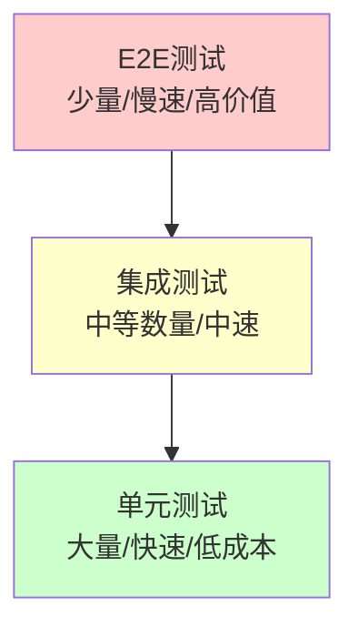

# 测试最佳实践

完善的测试策略能确保 Agent 应用的质量和可靠性。

## 🎯 测试原则

1. **测试金字塔** - 单元测试 > 集成测试 > E2E测试
2. **快速反馈** - 测试应该快速执行
3. **独立性** - 测试之间不应互相影响
4. **可重复性** - 相同输入得到相同结果
5. **清晰意图** - 测试名称清楚表达测试内容

## 📊 测试层次



### 测试分布建议

| 测试类型 | 比例 | 执行时间 | 覆盖范围 | Mock程度 |
|---------|------|---------|---------|---------|
| **单元测试** | 70% | <1s | 单个函数/类 | 高 |
| **集成测试** | 20% | 1-10s | 多个组件 | 中 |
| **E2E测试** | 10% | 10s+ | 完整流程 | 低 |

## 🧪 单元测试

### 测试工具注册

```go
package tools

import (
    "context"
    "testing"

    "github.com/stretchr/testify/assert"
    "github.com/stretchr/testify/require"
)

// 测试工具注册
func TestToolRegistry_Register(t *testing.T) {
    registry := NewRegistry()

    tool := &MockTool{
        name: "test_tool",
        desc: "A test tool",
    }

    // 测试注册
    err := registry.Register(tool)
    require.NoError(t, err)

    // 验证可以获取
    got, err := registry.Get("test_tool")
    require.NoError(t, err)
    assert.Equal(t, tool, got)
}

// 测试重复注册
func TestToolRegistry_RegisterDuplicate(t *testing.T) {
    registry := NewRegistry()

    tool1 := &MockTool{name: "test_tool"}
    tool2 := &MockTool{name: "test_tool"}

    // 第一次注册成功
    err := registry.Register(tool1)
    require.NoError(t, err)

    // 第二次注册应该失败
    err = registry.Register(tool2)
    assert.Error(t, err)
    assert.Contains(t, err.Error(), "already registered")
}

// 测试获取不存在的工具
func TestToolRegistry_GetNonexistent(t *testing.T) {
    registry := NewRegistry()

    _, err := registry.Get("nonexistent")
    assert.Error(t, err)
    assert.Contains(t, err.Error(), "not found")
}
```

### 测试工具执行

```go
// 测试工具执行逻辑
func TestFSReadTool_Execute(t *testing.T) {
    // 准备测试文件
    tmpDir := t.TempDir()
    testFile := filepath.Join(tmpDir, "test.txt")
    content := "Hello, World!"
    err := os.WriteFile(testFile, []byte(content), 0644)
    require.NoError(t, err)

    // 创建工具
    tool := NewFSReadTool()

    // 执行
    result, err := tool.Execute(context.Background(), map[string]interface{}{
        "path": testFile,
    }, nil)

    // 验证
    require.NoError(t, err)
    assert.Equal(t, content, result)
}

// 测试错误情况
func TestFSReadTool_ExecuteFileNotFound(t *testing.T) {
    tool := NewFSReadTool()

    _, err := tool.Execute(context.Background(), map[string]interface{}{
        "path": "/nonexistent/file.txt",
    }, nil)

    assert.Error(t, err)
    assert.Contains(t, err.Error(), "no such file")
}

// 使用表驱动测试
func TestFSReadTool_Execute_TableDriven(t *testing.T) {
    tests := []struct {
        name        string
        setup       func() string  // 返回文件路径
        input       map[string]interface{}
        wantErr     bool
        wantContain string
    }{
        {
            name: "normal file",
            setup: func() string {
                tmpFile := filepath.Join(t.TempDir(), "test.txt")
                os.WriteFile(tmpFile, []byte("content"), 0644)
                return tmpFile
            },
            input: map[string]interface{}{},
            wantErr: false,
            wantContain: "content",
        },
        {
            name: "file not found",
            setup: func() string {
                return "/nonexistent.txt"
            },
            input: map[string]interface{}{},
            wantErr: true,
            wantContain: "no such file",
        },
        {
            name: "with offset and limit",
            setup: func() string {
                tmpFile := filepath.Join(t.TempDir(), "test.txt")
                os.WriteFile(tmpFile, []byte("0123456789"), 0644)
                return tmpFile
            },
            input: map[string]interface{}{
                "offset": 2,
                "limit": 5,
            },
            wantErr: false,
            wantContain: "23456",
        },
    }

    tool := NewFSReadTool()

    for _, tt := range tests {
        t.Run(tt.name, func(t *testing.T) {
            filePath := tt.setup()
            input := tt.input
            input["path"] = filePath

            result, err := tool.Execute(context.Background(), input, nil)

            if tt.wantErr {
                assert.Error(t, err)
                if tt.wantContain != "" {
                    assert.Contains(t, err.Error(), tt.wantContain)
                }
            } else {
                assert.NoError(t, err)
                if tt.wantContain != "" {
                    assert.Contains(t, result.(string), tt.wantContain)
                }
            }
        })
    }
}
```

### 测试中间件

```go
// 测试中间件执行顺序
func TestMiddlewareStack_Order(t *testing.T) {
    var execOrder []string

    mw1 := &MockMiddleware{
        priority: 10,
        onWrap: func() {
            execOrder = append(execOrder, "mw1_before")
        },
        onAfter: func() {
            execOrder = append(execOrder, "mw1_after")
        },
    }

    mw2 := &MockMiddleware{
        priority: 20,
        onWrap: func() {
            execOrder = append(execOrder, "mw2_before")
        },
        onAfter: func() {
            execOrder = append(execOrder, "mw2_after")
        },
    }

    stack := middleware.NewStack()
    stack.Use(mw1)
    stack.Use(mw2)

    // 执行
    stack.WrapModelCall(ctx, req, func(ctx context.Context, req *types.ModelRequest) (*types.ModelResponse, error) {
        execOrder = append(execOrder, "handler")
        return &types.ModelResponse{}, nil
    })

    // 验证执行顺序（洋葱模型）
    expected := []string{
        "mw1_before",  // 优先级低的先执行
        "mw2_before",
        "handler",
        "mw2_after",   // 反向执行
        "mw1_after",
    }
    assert.Equal(t, expected, execOrder)
}
```

## 🔗 集成测试

### 测试 Agent 创建

```go
package agent_test

import (
    "context"
    "testing"

    "github.com/stretchr/testify/assert"
    "github.com/stretchr/testify/require"

    "agentsdk/pkg/agent"
    "agentsdk/pkg/provider"
    "agentsdk/pkg/store"
    "agentsdk/pkg/tools"
)

// 测试 Agent 完整创建流程
func TestAgent_Create_Integration(t *testing.T) {
    // 跳过需要真实 API 的测试
    if testing.Short() {
        t.Skip("skipping integration test")
    }

    // 准备依赖
    deps := setupTestDependencies(t)

    // 配置
    config := &types.AgentConfig{
        TemplateID: "test-agent",
        ModelConfig: &types.ModelConfig{
            Model:  "claude-sonnet-4-5",
            APIKey: getTestAPIKey(),
        },
        Tools: []interface{}{"Read", "Write"},
    }

    // 创建 Agent
    ag, err := agent.Create(context.Background(), config, deps)
    require.NoError(t, err)
    require.NotNil(t, ag)
    defer ag.Close()

    // 验证 Agent 状态
    assert.NotEmpty(t, ag.ID())
    assert.Equal(t, "test-agent", ag.TemplateID())
}

// 测试工具设置
func setupTestDependencies(t *testing.T) *types.Dependencies {
    // Tool Registry
    toolRegistry := tools.NewRegistry()
    require.NoError(t, builtin.RegisterAll(toolRegistry))

    // Store (使用内存存储)
    testStore := store.NewMemoryStore()

    // Provider Factory (使用 Mock Provider)
    providerFactory := provider.NewFactory()
    providerFactory.Register("anthropic", func(config *types.ModelConfig) (provider.Provider, error) {
        return NewMockProvider(), nil
    })

    return &types.Dependencies{
        ToolRegistry:    toolRegistry,
        Store:           testStore,
        ProviderFactory: providerFactory,
    }
}
```

### 测试 Agent 对话

```go
// 测试 Agent Chat 流程
func TestAgent_Chat_Integration(t *testing.T) {
    if testing.Short() {
        t.Skip("skipping integration test")
    }

    deps := setupTestDependencies(t)
    ag, err := agent.Create(context.Background(), testConfig, deps)
    require.NoError(t, err)
    defer ag.Close()

    // 执行对话
    result, err := ag.Chat(context.Background(), "Hello")
    require.NoError(t, err)
    require.NotNil(t, result)

    // 验证响应
    assert.NotEmpty(t, result.Content)
    assert.Greater(t, result.InputTokens, 0)
    assert.Greater(t, result.OutputTokens, 0)
}

// 测试工具调用
func TestAgent_ToolCall_Integration(t *testing.T) {
    if testing.Short() {
        t.Skip("skipping integration test")
    }

    deps := setupTestDependencies(t)
    ag, err := agent.Create(context.Background(), testConfig, deps)
    require.NoError(t, err)
    defer ag.Close()

    // 创建测试文件
    tmpDir := t.TempDir()
    testFile := filepath.Join(tmpDir, "test.txt")
    os.WriteFile(testFile, []byte("test content"), 0644)

    // 请求 Agent 读取文件
    result, err := ag.Chat(context.Background(),
        fmt.Sprintf("请读取文件 %s 的内容", testFile))
    require.NoError(t, err)

    // 验证工具被调用
    assert.Contains(t, result.Content, "test content")
}
```

### 测试中间件集成

```go
// 测试 Summarization 中间件
func TestSummarizationMiddleware_Integration(t *testing.T) {
    if testing.Short() {
        t.Skip("skipping integration test")
    }

    deps := setupTestDependencies(t)

    // 配置 Summarization 中间件
    summaryMW, err := middleware.NewSummarizationMiddleware(&middleware.SummarizationMiddlewareConfig{
        MaxTokensBeforeSummary: 1000,  // 低阈值便于测试
        MessagesToKeep:         2,
    })
    require.NoError(t, err)

    stack := middleware.NewStack()
    stack.Use(summaryMW)
    deps.MiddlewareStack = stack

    ag, err := agent.Create(context.Background(), testConfig, deps)
    require.NoError(t, err)
    defer ag.Close()

    // 进行多轮对话，触发总结
    for i := 0; i < 10; i++ {
        _, err := ag.Chat(context.Background(),
            fmt.Sprintf("这是第 %d 条很长的消息，包含很多内容...", i))
        require.NoError(t, err)
    }

    // 验证消息被总结
    conv, _ := ag.GetConversation()
    assert.Less(t, len(conv.Messages), 20, "消息应该被总结")
}
```

## 🎭 Mock 策略

### Mock LLM Provider

```go
// Mock Provider 用于测试
type MockProvider struct {
    responses     []*types.ModelResponse
    responseIndex int
    mu            sync.Mutex
}

func NewMockProvider() *MockProvider {
    return &MockProvider{
        responses: []*types.ModelResponse{},
    }
}

// 添加预设响应
func (p *MockProvider) AddResponse(resp *types.ModelResponse) {
    p.mu.Lock()
    defer p.mu.Unlock()
    p.responses = append(p.responses, resp)
}

// 实现 Provider 接口
func (p *MockProvider) Chat(ctx context.Context, req *types.ModelRequest) (*types.ModelResponse, error) {
    p.mu.Lock()
    defer p.mu.Unlock()

    if p.responseIndex >= len(p.responses) {
        return nil, fmt.Errorf("no more mock responses")
    }

    resp := p.responses[p.responseIndex]
    p.responseIndex++
    return resp, nil
}

// 使用示例
func TestAgentWithMockProvider(t *testing.T) {
    mockProvider := NewMockProvider()

    // 预设响应
    mockProvider.AddResponse(&types.ModelResponse{
        Content: "Hello! How can I help you?",
        InputTokens: 10,
        OutputTokens: 8,
    })

    mockProvider.AddResponse(&types.ModelResponse{
        Content: "I'll read the file for you.",
        ToolCalls: []*types.ToolCall{
            {
                ID:   "call_1",
                Name: "Read",
                Input: map[string]interface{}{
                    "path": "/test.txt",
                },
            },
        },
        InputTokens: 15,
        OutputTokens: 5,
    })

    // 使用 Mock Provider 创建 Agent
    // ... 测试逻辑
}
```

### Mock Store

```go
// Mock Store 用于测试
type MockStore struct {
    conversations map[string]*types.Conversation
    mu            sync.RWMutex
}

func NewMockStore() *MockStore {
    return &MockStore{
        conversations: make(map[string]*types.Conversation),
    }
}

func (s *MockStore) SaveConversation(ctx context.Context, agentID string, conv *types.Conversation) error {
    s.mu.Lock()
    defer s.mu.Unlock()

    // 深拷贝以避免并发问题
    convCopy := *conv
    s.conversations[agentID] = &convCopy
    return nil
}

func (s *MockStore) LoadConversation(ctx context.Context, agentID string) (*types.Conversation, error) {
    s.mu.RLock()
    defer s.mu.RUnlock()

    conv, ok := s.conversations[agentID]
    if !ok {
        return nil, fmt.Errorf("conversation not found")
    }

    convCopy := *conv
    return &convCopy, nil
}

// 测试辅助方法
func (s *MockStore) GetMessageCount(agentID string) int {
    s.mu.RLock()
    defer s.mu.RUnlock()

    conv, ok := s.conversations[agentID]
    if !ok {
        return 0
    }
    return len(conv.Messages)
}
```

### Mock Tool

```go
// Mock Tool 用于测试
type MockTool struct {
    name      string
    desc      string
    schema    map[string]interface{}
    execFunc  func(context.Context, map[string]interface{}, *tools.ToolContext) (interface{}, error)
    callCount int
    mu        sync.Mutex
}

func NewMockTool(name string) *MockTool {
    return &MockTool{
        name: name,
        desc: fmt.Sprintf("Mock tool: %s", name),
        schema: map[string]interface{}{
            "type": "object",
            "properties": map[string]interface{}{
                "input": map[string]interface{}{
                    "type": "string",
                },
            },
        },
    }
}

func (t *MockTool) Name() string {
    return t.name
}

func (t *MockTool) Description() string {
    return t.desc
}

func (t *MockTool) InputSchema() map[string]interface{} {
    return t.schema
}

func (t *MockTool) Execute(ctx context.Context, input map[string]interface{}, tc *tools.ToolContext) (interface{}, error) {
    t.mu.Lock()
    t.callCount++
    t.mu.Unlock()

    if t.execFunc != nil {
        return t.execFunc(ctx, input, tc)
    }

    return map[string]interface{}{
        "result": "mock result",
    }, nil
}

func (t *MockTool) GetCallCount() int {
    t.mu.Lock()
    defer t.mu.Unlock()
    return t.callCount
}

// 使用示例
func TestToolCalling(t *testing.T) {
    mockTool := NewMockTool("test_tool")
    mockTool.execFunc = func(ctx context.Context, input map[string]interface{}, tc *tools.ToolContext) (interface{}, error) {
        // 自定义行为
        return "custom result", nil
    }

    registry := tools.NewRegistry()
    registry.Register(mockTool)

    // ... 测试使用该工具的逻辑

    // 验证工具被调用
    assert.Equal(t, 1, mockTool.GetCallCount())
}
```

## 🌐 端到端测试

### E2E 测试框架

```go
// E2E 测试辅助
type E2ETestSuite struct {
    pool      *core.Pool
    scheduler *core.Scheduler
    cleanup   []func()
}

func NewE2ETestSuite() *E2ETestSuite {
    return &E2ETestSuite{
        cleanup: []func(){},
    }
}

func (s *E2ETestSuite) Setup(t *testing.T) {
    // 创建真实的依赖（使用测试配置）
    deps := &types.Dependencies{
        ToolRegistry: setupRealToolRegistry(),
        Store:        setupTestStore(t),
        ProviderFactory: setupProviderFactory(),
    }

    // 创建 Pool
    s.pool = core.NewPool(&core.PoolOptions{
        Dependencies: deps,
        MaxAgents:    10,
    })
    s.cleanup = append(s.cleanup, func() {
        s.pool.Shutdown()
    })

    // 创建 Scheduler
    s.scheduler = core.NewScheduler(nil)
    s.cleanup = append(s.cleanup, func() {
        s.scheduler.Shutdown()
    })
}

func (s *E2ETestSuite) Teardown() {
    for i := len(s.cleanup) - 1; i >= 0; i-- {
        s.cleanup[i]()
    }
}

// E2E 测试用例
func TestE2E_CompleteWorkflow(t *testing.T) {
    if testing.Short() {
        t.Skip("skipping E2E test")
    }

    suite := NewE2ETestSuite()
    suite.Setup(t)
    defer suite.Teardown()

    // 场景: 创建 Agent → 多轮对话 → 工具调用 → 清理
    ctx := context.Background()

    // 1. 创建 Agent
    ag, err := suite.pool.Create(ctx, &types.AgentConfig{
        TemplateID: "data-analyst",
        ModelConfig: &types.ModelConfig{
            Model:  "claude-sonnet-4-5",
            APIKey: os.Getenv("ANTHROPIC_API_KEY"),
        },
        Tools: []interface{}{"Read", "Bash"},
    })
    require.NoError(t, err)
    agentID := ag.ID()

    // 2. 进行对话
    resp1, err := ag.Chat(ctx, "你好，我需要分析一些数据")
    require.NoError(t, err)
    assert.NotEmpty(t, resp1.Content)

    // 3. 触发工具调用
    tmpDir := t.TempDir()
    dataFile := filepath.Join(tmpDir, "data.csv")
    os.WriteFile(dataFile, []byte("name,age\nAlice,30\nBob,25"), 0644)

    resp2, err := ag.Chat(ctx, fmt.Sprintf("请分析文件 %s", dataFile))
    require.NoError(t, err)
    assert.Contains(t, resp2.Content, "Alice")

    // 4. 验证 Agent 在 Pool 中
    agFromPool, err := suite.pool.Get(agentID)
    require.NoError(t, err)
    assert.Equal(t, ag, agFromPool)

    // 5. 移除 Agent
    suite.pool.Remove(agentID)
    _, err = suite.pool.Get(agentID)
    assert.Error(t, err)
}
```

### 性能测试

```go
// 基准测试
func BenchmarkAgent_Chat(b *testing.B) {
    deps := setupTestDependencies(b)
    ag, _ := agent.Create(context.Background(), testConfig, deps)
    defer ag.Close()

    ctx := context.Background()

    b.ResetTimer()
    for i := 0; i < b.N; i++ {
        ag.Chat(ctx, "test message")
    }
}

// 并发测试
func BenchmarkAgent_ChatParallel(b *testing.B) {
    deps := setupTestDependencies(b)
    pool := core.NewPool(&core.PoolOptions{
        Dependencies: deps,
        MaxAgents:    100,
    })
    defer pool.Shutdown()

    b.ResetTimer()
    b.RunParallel(func(pb *testing.PB) {
        for pb.Next() {
            ag, _ := pool.Create(context.Background(), testConfig)
            ag.Chat(context.Background(), "test message")
            pool.Remove(ag.ID())
        }
    })
}

// 压力测试
func TestAgent_StressTest(t *testing.T) {
    if testing.Short() {
        t.Skip("skipping stress test")
    }

    pool := setupTestPool(t)
    defer pool.Shutdown()

    // 创建 100 个 Agent
    agents := make([]*agent.Agent, 100)
    for i := 0; i < 100; i++ {
        ag, err := pool.Create(context.Background(), testConfig)
        require.NoError(t, err)
        agents[i] = ag
    }

    // 并发执行 1000 次对话
    var wg sync.WaitGroup
    errChan := make(chan error, 1000)

    for i := 0; i < 1000; i++ {
        wg.Add(1)
        go func(idx int) {
            defer wg.Done()

            ag := agents[idx%100]
            _, err := ag.Chat(context.Background(), "test")
            if err != nil {
                errChan <- err
            }
        }(i)
    }

    wg.Wait()
    close(errChan)

    // 验证错误
    errorCount := len(errChan)
    assert.Less(t, errorCount, 10, "错误率应该很低")
}
```

## 📈 测试覆盖率

### 生成覆盖率报告

```bash
# 运行测试并生成覆盖率
go test -v -cover ./... -coverprofile=coverage.out

# 查看覆盖率
go tool cover -func=coverage.out

# 生成 HTML 报告
go tool cover -html=coverage.out -o coverage.html

# 设置覆盖率目标
go test -v -cover ./... -coverprofile=coverage.out
go tool cover -func=coverage.out | grep total | awk '{print $3}' | sed 's/%//' | \
  awk '{if ($1 < 80) {print "Coverage below 80%"; exit 1}}'
```

### 覆盖率目标

```go
// 在 CI/CD 中检查覆盖率
func TestCoverageGoal(t *testing.T) {
    // 确保关键包的覆盖率
    packages := map[string]float64{
        "agentsdk/pkg/agent":      80.0,
        "agentsdk/pkg/tools":      75.0,
        "agentsdk/pkg/middleware": 70.0,
        "agentsdk/pkg/store":      80.0,
    }

    for pkg, minCoverage := range packages {
        coverage := getCoverageForPackage(pkg)
        if coverage < minCoverage {
            t.Errorf("Package %s coverage %.2f%% below target %.2f%%",
                pkg, coverage, minCoverage)
        }
    }
}
```

## ✅ 测试清单

### 代码提交前

- [ ] 所有单元测试通过
- [ ] 新功能有对应测试
- [ ] 测试覆盖率 >= 80%
- [ ] 没有跳过的测试 (除非有明确原因)
- [ ] Mock 对象使用正确
- [ ] 测试名称清晰描述意图

### Pull Request 前

- [ ] 所有集成测试通过
- [ ] E2E 测试通过
- [ ] 性能基准测试无退化
- [ ] 测试在 CI/CD 中通过
- [ ] 代码审查完成

### 发布前

- [ ] 完整回归测试通过
- [ ] 压力测试通过
- [ ] 兼容性测试通过
- [ ] 文档与测试同步更新

## 🎨 测试最佳实践

### 1. 使用 Table-Driven Tests

```go
// ✅ 表驱动测试，易于添加新案例
func TestValidateInput(t *testing.T) {
    tests := []struct {
        name    string
        input   string
        wantErr bool
        errMsg  string
    }{
        {"valid input", "hello", false, ""},
        {"empty input", "", true, "empty"},
        {"too long", strings.Repeat("a", 10001), true, "too long"},
        {"special chars", "hello\x00world", true, "invalid"},
    }

    for _, tt := range tests {
        t.Run(tt.name, func(t *testing.T) {
            err := validateInput(tt.input)
            if tt.wantErr {
                assert.Error(t, err)
                assert.Contains(t, err.Error(), tt.errMsg)
            } else {
                assert.NoError(t, err)
            }
        })
    }
}
```

### 2. 测试隔离

```go
// ✅ 每个测试独立，不依赖其他测试
func TestToolA(t *testing.T) {
    // 独立的 setup
    registry := tools.NewRegistry()
    tool := NewToolA()
    registry.Register(tool)

    // 测试...

    // 独立的 cleanup（如果需要）
}

// ❌ 测试之间相互依赖
var sharedRegistry *tools.Registry  // 不要这样做！

func TestToolB(t *testing.T) {
    // 依赖 TestToolA 先运行 ❌
    tool := sharedRegistry.Get("tool_a")
    // ...
}
```

### 3. 清晰的测试意图

```go
// ✅ 清晰的测试名称
func TestAgent_Chat_ReturnsErrorWhenContextCanceled(t *testing.T) {
    // 测试名称清楚说明了测试内容
}

// ❌ 模糊的测试名称
func TestAgent_Test1(t *testing.T) {
    // 不清楚在测试什么
}
```

### 4. AAA 模式 (Arrange-Act-Assert)

```go
func TestAgent_Chat(t *testing.T) {
    // Arrange - 准备测试数据和环境
    deps := setupTestDependencies(t)
    ag, err := agent.Create(context.Background(), testConfig, deps)
    require.NoError(t, err)
    defer ag.Close()

    // Act - 执行被测试的操作
    result, err := ag.Chat(context.Background(), "test message")

    // Assert - 验证结果
    require.NoError(t, err)
    assert.NotEmpty(t, result.Content)
    assert.Greater(t, result.InputTokens, 0)
}
```

### 5. 使用测试辅助函数

```go
// 测试辅助函数
func mustCreateAgent(t *testing.T, config *types.AgentConfig) *agent.Agent {
    t.Helper()  // 标记为辅助函数，错误时显示调用者位置

    ag, err := agent.Create(context.Background(), config, testDeps)
    require.NoError(t, err)

    t.Cleanup(func() {  // 自动清理
        ag.Close()
    })

    return ag
}

// 使用
func TestSomething(t *testing.T) {
    ag := mustCreateAgent(t, testConfig)
    // 不需要手动 defer ag.Close()
    // ...
}
```

## 🔗 相关资源

- [错误处理](/best-practices/error-handling)
- [监控运维](/best-practices/monitoring)
- [示例代码](/examples)
- [Go Testing 最佳实践](https://go.dev/doc/tutorial/add-a-test)
