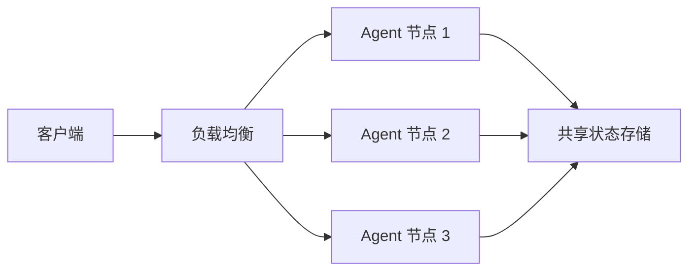

# 项目路线图

AgentSDK 持续迭代，致力于成为最优秀的企业级 AI Agent 框架。

## 当前状态（v0.7.0）

::alert{type="success" icon="i-lucide-check-circle"}
**生产就绪** - 完整的 Agent 运行时，支持工作流编排、数据持久化、分布式追踪、多 Agent 协作
::

### 已完成特性

| 特性分类 | 功能清单 | 状态 |
|---------|---------|------|
| **核心运行时** | Agent Create/Send/Chat/Subscribe | ✅ |
| **流式处理** | iter.Seq2 API，内存降低 80%+ | ✅ |
| **事件系统** | Progress/Control/Monitor 三通道 | ✅ |
| **中间件** | 洋葱模型，Summarization/PII Redaction | ✅ |
| **记忆系统** | Text/Working/Semantic Memory | ✅ |
| **高级记忆** | Provenance/Consolidation/Auto-Redaction | ✅ |
| **多 Agent** | Pool/Room/Workflow (Parallel/Sequential/Loop) | ✅ |
| **工具系统** | 9 种内置工具 + MCP 协议支持 | ✅ |
| **Provider** | 10+ LLM 厂商（OpenAI/Anthropic/DeepSeek/GLM 等）| ✅ |
| **云沙箱** | 阿里云 AgentBay、火山引擎集成 | ✅ |
| **持久化** | PostgreSQL + MySQL 8.0+ 双数据库 | ✅ |
| **可观测** | OpenTelemetry 完整集成 | ✅ |
| **测试** | 80%+ 覆盖率，1300+ 行单元测试 | ✅ |

**代码规模**：
- **核心代码**：41,417 行
- **测试代码**：15,818 行（38.2% 比例）
- **文档**：5,200+ 行技术白皮书

## 短期计划（Q1 2026，3-6 个月）

### 性能优化

::card-group
::card{icon="i-lucide-zap" title="Prompt Caching"}
实现 Anthropic Prompt Caching
- 减少 90% 重复计算
- 降低 API 成本
- 加快响应速度
::

::card{icon="i-lucide-database" title="零拷贝优化"}
优化消息传递性能
- 减少内存分配
- 降低 GC 压力
- 提升吞吐量
::
::

### 云平台扩展

::list{type="primary"}
- **Docker Sandbox**：本地开发友好的容器沙箱
- **Kubernetes Sandbox**：云原生环境的 Pod 沙箱
- **更多云厂商**：腾讯云、华为云沙箱集成
::

### 工具生态

| 工具类型 | 计划 |
|---------|------|
| **MCP Server** | 官方 MCP Server 仓库，20+ 常用工具 |
| **内置工具** | 数据库查询、API 调用、文件处理增强 |
| **工具市场** | 社区贡献的工具注册中心 |

### 开发者体验

::card-group
::card{icon="i-lucide-terminal" title="CLI 工具"}
命令行工具快速创建项目
```bash
agentsdk init my-agent
agentsdk dev
agentsdk deploy
```
::

::card{icon="i-lucide-file-code" title="项目模板"}
开箱即用的项目模板
- 聊天机器人
- 代码助手
- 文档处理
::

::card{icon="i-lucide-puzzle" title="VSCode 插件"}
IDE 集成开发支持
- Agent 配置可视化
- 事件流调试
- 性能分析
::
::

## 中期规划（Q3-Q4 2026，6-12 个月）

### 多模态能力

::card-group
::card{icon="i-lucide-image" title="视觉理解"}
支持图像输入和生成
- Claude/GPT-4V 集成
- OCR 工具
- 图表分析
::

::card{icon="i-lucide-mic" title="语音处理"}
支持音频输入输出
- 语音转文字
- 文字转语音
- 实时对话
::
::

### 高级记忆

::list{type="success"}
- **Graph Memory**：知识图谱增强的记忆系统
- **向量数据库扩展**：Pinecone、Weaviate、Milvus 支持
- **记忆分析**：记忆质量评估、自动清理、优化建议
::

### 分布式 Agent



**特性**：
- 分布式会话管理
- Agent 跨节点迁移
- 故障自动转移
- 水平扩展能力

### 企业特性

| 特性 | 描述 |
|------|------|
| **RBAC 权限** | 基于角色的访问控制 |
| **审计日志** | 完整的操作审计和合规性报告 |
| **配额管理** | 用户级别的资源限制和计费 |
| **私有部署** | 企业内网部署方案和技术支持 |

## 长期愿景（2027+，12 个月以上）

### AutoML 集成

::alert{type="info" icon="i-lucide-brain"}
自动优化 Agent 性能
::

- **模型选择**：根据任务自动选择最优模型
- **Prompt 优化**：A/B 测试和自动调优
- **工具推荐**：基于历史数据推荐工具组合
- **性能监控**：实时分析和自动优化

### Agent 市场

::card-group
::card{icon="i-lucide-store" title="Agent 模板市场"}
社区贡献的 Agent 模板
- 分类浏览
- 评分评论
- 一键部署
::

::card{icon="i-lucide-box" title="工具市场"}
丰富的工具生态
- MCP Server
- 自定义工具
- 企业工具集成
::

::card{icon="i-lucide-share-2" title="技能市场"}
可复用的 Agent 技能
- Slash Commands
- Skills 注入
- 组合使用
::
::

### 边缘部署

支持边缘设备和离线场景：

::list{type="primary"}
- **本地模型**：LLaMA、Mistral 等开源模型支持
- **移动端**：iOS/Android SDK
- **嵌入式**：树莓派、NVIDIA Jetson 支持
- **离线模式**：无需网络连接的 Agent 运行
::

### "文字+" 专业场景

深耕细分领域应用：

| 场景 | 目标 |
|------|------|
| **代码助手** | 智能代码生成、审查、重构、测试 |
| **文档处理** | PDF/Word 解析、格式转换、内容提取 |
| **知识库** | 企业知识管理、智能问答、知识图谱 |
| **内容创作** | 文章写作、翻译、校对、润色 |
| **教育场景** | 作业批改、学习辅导、个性化推荐 |

## 参与路线图

::alert{type="success" icon="i-lucide-users"}
我们欢迎社区参与路线图规划！
::

**如何参与**：

1. **功能建议**：在 [GitHub Discussions](https://github.com/wordflowlab/agentsdk/discussions) 提出想法
2. **投票**：对感兴趣的功能投票，帮助我们确定优先级
3. **贡献代码**：认领 Issue，提交 PR 实现功能
4. **反馈**：分享使用体验，报告 bug 和性能问题

---

::alert{type="info" icon="i-lucide-info"}
路线图会根据社区反馈和技术发展动态调整。关注 [GitHub Releases](https://github.com/wordflowlab/agentsdk/releases) 获取最新进展。
::
