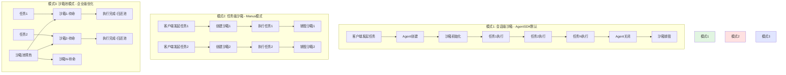
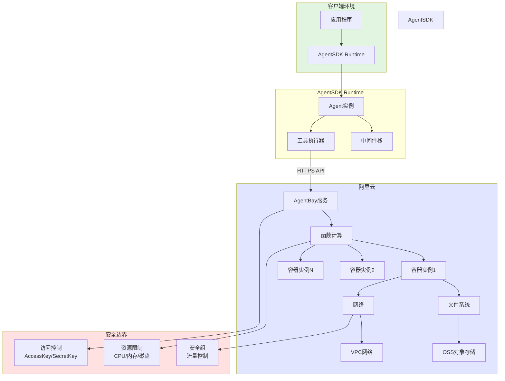
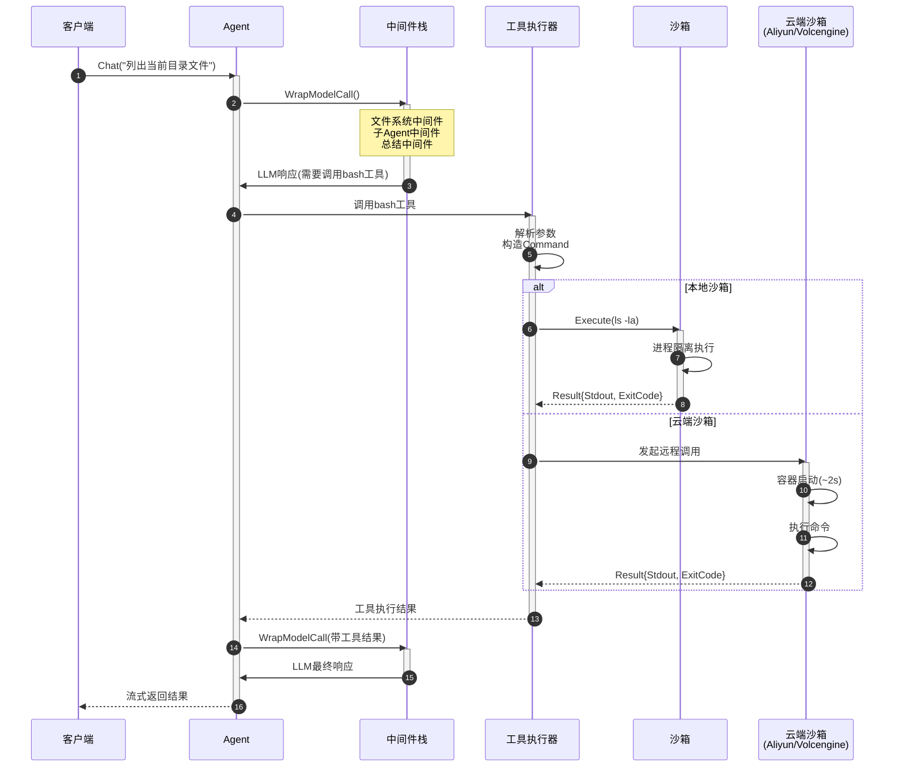

# 沙箱系统

AgentSDK的沙箱系统提供安全隔离的代码执行环境，确保Agent执行的命令不会危害主机系统。

## 🛡️ 为什么需要沙箱？

### 安全风险

Agent可能会：
- 执行危险命令（`rm -rf /`）
- 访问敏感文件
- 发起网络攻击
- 消耗过多资源

### 沙箱的作用

```
┌────────────────────────────────────┐
│         主机系统                    │
│  ┌──────────────────────────────┐  │
│  │      AgentSDK Runtime        │  │
│  │                              │  │
│  │  ┌────────────────────────┐  │  │
│  │  │     Sandbox            │  │  │
│  │  │  ┌──────────────────┐  │  │  │
│  │  │  │  Agent执行代码    │  │  │  │
│  │  │  │  (隔离环境)       │  │  │  │
│  │  │  └──────────────────┘  │  │  │
│  │  │  - 限制文件访问        │  │  │
│  │  │  - 限制网络访问        │  │  │
│  │  │  - 限制资源使用        │  │  │
│  │  └────────────────────────┘  │  │
│  └──────────────────────────────┘  │
└────────────────────────────────────┘
```

## 🔄 沙箱生命周期与执行模式

### 生命周期流程图

AgentSDK支持三种沙箱执行模式，满足不同场景需求：



### 执行模式对比

| 模式 | 沙箱生命周期 | 适用场景 | 优点 | 缺点 |
|------|------------|---------|------|------|
| **会话级** | Agent创建→关闭 | 长对话、状态保留 | 无重复创建开销<br/>保留执行上下文 | 长期占用资源 |
| **任务级** | 每个任务独立 | 高安全要求、无状态任务 | 完全隔离<br/>无状态污染 | 冷启动延迟<br/>成本较高 |
| **沙箱池** | 预热+复用 | 高并发、低延迟 | 极低延迟<br/>资源利用率高 | 需要状态清理<br/>管理复杂 |

## 📦 沙箱类型

AgentSDK支持多种沙箱后端：

| 沙箱类型 | 隔离级别 | 使用场景 | 性能 | 成本 |
|---------|---------|---------|------|------|
| **LocalSandbox** | 进程级 | 开发测试 | 高 | 免费 |
| **AliyunSandbox** | 容器级 | 生产环境 | 中 | 按用量 |
| **VolcengineSandbox** | 容器级 | 生产环境 | 高 | 按用量 |
| **MockSandbox** | 无隔离 | 单元测试 | 极高 | 免费 |

## 🏠 LocalSandbox

### 特点

- 在本地进程或Docker容器中执行
- 适合开发和测试
- 低延迟、高性能
- 免费使用

### 配置

```go
ag, err := agent.Create(ctx, &types.AgentConfig{
    Sandbox: &types.SandboxConfig{
        Kind:    types.SandboxKindLocal,
        WorkDir: "./workspace",
    },
}, deps)
```

### Docker模式

```go
ag, err := agent.Create(ctx, &types.AgentConfig{
    Sandbox: &types.SandboxConfig{
        Kind:    types.SandboxKindLocal,
        WorkDir: "/workspace",
        Config: map[string]interface{}{
            "use_docker": true,
            "image":      "golang:1.21",
            "memory":     "512m",
            "cpu":        "1.0",
        },
    },
}, deps)
```

### 限制

- 依赖主机环境
- 隔离性较弱
- 不适合生产环境
- 需要手动管理清理

## ☁️ AliyunSandbox

### 特点

- 阿里云AgentBay Computer Use
- 容器级隔离
- 按需付费
- 自动扩缩容
- 生产级稳定性

### 开通服务

1. 访问[阿里云AgentBay](https://www.aliyun.com/product/agentbay)
2. 开通服务
3. 获取AccessKey和SecretKey

### 配置

```go
ag, err := agent.Create(ctx, &types.AgentConfig{
    Sandbox: &types.SandboxConfig{
        Kind:    types.SandboxKindAliyun,
        WorkDir: "/workspace",
        Config: map[string]interface{}{
            "region":     "cn-hangzhou",
            "access_key": os.Getenv("ALIYUN_ACCESS_KEY_ID"),
            "secret_key": os.Getenv("ALIYUN_ACCESS_KEY_SECRET"),

            // 可选配置
            "timeout":       300,        // 超时时间（秒）
            "memory_limit":  1024,       // 内存限制（MB）
            "cpu_limit":     2.0,        // CPU限制（核心数）
            "network_mode":  "restricted", // 网络模式
        },
    },
}, deps)
```

### 环境变量配置

```bash
# .env文件
export ALIYUN_ACCESS_KEY_ID="your-access-key"
export ALIYUN_ACCESS_KEY_SECRET="your-secret-key"
export ALIYUN_REGION="cn-hangzhou"
```

### 费用说明

- 按执行时间计费
- 约￥0.01/秒（取决于资源配置）
- 有免费额度（新用户）

### 架构集成图



### 数据流说明

1. **客户端 → AgentSDK**：应用程序通过SDK发起Agent调用
2. **AgentSDK → 阿里云**：通过HTTPS API调用AgentBay服务
3. **AgentBay → 函数计算**：动态创建或分配容器实例
4. **容器执行**：在隔离环境中执行命令，访问受限资源
5. **结果返回**：执行结果通过API返回到AgentSDK

## 🌋 VolcengineSandbox

### 特点

- 火山引擎云沙箱
- 高性能计算
- 容器级隔离
- 按需付费

### 开通服务

1. 访问[火山引擎](https://www.volcengine.com/)
2. 开通沙箱服务
3. 获取AK/SK

### 配置

```go
ag, err := agent.Create(ctx, &types.AgentConfig{
    Sandbox: &types.SandboxConfig{
        Kind:    types.SandboxKindVolcengine,
        WorkDir: "/workspace",
        Config: map[string]interface{}{
            "region":           "cn-beijing",
            "access_key_id":    os.Getenv("VOLC_ACCESS_KEY_ID"),
            "secret_access_key": os.Getenv("VOLC_SECRET_ACCESS_KEY"),

            // 可选配置
            "instance_type": "standard",  // standard/performance
            "timeout":       600,
            "auto_destroy":  true,
        },
    },
}, deps)
```

## 🧪 MockSandbox

### 特点

- 模拟执行，不实际运行
- 用于单元测试
- 无副作用
- 可预设返回值

### 配置

```go
mockSandbox := sandbox.NewMockSandbox()

// 预设命令返回
mockSandbox.SetOutput("ls", "file1.txt\nfile2.txt\n")
mockSandbox.SetOutput("cat README.md", "# Hello\n...")

ag, err := agent.Create(ctx, &types.AgentConfig{
    Sandbox: &types.SandboxConfig{
        Kind: types.SandboxKindMock,
    },
}, &agent.Dependencies{
    SandboxFactory: func() sandbox.Sandbox {
        return mockSandbox
    },
    // ...
})
```

### 测试示例

```go
func TestAgentWithMockSandbox(t *testing.T) {
    mock := sandbox.NewMockSandbox()
    mock.SetOutput("go test", "PASS\nok\t...")

    ag, _ := agent.Create(ctx, config, &agent.Dependencies{
        SandboxFactory: func() sandbox.Sandbox {
            return mock
        },
    })

    result, _ := ag.Chat(ctx, "运行测试")
    assert.Contains(t, result.Text, "测试通过")
}
```

## ⏱️ 任务执行时序图

下图展示了从客户端发起请求到沙箱执行完成的完整交互流程：



### 关键时序节点

| 阶段 | 本地沙箱耗时 | 云端沙箱耗时 | 说明 |
|------|------------|------------|------|
| 1-3 LLM推理 | ~500ms | ~500ms | 第一次模型调用 |
| 4-6 工具准备 | ~10ms | ~10ms | 参数解析和验证 |
| 7-9 沙箱执行 | ~50ms | ~2s | 云端需要冷启动 |
| 10-12 LLM响应 | ~300ms | ~300ms | 第二次模型调用 |
| **总耗时** | **~860ms** | **~2.8s** | - |

### 优化建议

1. **云端沙箱预热**：提前创建沙箱实例，消除冷启动延迟
2. **并行执行**：多个独立命令可并行调用沙箱
3. **结果缓存**：相同命令（如 `ls`）可缓存结果
4. **沙箱池**：高并发场景使用沙箱池降低平均延迟

## 🔧 Sandbox接口

### 接口定义

```go
type Sandbox interface {
    // 执行命令
    Execute(ctx context.Context, cmd *Command) (*Result, error)

    // 文件操作
    ReadFile(ctx context.Context, path string) ([]byte, error)
    WriteFile(ctx context.Context, path string, content []byte) error
    ListFiles(ctx context.Context, path string) ([]FileInfo, error)

    // 生命周期
    Start(ctx context.Context) error
    Stop(ctx context.Context) error
    Health(ctx context.Context) error
}
```

### Command结构

```go
type Command struct {
    Command     string            // 命令字符串
    Args        []string          // 参数
    Env         map[string]string // 环境变量
    WorkDir     string            // 工作目录
    Timeout     time.Duration     // 超时时间
    StdinData   []byte            // 标准输入
}
```

### Result结构

```go
type Result struct {
    Stdout   string // 标准输出
    Stderr   string // 标准错误
    ExitCode int    // 退出码
    Duration time.Duration // 执行时长
    Error    error  // 错误（如有）
}
```

## 🎯 使用场景

### 场景1：代码执行

```go
// Agent执行bash命令
ag.Chat(ctx, `
运行以下Go程序：
go run main.go

然后告诉我输出是什么
`)
```

沙箱中执行：
```bash
$ go run main.go
Hello, World!
```

### 场景2：文件操作

```go
// Agent操作文件
ag.Chat(ctx, `
1. 创建一个hello.txt文件
2. 写入"Hello AgentSDK"
3. 读取并验证内容
`)
```

沙箱操作：
```bash
$ echo "Hello AgentSDK" > /workspace/hello.txt
$ cat /workspace/hello.txt
Hello AgentSDK
```

### 场景3：依赖安装

```go
// Agent安装依赖
ag.Chat(ctx, `
安装所需的Python包：
pip install requests beautifulsoup4

然后运行scraper.py
`)
```

### 场景4：测试运行

```go
// Agent运行测试
ag.Chat(ctx, `
运行所有单元测试：
go test ./...

如果有失败，分析原因
`)
```

## ⚙️ 高级配置

### 资源限制

```go
Sandbox: &types.SandboxConfig{
    Kind: types.SandboxKindAliyun,
    Config: map[string]interface{}{
        // CPU限制
        "cpu_limit": 2.0,  // 2个CPU核心
        "cpu_request": 1.0, // 请求1个核心

        // 内存限制
        "memory_limit": 2048,  // 2GB
        "memory_request": 1024, // 请求1GB

        // 磁盘限制
        "disk_limit": 10240,  // 10GB

        // 超时限制
        "timeout": 600,  // 10分钟
        "idle_timeout": 300,  // 空闲5分钟自动销毁
    },
}
```

### 网络配置

```go
Config: map[string]interface{}{
    // 网络模式
    "network_mode": "restricted",  // none/restricted/full

    // 允许的域名白名单
    "allowed_domains": []string{
        "api.github.com",
        "registry.npmjs.org",
    },

    // 禁止的域名黑名单
    "blocked_domains": []string{
        "*.internal.com",
    },

    // 代理配置
    "http_proxy": "http://proxy.example.com:8080",
}
```

### 持久化存储

```go
Config: map[string]interface{}{
    // 挂载卷
    "volumes": []map[string]string{
        {
            "source": "/host/data",
            "target": "/workspace/data",
            "readonly": false,
        },
    },

    // 状态持久化
    "persistent_volume": "/mnt/agent-state",
    "restore_on_start": true,
}
```

### 镜像配置

```go
Config: map[string]interface{}{
    // 自定义镜像
    "image": "my-registry.com/agent-runtime:v1.0",

    // 镜像拉取策略
    "image_pull_policy": "IfNotPresent",  // Always/IfNotPresent/Never

    // 镜像凭据
    "image_pull_secrets": []string{"my-registry-secret"},
}
```

## 🔒 安全策略

### 文件系统隔离

```go
Config: map[string]interface{}{
    // 只读挂载
    "readonly_paths": []string{
        "/etc",
        "/usr",
    },

    // 禁止访问
    "blocked_paths": []string{
        "/proc",
        "/sys",
    },

    // 临时目录
    "temp_dir": "/tmp/agent",
    "auto_clean_temp": true,
}
```

### 命令白名单

```go
Config: map[string]interface{}{
    // 允许的命令
    "allowed_commands": []string{
        "ls", "cat", "echo",
        "go", "python3", "node",
        "git", "npm", "pip",
    },

    // 禁止的命令
    "blocked_commands": []string{
        "rm", "dd", "mkfs",
        "sudo", "su",
    },
}
```

### 环境变量过滤

```go
Config: map[string]interface{}{
    // 允许传递的环境变量
    "env_whitelist": []string{
        "PATH",
        "HOME",
        "LANG",
    },

    // 禁止的环境变量
    "env_blacklist": []string{
        "AWS_*",
        "GITHUB_TOKEN",
    },
}
```

## 📊 监控和日志

### 执行日志

```go
// 订阅Monitor通道获取沙箱事件
monitorCh := ag.Subscribe([]types.AgentChannel{
    types.ChannelMonitor,
}, nil)

for envelope := range monitorCh {
    if e, ok := envelope.Event.(*types.MonitorSandboxExecutionEvent); ok {
        log.Printf("沙箱执行: Command=%s Duration=%v ExitCode=%d",
            e.Command, e.Duration, e.ExitCode)
    }
}
```

### 资源监控

```go
type MonitorSandboxResourceEvent struct {
    CPUUsage    float64  // CPU使用率
    MemoryUsage int64    // 内存使用（字节）
    DiskUsage   int64    // 磁盘使用（字节）
    NetworkIn   int64    // 网络入（字节）
    NetworkOut  int64    // 网络出（字节）
}
```

### 告警配置

```go
Config: map[string]interface{}{
    // 资源告警阈值
    "alert_cpu_threshold": 80.0,     // CPU使用率超过80%
    "alert_memory_threshold": 90.0,   // 内存使用率超过90%
    "alert_disk_threshold": 95.0,     // 磁盘使用率超过95%

    // 告警回调
    "alert_webhook": "https://alerts.example.com/webhook",
}
```

## 🎯 最佳实践

### 1. 选择合适的沙箱

```go
// 开发环境
if os.Getenv("ENV") == "development" {
    sandboxKind = types.SandboxKindLocal
}

// 测试环境
if os.Getenv("ENV") == "test" {
    sandboxKind = types.SandboxKindMock
}

// 生产环境
if os.Getenv("ENV") == "production" {
    sandboxKind = types.SandboxKindAliyun
}
```

### 2. 设置合理的超时

```go
Config: map[string]interface{}{
    // 短任务
    "timeout": 30,  // 30秒

    // 长任务（编译、测试）
    "timeout": 600,  // 10分钟

    // 批量处理
    "timeout": 3600,  // 1小时
}
```

### 3. 清理临时文件

```go
Config: map[string]interface{}{
    "auto_clean": true,
    "clean_on_stop": true,
    "max_disk_usage": 5 * 1024 * 1024 * 1024,  // 5GB
}
```

### 4. 错误处理

```go
result, err := sandbox.Execute(ctx, cmd)
if err != nil {
    // 检查错误类型
    if errors.Is(err, context.DeadlineExceeded) {
        log.Println("命令超时")
    } else if errors.Is(err, sandbox.ErrResourceLimit) {
        log.Println("资源限制")
    } else {
        log.Printf("执行失败: %v", err)
    }
    return err
}

// 检查退出码
if result.ExitCode != 0 {
    log.Printf("命令失败: %s", result.Stderr)
}
```

### 5. 性能优化

```go
// 复用沙箱实例
type SandboxPool struct {
    pool chan sandbox.Sandbox
}

func (p *SandboxPool) Get() sandbox.Sandbox {
    select {
    case sb := <-p.pool:
        return sb
    default:
        return sandbox.New()
    }
}

func (p *SandboxPool) Put(sb sandbox.Sandbox) {
    select {
    case p.pool <- sb:
    default:
        sb.Stop(context.Background())
    }
}
```

## 📚 下一步

- [Agent生命周期](/core-concepts/agent-lifecycle) - 理解沙箱在Agent生命周期中的作用
- [工具系统](/core-concepts/tools-system) - 理解工具如何使用沙箱
- [实战指南](/guides/sandbox-setup) - 沙箱配置和使用示例
- [API参考](/api-reference/sandbox-api) - 详细的Sandbox API文档

## 🔗 相关资源

- [阿里云AgentBay文档](https://help.aliyun.com/product/agentbay.html)
- [火山引擎沙箱文档](https://www.volcengine.com/docs/sandbox)
- [沙箱示例代码](https://github.com/wordflowlab/agentsdk/tree/main/examples/sandbox)
