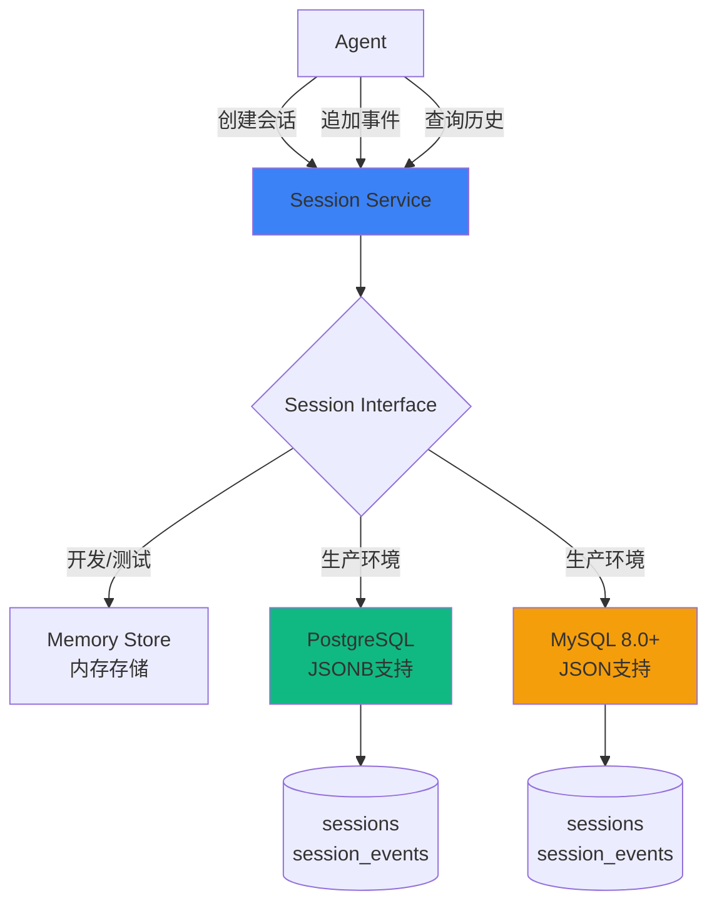
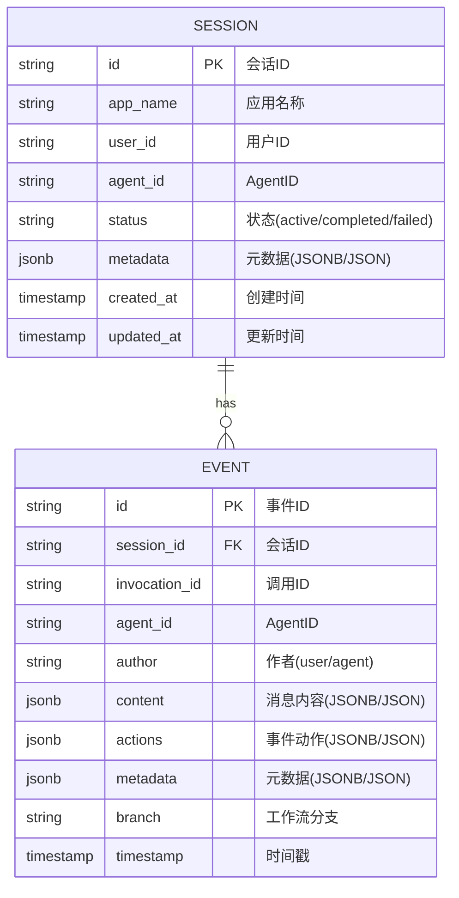
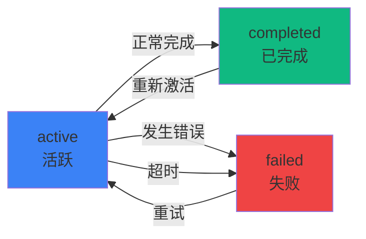
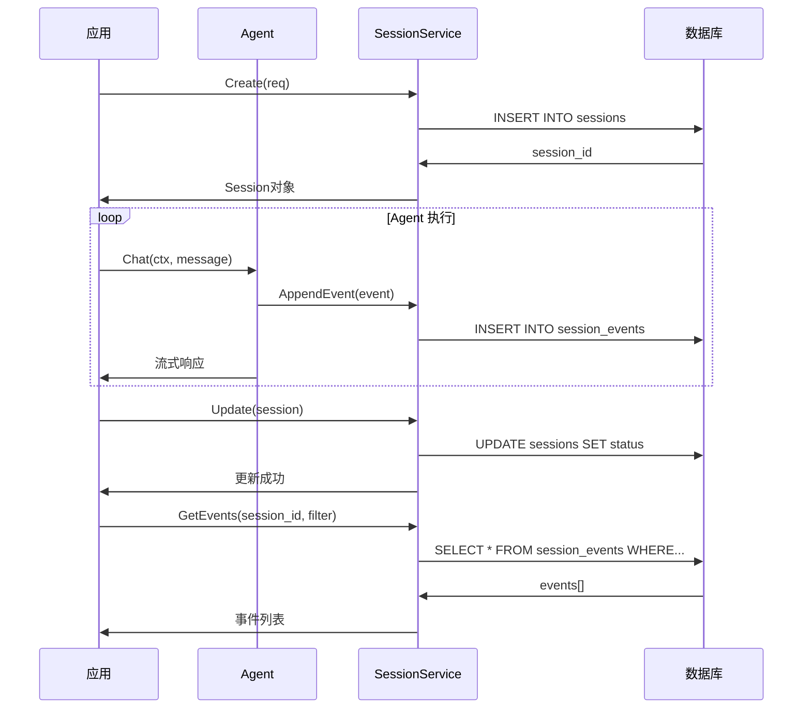

# Session 持久化

Session 持久化是 AgentSDK Phase 7 引入的关键功能，提供了完整的会话状态和事件历史持久化能力，支持 PostgreSQL 和 MySQL 8.0+。

## 🎯 为什么需要 Session 持久化？

在生产环境中，Agent 的会话和历史记录需要持久化存储：

- ✅ **会话恢复**: 应用重启后能够恢复用户会话
- ✅ **历史查询**: 查看完整的对话历史和工具调用记录
- ✅ **审计合规**: 满足安全审计和合规要求
- ✅ **数据分析**: 分析用户行为和 Agent 性能
- ✅ **调试优化**: 追踪问题和优化 Agent 表现

## 📊 架构设计



### 三种存储实现

| 存储类型 | 用途 | 数据持久化 | JSON 支持 | 适用场景 |
|---------|------|-----------|-----------|---------|
| **Memory** | 开发/测试 | ❌ 无 | ✅ 原生 | 本地开发、单元测试 |
| **PostgreSQL** | 生产推荐 | ✅ 持久化 | ✅ JSONB | 复杂查询、全文搜索 |
| **MySQL 8.0+** | 生产可选 | ✅ 持久化 | ✅ JSON | 已有 MySQL 基础设施 |

## 📐 数据模型

### Session 表

存储会话元数据：



**Session 字段说明**:

| 字段 | 类型 | 说明 | 示例 |
|------|------|------|------|
| `id` | string | 会话唯一ID | `"sess-20250113-abc123"` |
| `app_name` | string | 应用名称 | `"my-chatbot"` |
| `user_id` | string | 用户ID | `"user-001"` |
| `agent_id` | string | Agent ID | `"agent-assistant"` |
| `status` | string | 会话状态 | `"active"`, `"completed"`, `"failed"` |
| `metadata` | jsonb/json | 自定义元数据 | `{"version": "1.0", "env": "prod"}` |

**Event 字段说明**:

| 字段 | 类型 | 说明 | 示例 |
|------|------|------|------|
| `id` | string | 事件唯一ID | `"evt-001"` |
| `session_id` | string | 所属会话ID | `"sess-20250113-abc123"` |
| `invocation_id` | string | 调用ID（工作流追踪） | `"inv-001"` |
| `agent_id` | string | 产生事件的 Agent ID | `"agent-001"` |
| `author` | string | 事件作者 | `"user"`, `"agent"` |
| `content` | jsonb/json | 消息内容 | `{"role": "user", "content": "Hello"}` |
| `actions` | jsonb/json | 事件动作 | `{"escalate": false}` |
| `metadata` | jsonb/json | 事件元数据 | `{"loop_iteration": 1}` |
| `branch` | string | 工作流分支路径 | `"Pipeline.Analyzer"` |

### 索引优化

为高性能查询创建的索引：

```sql
-- Session 表索引
CREATE INDEX idx_sessions_user_id ON sessions(user_id);
CREATE INDEX idx_sessions_agent_id ON sessions(agent_id);
CREATE INDEX idx_sessions_status ON sessions(status);
CREATE INDEX idx_sessions_created_at ON sessions(created_at);

-- Event 表索引
CREATE INDEX idx_events_session_id ON session_events(session_id);
CREATE INDEX idx_events_timestamp ON session_events(timestamp);
CREATE INDEX idx_events_invocation_id ON session_events(invocation_id);
CREATE INDEX idx_events_agent_id ON session_events(agent_id);
```

## 🔄 生命周期

### Session 状态机



### 完整流程



## 🔧 服务接口

### 核心接口

```go
type SessionService interface {
    // Session 管理
    Create(ctx context.Context, req *CreateRequest) (*Session, error)
    Get(ctx context.Context, id string) (*Session, error)
    Update(ctx context.Context, session *Session) error
    Delete(ctx context.Context, id string) error
    List(ctx context.Context, filter *ListFilter) ([]*Session, error)

    // Event 管理
    AppendEvent(ctx context.Context, sessionID string, event *Event) error
    AppendEvents(ctx context.Context, sessionID string, events []*Event) error
    GetEvents(ctx context.Context, sessionID string, filter *EventFilter) ([]*Event, error)

    // 批量操作
    DeleteByUser(ctx context.Context, userID string) error
    DeleteByApp(ctx context.Context, appName string) error

    // 资源清理
    Close() error
}
```

### 过滤器

**ListFilter** - Session 列表查询：

```go
type ListFilter struct {
    AppName   string    // 按应用名称过滤
    UserID    string    // 按用户ID过滤
    AgentID   string    // 按AgentID过滤
    Status    string    // 按状态过滤
    StartTime time.Time // 时间范围开始
    EndTime   time.Time // 时间范围结束
    Limit     int       // 返回数量限制
    Offset    int       // 偏移量（分页）
}
```

**EventFilter** - Event 查询：

```go
type EventFilter struct {
    InvocationID string    // 按调用ID过滤
    AgentID      string    // 按AgentID过滤
    Author       string    // 按作者过滤
    StartTime    time.Time // 时间范围开始
    EndTime      time.Time // 时间范围结束
    Limit        int       // 返回数量限制
    Offset       int       // 偏移量（分页）
}
```

## 🚀 性能优化

### 1. 批量操作

```go
// ✅ 推荐：批量插入事件
events := []*session.Event{ /* ... */ }
service.AppendEvents(ctx, sess.ID, events)  // 单个事务

// ❌ 避免：逐条插入
for _, event := range events {
    service.AppendEvent(ctx, sess.ID, event)  // 多个事务，慢
}
```

**性能对比**:
- 批量插入：~10ms（100条事件）
- 逐条插入：~1000ms（100条事件，每条10ms）

### 2. 连接池调优

```go
// 生产环境推荐配置
config := &postgres.Config{
    MaxOpenConns: 50,              // 最大连接数
    MaxIdleConns: 10,              // 最大空闲连接
    MaxLifetime:  5 * time.Minute, // 连接最大生命周期
}
```

### 3. 查询优化

```go
// ✅ 推荐：使用索引字段查询
filter := &session.ListFilter{
    UserID:    "user-001",  // 有索引
    StartTime: yesterday,   // 有索引
    Limit:     100,
}

// ❌ 避免：LIKE 查询或全表扫描
// 使用 metadata 字段做复杂查询可能较慢
```

### 4. 分页最佳实践

```go
// 游标分页（推荐）
filter := &session.EventFilter{
    StartTime: lastEventTime,  // 上次查询的最后一个事件时间
    Limit:     100,
}

// Offset 分页（简单但慢）
filter := &session.EventFilter{
    Limit:  100,
    Offset: 200,  // 第3页，跳过前200条
}
```

## 🔐 安全最佳实践

### 1. 数据库权限最小化

```sql
-- PostgreSQL: 创建专用用户
CREATE USER agentsdk_app WITH PASSWORD 'strong_password';
GRANT SELECT, INSERT, UPDATE, DELETE ON sessions, session_events TO agentsdk_app;
GRANT USAGE, SELECT ON ALL SEQUENCES IN SCHEMA public TO agentsdk_app;

-- MySQL: 创建专用用户
CREATE USER 'agentsdk_app'@'%' IDENTIFIED BY 'strong_password';
GRANT SELECT, INSERT, UPDATE, DELETE ON agentsdk.* TO 'agentsdk_app'@'%';
FLUSH PRIVILEGES;
```

### 2. SSL/TLS 连接

```go
// PostgreSQL SSL
DSN: "host=db.example.com port=5432 user=user dbname=db sslmode=require"

// MySQL SSL
DSN: "user:pwd@tcp(db.example.com:3306)/db?tls=custom"
```

### 3. 敏感数据加密

```go
// 存储前加密敏感内容
event := &session.Event{
    Content: types.Message{
        Role:    types.RoleUser,
        Content: encrypt(sensitiveContent),  // 加密
    },
    Metadata: map[string]interface{}{
        "ip": hashIP(clientIP),  // 哈希化
    },
}
```

### 4. 数据保留策略

```go
// 定期清理历史数据
func cleanupOldSessions(service SessionService) {
    cutoffTime := time.Now().Add(-30 * 24 * time.Hour) // 30天前

    sessions, _ := service.List(ctx, &session.ListFilter{
        EndTime: cutoffTime,
        Status:  session.StatusCompleted,
        Limit:   1000,
    })

    for _, sess := range sessions {
        service.Delete(ctx, sess.ID)
    }
}
```

## 📊 数据库选择指南

### PostgreSQL vs MySQL

| 特性 | PostgreSQL | MySQL 8.0+ | 说明 |
|------|-----------|-----------|------|
| **JSON 查询** | ✅ 优秀 (JSONB) | ✅ 良好 (JSON) | PG 的 JSONB 性能更好 |
| **全文搜索** | ✅ 内置 | ⚠️ 需配置 | PG 开箱即用 |
| **复杂查询** | ✅ 强大 | ✅ 良好 | PG 支持更多高级特性 |
| **并发性能** | ✅ MVCC | ✅ InnoDB | 都支持高并发 |
| **生态成熟度** | ✅ 活跃 | ✅ 活跃 | 两者都很成熟 |
| **云服务支持** | ✅ 广泛 | ✅ 广泛 | AWS、GCP、Azure 都支持 |
| **部署成本** | 💰 中 | 💰 低 | MySQL 部署稍简单 |

**推荐决策**:
- ✅ **选择 PostgreSQL**: 需要复杂 JSON 查询、全文搜索、高级分析
- ✅ **选择 MySQL**: 已有 MySQL 基础设施、简单查询为主、成本敏感

## 🔗 与工作流 Agent 集成

Session 持久化与工作流 Agent 无缝集成：

```go
// 创建 Session
sess, _ := sessionService.Create(ctx, &session.CreateRequest{
    AppName: "workflow-demo",
    UserID:  userID,
    AgentID: "pipeline-agent",
})

// 执行工作流，自动持久化事件
sequential, _ := workflow.NewSequentialAgent(workflow.SequentialConfig{
    Name: "DataPipeline",
    SubAgents: []workflow.Agent{collector, analyzer, reporter},
})

for event, err := range sequential.Execute(ctx, "处理数据") {
    // 追加事件到数据库
    sessionService.AppendEvent(ctx, sess.ID, &event)

    // 事件包含丰富的工作流元数据
    step := event.Metadata["sequential_step"]
    branch := event.Branch  // "DataPipeline.Analyzer"
}

// 更新 Session 状态
sess.Status = session.StatusCompleted
sessionService.Update(ctx, sess)
```

## 📚 相关资源

- [Session 持久化示例](/examples/session) - PostgreSQL 和 MySQL 完整示例
- [工作流 Agent](/core-concepts/workflow-agents) - 与工作流集成
- [性能优化](/best-practices/performance) - 数据库性能调优
- [安全最佳实践](/best-practices/security) - 数据安全策略

## ❓ 常见问题

### Q1: 如何从内存存储迁移到 PostgreSQL？

A: 使用批量操作迁移数据：

```go
// 从内存读取
memSessions := memStore.ListSessions()

// 批量写入 PostgreSQL
for _, sess := range memSessions {
    pgService.Create(ctx, sess)

    events := memStore.GetEvents(sess.ID)
    pgService.AppendEvents(ctx, sess.ID, events)
}
```

### Q2: 如何处理大量事件的查询？

A: 使用流式分页查询：

```go
offset := 0
limit := 1000

for {
    events, _ := service.GetEvents(ctx, sess.ID, &session.EventFilter{
        Limit:  limit,
        Offset: offset,
    })

    if len(events) == 0 {
        break
    }

    processEvents(events)
    offset += limit
}
```

### Q3: 支持事务吗？

A: 是的，批量操作自动使用事务：

```go
// AppendEvents 内部使用事务
service.AppendEvents(ctx, sess.ID, events)  // 全部成功或全部失败
```

### Q4: 如何监控数据库性能？

A: 检查连接池状态：

```go
stats := service.DB().Stats()
fmt.Printf("Open=%d Idle=%d InUse=%d WaitCount=%d\n",
    stats.OpenConnections,
    stats.Idle,
    stats.InUse,
    stats.WaitCount)
```

### Q5: 数据如何备份？

```bash
# PostgreSQL
pg_dump -h localhost -U postgres agentsdk > backup-$(date +%Y%m%d).sql

# MySQL
mysqldump -h 127.0.0.1 -u root -p agentsdk > backup-$(date +%Y%m%d).sql
```

## 🚀 下一步

- [开始使用 Session 持久化](/examples/session) - 完整代码示例
- [工作流 Agent](/core-concepts/workflow-agents) - 持久化工作流状态
- [部署指南](/best-practices/deployment) - 生产环境配置
- [性能调优](/best-practices/performance) - 数据库优化策略
