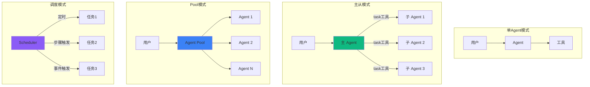
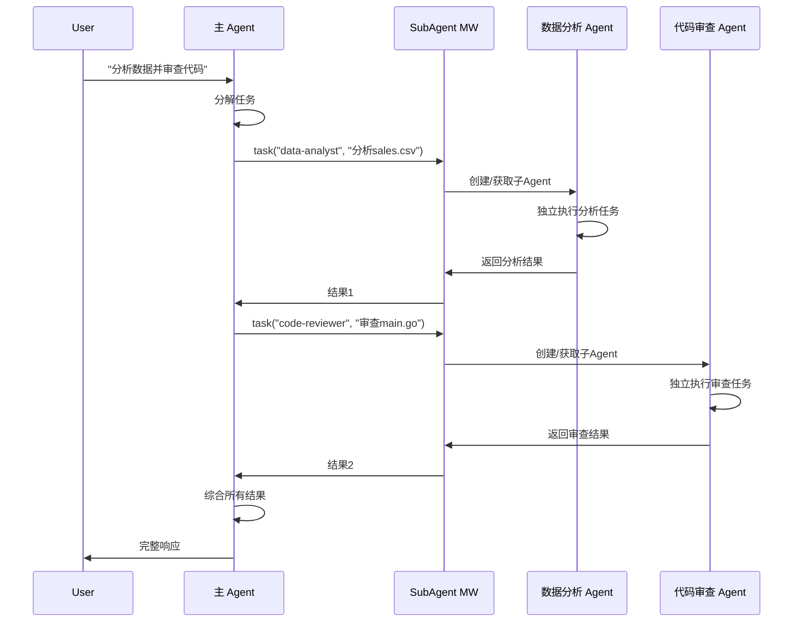
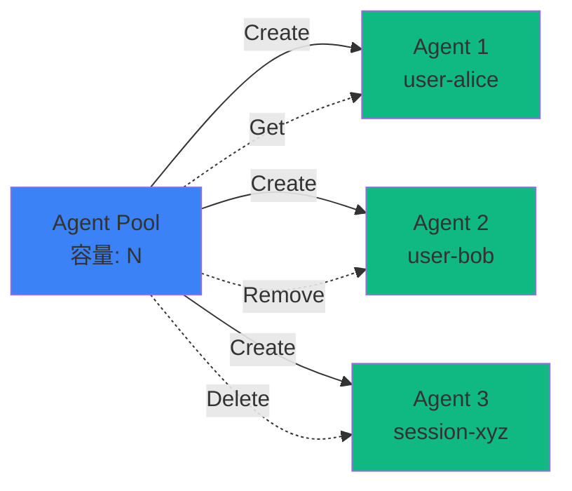
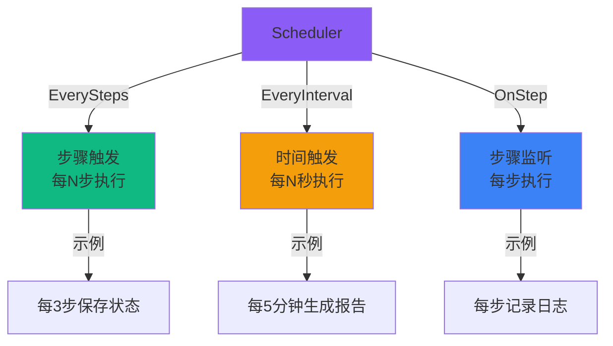
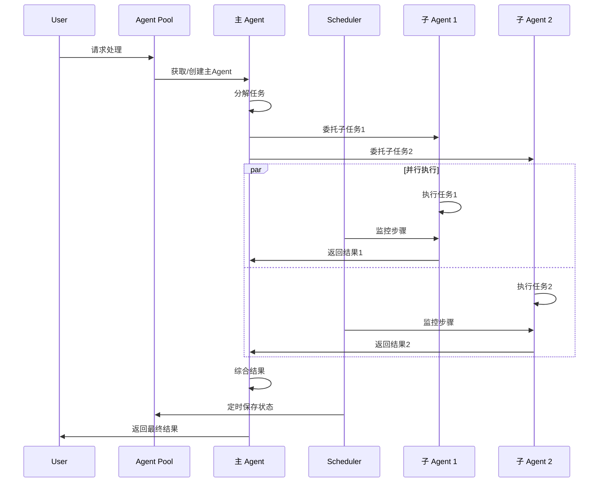

# 多 Agent 协作示例

AgentSDK 提供了多种多 Agent 协作模式，支持从简单的任务委托到复杂的分布式系统。

## 🎯 协作模式概览



## 📦 协作组件

| 组件 | 功能 | 适用场景 |
|------|------|----------|
| [SubAgent 中间件](#subagent) | 任务委托 | 主从协作、专业化分工 |
| [Agent Pool](#pool) | Agent 生命周期管理 | 多租户、会话管理 |
| [Scheduler](#scheduler) | 任务调度 | 定时任务、事件触发 |

## <a id="subagent"></a>🤖 SubAgent - 主从协作

**功能**: 主 Agent 通过 `task` 工具委托任务给子 Agent 执行。

### 架构



### 配置和使用

```go
package main

import (
    "context"
    "log"
    "os"

    "github.com/wordflowlab/agentsdk/pkg/agent"
    "github.com/wordflowlab/agentsdk/pkg/middleware"
    "github.com/wordflowlab/agentsdk/pkg/types"
)

func main() {
    ctx := context.Background()

    // 1. 创建 SubAgent 中间件
    subagentMW, _ := middleware.NewSubAgentMiddleware(&middleware.SubAgentMiddlewareConfig{
        Factory: createSubAgentFactory(),
        Specs: []middleware.SubAgentSpec{
            {
                Name:        "data-analyst",
                Description: "数据分析专家，擅长数据处理和可视化",
                Prompt:      "你是数据分析专家，精通数据处理、统计分析和可视化。",
                Tools:       []string{"python_exec", "pandas_query", "matplotlib"},
            },
            {
                Name:        "code-reviewer",
                Description: "代码审查专家，检查代码质量和安全问题",
                Prompt:      "你是资深代码审查专家，专注于代码质量、安全性和最佳实践。",
                Tools:       []string{"fs_read", "grep", "bash_run"},
            },
            {
                Name:        "content-writer",
                Description: "内容创作专家，擅长撰写各类文档",
                Prompt:      "你是专业内容创作者，擅长撰写清晰、准确、吸引人的文档。",
                Tools:       []string{"fs_read", "fs_write", "web_search"},
            },
        },
        EnableGeneralPurpose: true,  // 同时启用通用子Agent
    })

    // 2. 注册中间件
    stack := middleware.NewStack()
    stack.Use(subagentMW)

    // 3. 创建主 Agent
    config := &types.AgentConfig{
        TemplateID: "coordinator",
        ModelConfig: &types.ModelConfig{
            Provider: "anthropic",
            Model:    "claude-sonnet-4-5",
            APIKey:   os.Getenv("ANTHROPIC_API_KEY"),
        },
        SystemPrompt: `你是一个协调者，负责分解复杂任务并委托给专业子Agent。
可用的专业子Agent：
- data-analyst: 数据分析
- code-reviewer: 代码审查
- content-writer: 内容创作
- general-purpose: 通用任务

当任务复杂或需要专业技能时，使用 task 工具委托给合适的子Agent。`,
    }

    deps := createDependencies(stack)
    mainAgent, err := agent.Create(ctx, config, deps)
    if err != nil {
        log.Fatal(err)
    }
    defer mainAgent.Close()

    // 4. 使用主 Agent（自动委托任务）
    testSubAgentCoordination(ctx, mainAgent)
}

func testSubAgentCoordination(ctx context.Context, ag *agent.Agent) {
    // 示例 1: 数据分析任务
    fmt.Println("=== 示例 1: 数据分析 ===")
    result, _ := ag.Chat(ctx, "请分析 sales-2024.csv 文件，生成月度销售报告")
    // → 主Agent识别需要数据分析能力
    // → 调用: task(agent="data-analyst", task="分析 sales-2024.csv...")
    // → 子Agent独立执行分析任务
    // → 主Agent收到结果并响应用户
    fmt.Printf("结果: %s\n\n", result.Text)

    // 示例 2: 代码审查任务
    fmt.Println("=== 示例 2: 代码审查 ===")
    result, _ = ag.Chat(ctx, "请审查 src/api/users.go 的安全性")
    // → 调用: task(agent="code-reviewer", task="审查 src/api/users.go 安全性")
    fmt.Printf("结果: %s\n\n", result.Text)

    // 示例 3: 复合任务（多个子Agent协作）
    fmt.Println("=== 示例 3: 复合任务 ===")
    result, _ = ag.Chat(ctx, "分析sales.csv数据，审查相关代码，然后写一份技术报告")
    // → 主Agent分解任务：
    //   1. task(agent="data-analyst", ...)
    //   2. task(agent="code-reviewer", ...)
    //   3. task(agent="content-writer", ...)
    // → 综合所有结果生成最终报告
    fmt.Printf("结果: %s\n\n", result.Text)
}
```

### 关键特性

**1. 任务隔离**
```go
// 每个子Agent有独立的上下文
// 不会污染主Agent的对话历史
```

**2. 专业化分工**
```go
// 不同子Agent可以有不同的：
// - SystemPrompt（角色定位）
// - Tools（专业工具）
// - 中间件（特定能力）
```

**3. 并行执行**（可选）
```go
subagentMW, _ := middleware.NewSubAgentMiddleware(&middleware.SubAgentMiddlewareConfig{
    EnableParallel: true,  // 启用并行执行
    // 多个task调用可以并发执行
})
```

---

## <a id="pool"></a>🏊 Agent Pool - 生命周期管理

**功能**: 管理多个 Agent 的创建、获取、移除，适用于多租户和会话管理。

[查看完整代码 →](https://github.com/wordflowlab/agentsdk/blob/main/examples/pool/main.go)

### 核心概念



### 基本使用

```go
package main

import (
    "context"
    "fmt"

    "github.com/wordflowlab/agentsdk/pkg/core"
    "github.com/wordflowlab/agentsdk/pkg/types"
)

func main() {
    ctx := context.Background()

    // 1. 创建 Pool
    pool := core.NewPool(&core.PoolOptions{
        Dependencies: createDependencies(),
        MaxAgents:    100,  // 最大容量
    })
    defer pool.Shutdown()  // 释放所有Agent

    // 2. 创建 Agent
    config := &types.AgentConfig{
        TemplateID: "assistant",
        ModelConfig: &types.ModelConfig{
            Provider: "anthropic",
            Model:    "claude-sonnet-4-5",
            APIKey:   os.Getenv("ANTHROPIC_API_KEY"),
        },
    }

    ag, err := pool.Create(ctx, config)
    if err != nil {
        log.Fatal(err)
    }
    fmt.Printf("✓ Agent 创建成功: %s\n", ag.ID())

    // 3. 获取 Agent
    ag, exists := pool.Get("agt:xxxxx")
    if exists {
        fmt.Println("✓ Agent 获取成功")
    }

    // 4. 列出所有 Agent
    allAgents := pool.List("")
    fmt.Printf("池中 Agent 数量: %d\n", len(allAgents))

    // 5. 按前缀过滤
    userAgents := pool.List("user-")
    fmt.Printf("用户 Agent: %v\n", userAgents)

    // 6. 查询状态
    status, _ := pool.Status(ag.ID())
    fmt.Printf("状态: %s, 步骤: %d\n", status.State, status.StepCount)

    // 7. 移除 Agent（保留存储）
    err = pool.Remove(ag.ID())

    // 8. 删除 Agent（包括存储）
    err = pool.Delete(ctx, ag.ID())

    // 9. 遍历所有 Agent
    pool.ForEach(func(agentID string, ag *agent.Agent) error {
        status := ag.Status()
        fmt.Printf("  %s: %s\n", agentID, status.State)
        return nil
    })
}
```

### Pool API

| 方法 | 功能 | 说明 |
|------|------|------|
| `Create(ctx, config)` | 创建新Agent | 返回Agent实例 |
| `Resume(ctx, agentID, config)` | 恢复Agent | 从存储恢复 |
| `Get(agentID)` | 获取Agent | 返回 (agent, exists) |
| `List(prefix)` | 列出Agent | 可选前缀过滤 |
| `Status(agentID)` | 查询状态 | 返回状态信息 |
| `Remove(agentID)` | 移除Agent | 关闭但保留存储 |
| `Delete(ctx, agentID)` | 删除Agent | 包括存储数据 |
| `ForEach(fn)` | 遍历Agent | 回调函数遍历 |
| `Size()` | 池大小 | 当前Agent数量 |
| `Shutdown()` | 关闭池 | 关闭所有Agent |

### 使用场景

**1. 多租户系统**

```go
// 为每个用户创建独立Agent
func getUserAgent(ctx context.Context, pool *core.Pool, userID string) (*agent.Agent, error) {
    // 尝试获取现有Agent
    ag, exists := pool.Get(userID)
    if exists {
        return ag, nil
    }

    // 创建新Agent
    config := createUserAgentConfig(userID)
    return pool.Create(ctx, config)
}

// 使用
ag, _ := getUserAgent(ctx, pool, "user-123")
ag.Chat(ctx, "用户的消息")
```

**2. 会话管理**

```go
// HTTP Handler
func handleChat(w http.ResponseWriter, r *http.Request) {
    sessionID := r.Header.Get("Session-ID")

    // 获取或创建会话Agent
    ag, exists := pool.Get(sessionID)
    if !exists {
        ag, _ = pool.Create(ctx, createSessionConfig(sessionID))
    }

    // 处理消息
    result, _ := ag.Chat(ctx, getUserMessage(r))
    json.NewEncoder(w).Encode(result)

    // 会话超时清理（定时任务）
    if isSessionExpired(sessionID) {
        pool.Remove(sessionID)
    }
}
```

**3. Worker Pool**

```go
// 创建Worker池
for i := 0; i < 10; i++ {
    workerID := fmt.Sprintf("worker-%d", i)
    pool.Create(ctx, createWorkerConfig(workerID))
}

// 任务分配
func assignTask(task string) {
    pool.ForEach(func(id string, ag *agent.Agent) error {
        if ag.Status().State == types.AgentStateIdle {
            ag.Send(ctx, task)  // 异步执行
            return fmt.Errorf("task assigned")  // 停止遍历
        }
        return nil
    })
}
```

---

## <a id="scheduler"></a>⏰ Scheduler - 任务调度

**功能**: 基于步骤或时间触发任务，支持定时执行和事件监听。

[查看完整代码 →](https://github.com/wordflowlab/agentsdk/blob/main/examples/scheduler/main.go)

### 调度模式



### 基本使用

```go
package main

import (
    "context"
    "fmt"
    "time"

    "github.com/wordflowlab/agentsdk/pkg/core"
)

func main() {
    ctx := context.Background()

    // 创建 Scheduler
    scheduler := core.NewScheduler(nil)
    defer scheduler.Shutdown()

    // 1. 步骤触发：每3步执行一次
    taskID1, _ := scheduler.EverySteps(3, func(ctx context.Context, stepCount int) error {
        fmt.Printf("✓ 步骤任务: 第 %d 步\n", stepCount)
        // 示例: 每3步保存Agent状态
        return saveAgentState(ctx)
    })
    fmt.Printf("步骤任务创建: %s\n", taskID1)

    // 2. 时间触发：每5秒执行一次
    taskID2, _ := scheduler.EveryInterval(5*time.Second, func(ctx context.Context) error {
        fmt.Printf("✓ 定时任务: %s\n", time.Now().Format("15:04:05"))
        // 示例: 每5秒生成进度报告
        return generateProgressReport(ctx)
    })
    fmt.Printf("定时任务创建: %s\n", taskID2)

    // 3. 步骤监听：每步都执行
    cancel := scheduler.OnStep(func(ctx context.Context, stepCount int) error {
        fmt.Printf("  [监听] 步骤 %d 完成\n", stepCount)
        // 示例: 记录每步的日志
        return logStep(ctx, stepCount)
    })
    defer cancel()  // 取消监听

    // 4. 通知步骤（模拟Agent执行）
    for i := 1; i <= 10; i++ {
        scheduler.NotifyStep(i)
        time.Sleep(500 * time.Millisecond)
    }

    // 5. 取消任务
    scheduler.CancelTask(taskID1)
    scheduler.CancelTask(taskID2)
}
```

### Scheduler API

| 方法 | 功能 | 参数 |
|------|------|------|
| `EverySteps(n, fn)` | 每N步执行 | n: 步数间隔<br/>fn: 任务函数 |
| `EveryInterval(d, fn)` | 每N时间执行 | d: 时间间隔<br/>fn: 任务函数 |
| `OnStep(fn)` | 步骤监听 | fn: 监听函数<br/>返回取消函数 |
| `NotifyStep(n)` | 通知步骤 | n: 当前步数 |
| `CancelTask(id)` | 取消任务 | id: 任务ID |
| `Shutdown()` | 关闭调度器 | 停止所有任务 |

### 使用场景

**1. 定期保存状态**

```go
// 每5步自动保存Agent状态
scheduler.EverySteps(5, func(ctx context.Context, stepCount int) error {
    return ag.SaveState(ctx)
})
```

**2. 进度报告**

```go
// 每1分钟生成进度报告
scheduler.EveryInterval(1*time.Minute, func(ctx context.Context) error {
    progress := calculateProgress()
    return sendProgressReport(progress)
})
```

**3. 性能监控**

```go
// 监听每一步，记录性能指标
scheduler.OnStep(func(ctx context.Context, stepCount int) error {
    metrics := collectMetrics()
    return reportMetrics(metrics)
})
```

**4. 超时控制**

```go
// 15分钟后自动停止Agent
scheduler.EveryInterval(15*time.Minute, func(ctx context.Context) error {
    ag.Pause()
    return fmt.Errorf("timeout: agent paused after 15 minutes")
})
```

---

## 🎨 协作模式组合

### 完整的多Agent系统

```go
package main

import (
    "context"
    "fmt"

    "github.com/wordflowlab/agentsdk/pkg/agent"
    "github.com/wordflowlab/agentsdk/pkg/core"
    "github.com/wordflowlab/agentsdk/pkg/middleware"
)

func main() {
    ctx := context.Background()

    // 1. 创建 Agent Pool（管理所有Agent）
    pool := core.NewPool(&core.PoolOptions{
        Dependencies: createDependencies(),
        MaxAgents:    50,
    })
    defer pool.Shutdown()

    // 2. 创建 Scheduler（任务调度）
    scheduler := core.NewScheduler(pool)
    defer scheduler.Shutdown()

    // 3. 创建主Agent（使用SubAgent中间件）
    subagentMW, _ := middleware.NewSubAgentMiddleware(&middleware.SubAgentMiddlewareConfig{
        Factory: createSubAgentFactory(),
        Specs:   createSubAgentSpecs(),
    })

    stack := middleware.NewStack()
    stack.Use(subagentMW)

    mainConfig := &types.AgentConfig{
        TemplateID: "coordinator",
        // ... 配置
    }

    deps := createDependencies(stack)
    mainAgent, _ := pool.Create(ctx, mainConfig)

    // 4. 设置定时任务
    scheduler.EverySteps(10, func(ctx context.Context, step int) error {
        // 每10步保存所有Agent状态
        return pool.ForEach(func(id string, ag *agent.Agent) error {
            return ag.SaveState(ctx)
        })
    })

    scheduler.EveryInterval(5*time.Minute, func(ctx context.Context) error {
        // 每5分钟生成系统报告
        return generateSystemReport(pool)
    })

    // 5. 使用系统
    result, _ := mainAgent.Chat(ctx, "复杂的多步骤任务")
    fmt.Println(result.Text)
}
```

### 协作流程示例



---

## 💡 最佳实践

### 1. Agent Pool 管理

```go
// ✅ 设置合理的容量限制
pool := core.NewPool(&core.PoolOptions{
    MaxAgents: 100,  // 根据系统资源设置
})

// ✅ 及时清理不用的Agent
if !ag.IsActive() {
    pool.Remove(ag.ID())
}

// ✅ 使用有意义的Agent ID
agentID := fmt.Sprintf("user-%s-session-%s", userID, sessionID)
```

### 2. SubAgent 设计

```go
// ✅ 明确的职责划分
Specs: []middleware.SubAgentSpec{
    {
        Name: "data-analyst",      // 单一职责
        Prompt: "专注数据分析",
        Tools: []string{"pandas", "numpy"},  // 专业工具
    },
}

// ❌ 职责模糊
Specs: []middleware.SubAgentSpec{
    {
        Name: "helper",            // 职责不清
        Prompt: "帮助各种任务",
        Tools: []string{"*"},      // 工具太多
    },
}
```

### 3. Scheduler 使用

```go
// ✅ 合理的触发频率
scheduler.EverySteps(5, saveState)      // 不要太频繁
scheduler.EveryInterval(5*time.Minute, report)  // 不要太密集

// ✅ 错误处理
scheduler.EverySteps(10, func(ctx context.Context, step int) error {
    if err := doSomething(); err != nil {
        log.Printf("Task failed: %v", err)
        return err  // 返回错误但不会停止调度
    }
    return nil
})

// ✅ 及时取消不需要的任务
taskID, _ := scheduler.EveryInterval(1*time.Minute, fn)
// ... 使用
scheduler.CancelTask(taskID)  // 不需要时取消
```

### 4. 资源管理

```go
// ✅ 始终释放资源
defer pool.Shutdown()
defer scheduler.Shutdown()

// ✅ 监控资源使用
fmt.Printf("池大小: %d/%d\n", pool.Size(), maxAgents)
if pool.Size() > maxAgents * 0.8 {
    log.Warn("Pool almost full, consider cleanup")
}
```

---

## ❓ 常见问题

### Q: Pool 和 SubAgent 有什么区别？

| 特性 | Pool | SubAgent |
|------|------|----------|
| 管理对象 | 独立的Agent实例 | 主Agent的子任务Agent |
| 生命周期 | 手动管理 | 自动管理 |
| 上下文 | 独立上下文 | 任务隔离上下文 |
| 适用场景 | 多租户、会话 | 任务委托、专业化 |

### Q: 如何选择协作模式？

- **SubAgent**: 单个用户的复杂任务，需要专业化分工
- **Pool**: 多个用户/会话，需要管理多个独立Agent
- **Scheduler**: 定时任务、周期性操作、事件监听

### Q: SubAgent 会增加成本吗？

会的。每个子Agent调用都是独立的LLM请求。建议：
- 只在必要时使用SubAgent
- 合并相关的子任务
- 使用缓存减少重复调用

### Q: Pool 的最大容量如何设置？

考虑因素：
- 系统内存（每个Agent占用内存）
- 并发请求数
- 存储I/O能力
- 建议：从小开始（10-50），监控后调整

---

## 🔗 相关资源

- [SubAgent 中间件](/examples/middleware/builtin#subagent) - 详细配置
- [Agent 生命周期](/core-concepts/agent-lifecycle) - Agent状态管理
- [完整示例代码](https://github.com/wordflowlab/agentsdk/tree/main/examples)
  - [Pool 示例](https://github.com/wordflowlab/agentsdk/blob/main/examples/pool/main.go)
  - [Scheduler 示例](https://github.com/wordflowlab/agentsdk/blob/main/examples/scheduler/main.go)
