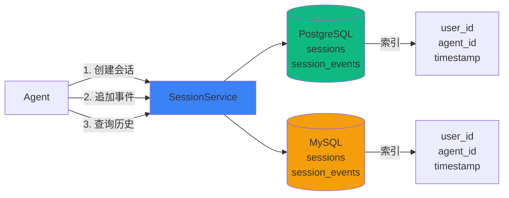
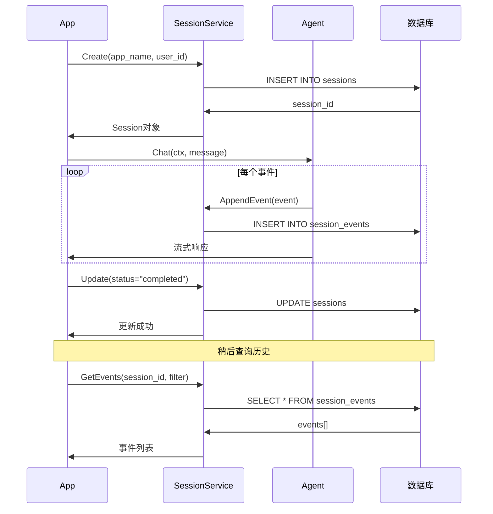

# Session 持久化

AgentSDK 提供完整的 Session 持久化功能，支持 PostgreSQL 和 MySQL 8.0+，用于持久化 Agent 会话历史和事件流。

## 🎯 核心功能

- ✅ **双数据库支持**: PostgreSQL 和 MySQL 8.0+
- ✅ **高性能**: 批量插入、事务优化、连接池
- ✅ **丰富查询**: 支持时间范围、分页、过滤
- ✅ **JSON 支持**: PostgreSQL JSONB 和 MySQL JSON 类型
- ✅ **自动迁移**: 首次运行自动创建表结构
- ✅ **完整测试**: 单元测试 + 容器化集成测试

## 📊 架构设计



**数据流程**:
1. **创建会话** → 插入 sessions 表，返回 session_id
2. **追加事件** → 插入 session_events 表，关联 session_id
3. **查询历史** → 根据索引快速检索事件

## 📦 安装

```bash
# PostgreSQL
go get github.com/wordflowlab/agentsdk/pkg/session/postgres

# MySQL
go get github.com/wordflowlab/agentsdk/pkg/session/mysql
```

## 🚀 快速开始

### PostgreSQL

```go
package main

import (
    "context"
    "fmt"
    "log"

    "github.com/wordflowlab/agentsdk/pkg/session"
    "github.com/wordflowlab/agentsdk/pkg/session/postgres"
    "github.com/wordflowlab/agentsdk/pkg/types"
)

func main() {
    // 1. 创建 PostgreSQL Session 服务
    service, err := postgres.NewService(&postgres.Config{
        DSN:         "host=localhost port=5432 user=postgres password=password dbname=agentsdk sslmode=disable",
        AutoMigrate: true, // 自动创建表
    })
    if err != nil {
        log.Fatal(err)
    }
    defer service.Close()

    ctx := context.Background()

    // 2. 创建 Session
    sess, err := service.Create(ctx, &session.CreateRequest{
        AppName: "my-app",
        UserID:  "user-001",
        AgentID: "agent-001",
        Metadata: map[string]interface{}{
            "environment": "production",
            "version":     "1.0.0",
        },
    })
    if err != nil {
        log.Fatal(err)
    }
    fmt.Printf("创建 Session: %s\n", sess.ID)

    // 3. 追加事件
    event := &session.Event{
        ID:           "evt-001",
        SessionID:    sess.ID,
        InvocationID: "inv-001",
        AgentID:      "agent-001",
        Author:       "user",
        Content: types.Message{
            Role:    types.RoleUser,
            Content: "Hello, AI!",
        },
        Metadata: map[string]interface{}{
            "ip": "192.168.1.1",
        },
    }

    if err := service.AppendEvent(ctx, sess.ID, event); err != nil {
        log.Fatal(err)
    }
    fmt.Println("事件已保存")

    // 4. 查询事件
    events, err := service.GetEvents(ctx, sess.ID, nil)
    if err != nil {
        log.Fatal(err)
    }

    fmt.Printf("查询到 %d 个事件:\n", len(events))
    for _, e := range events {
        fmt.Printf("  - [%s] %s: %s\n",
            e.Timestamp.Format("15:04:05"),
            e.Author,
            e.Content.Content)
    }

    // 5. 更新 Session
    sess.Status = session.StatusCompleted
    sess.Metadata["completed_at"] = time.Now()
    if err := service.Update(ctx, sess); err != nil {
        log.Fatal(err)
    }
    fmt.Println("Session 状态已更新")
}
```

### MySQL

```go
package main

import (
    "context"
    "log"

    "github.com/wordflowlab/agentsdk/pkg/session/mysql"
)

func main() {
    // MySQL 使用方式与 PostgreSQL 相同
    service, err := mysql.NewService(&mysql.Config{
        DSN: "root:password@tcp(127.0.0.1:3306)/agentsdk?charset=utf8mb4&parseTime=True",
        AutoMigrate: true,
    })
    if err != nil {
        log.Fatal(err)
    }
    defer service.Close()

    // 后续操作与 PostgreSQL 完全一致
    // ...
}
```

## 🔄 持久化流程

完整的 Session 持久化流程：



## 📊 数据模型

### Session 表结构

```sql
-- PostgreSQL
CREATE TABLE sessions (
    id          VARCHAR(255) PRIMARY KEY,
    app_name    VARCHAR(255) NOT NULL,
    user_id     VARCHAR(255),
    agent_id    VARCHAR(255),
    status      VARCHAR(50) NOT NULL DEFAULT 'active',
    metadata    JSONB,
    created_at  TIMESTAMP NOT NULL,
    updated_at  TIMESTAMP NOT NULL,
    INDEX idx_user_id (user_id),
    INDEX idx_agent_id (agent_id),
    INDEX idx_status (status),
    INDEX idx_created_at (created_at)
);

-- MySQL
CREATE TABLE sessions (
    id          VARCHAR(255) PRIMARY KEY,
    app_name    VARCHAR(255) NOT NULL,
    user_id     VARCHAR(255),
    agent_id    VARCHAR(255),
    status      VARCHAR(50) NOT NULL DEFAULT 'active',
    metadata    JSON,
    created_at  TIMESTAMP NOT NULL,
    updated_at  TIMESTAMP NOT NULL,
    INDEX idx_user_id (user_id),
    INDEX idx_agent_id (agent_id),
    INDEX idx_status (status),
    INDEX idx_created_at (created_at)
) ENGINE=InnoDB DEFAULT CHARSET=utf8mb4 COLLATE=utf8mb4_unicode_ci;
```

### Event 表结构

```sql
-- PostgreSQL
CREATE TABLE session_events (
    id              VARCHAR(255) PRIMARY KEY,
    session_id      VARCHAR(255) NOT NULL,
    invocation_id   VARCHAR(255),
    agent_id        VARCHAR(255),
    author          VARCHAR(255) NOT NULL,
    content         JSONB NOT NULL,
    actions         JSONB,
    metadata        JSONB,
    branch          VARCHAR(255),
    timestamp       TIMESTAMP NOT NULL,
    INDEX idx_session_id (session_id),
    INDEX idx_timestamp (timestamp),
    INDEX idx_invocation_id (invocation_id),
    INDEX idx_agent_id (agent_id),
    FOREIGN KEY (session_id) REFERENCES sessions(id) ON DELETE CASCADE
);

-- MySQL (相同结构，JSON 类型代替 JSONB)
```

## 🔧 高级功能

### 1. 批量追加事件

```go
// 批量插入多个事件（性能优化）
events := []*session.Event{
    {ID: "evt-001", Content: types.Message{Role: types.RoleUser, Content: "Hello"}},
    {ID: "evt-002", Content: types.Message{Role: types.RoleAssistant, Content: "Hi"}},
    {ID: "evt-003", Content: types.Message{Role: types.RoleUser, Content: "How are you?"}},
}

if err := service.AppendEvents(ctx, sess.ID, events); err != nil {
    log.Fatal(err)
}
```

### 2. 条件查询事件

```go
// 分页查询
filter := &session.EventFilter{
    Limit:  10,
    Offset: 0,
}
events, err := service.GetEvents(ctx, sess.ID, filter)

// 时间范围查询
filter := &session.EventFilter{
    StartTime: time.Now().Add(-24 * time.Hour),
    EndTime:   time.Now(),
}
events, err := service.GetEvents(ctx, sess.ID, filter)

// 按 Agent 过滤
filter := &session.EventFilter{
    AgentID: "agent-001",
}
events, err := service.GetEvents(ctx, sess.ID, filter)

// 组合查询
filter := &session.EventFilter{
    AgentID:   "agent-001",
    StartTime: time.Now().Add(-1 * time.Hour),
    Limit:     50,
    Offset:    0,
}
events, err := service.GetEvents(ctx, sess.ID, filter)
```

### 3. Session 列表查询

```go
// 查询用户的所有 Session
sessions, err := service.List(ctx, &session.ListFilter{
    UserID: "user-001",
    Limit:  20,
})

// 查询应用的活跃 Session
sessions, err := service.List(ctx, &session.ListFilter{
    AppName: "my-app",
    Status:  session.StatusActive,
    Limit:   100,
})

// 时间范围查询
sessions, err := service.List(ctx, &session.ListFilter{
    StartTime: time.Now().Add(-7 * 24 * time.Hour),
    EndTime:   time.Now(),
})
```

### 4. 删除操作

```go
// 删除单个 Session（级联删除所有事件）
if err := service.Delete(ctx, sess.ID); err != nil {
    log.Fatal(err)
}

// 删除用户的所有 Session
if err := service.DeleteByUser(ctx, "user-001"); err != nil {
    log.Fatal(err)
}

// 删除应用的所有 Session
if err := service.DeleteByApp(ctx, "my-app"); err != nil {
    log.Fatal(err)
}
```

## 🏗️ 数据库配置

### PostgreSQL 配置

```go
config := &postgres.Config{
    // 数据库连接
    DSN: "host=localhost port=5432 user=postgres password=pwd dbname=agentsdk",

    // 连接池
    MaxOpenConns: 25,  // 最大连接数
    MaxIdleConns: 5,   // 最大空闲连接
    MaxLifetime:  5 * time.Minute,  // 连接最大生命周期

    // 自动迁移
    AutoMigrate: true,  // 首次运行自动创建表

    // 表名前缀
    TablePrefix: "agent_",  // 表名: agent_sessions, agent_session_events
}

service, err := postgres.NewService(config)
```

### MySQL 配置

```go
config := &mysql.Config{
    // 数据库连接 (必须包含 charset=utf8mb4 和 parseTime=True)
    DSN: "user:password@tcp(host:3306)/dbname?charset=utf8mb4&parseTime=True&loc=Local",

    // 连接池
    MaxOpenConns: 25,
    MaxIdleConns: 5,
    MaxLifetime:  5 * time.Minute,

    // 自动迁移
    AutoMigrate: true,

    // 表名前缀
    TablePrefix: "",
}

service, err := mysql.NewService(config)
```

## 🐳 Docker 快速启动

### PostgreSQL

```bash
docker run -d \
  --name agentsdk-postgres \
  -e POSTGRES_PASSWORD=password \
  -e POSTGRES_DB=agentsdk \
  -p 5432:5432 \
  postgres:15-alpine

# 连接测试
psql -h localhost -U postgres -d agentsdk
```

### MySQL

```bash
docker run -d \
  --name agentsdk-mysql \
  -e MYSQL_ROOT_PASSWORD=password \
  -e MYSQL_DATABASE=agentsdk \
  -p 3306:3306 \
  mysql:8.0

# 连接测试
mysql -h 127.0.0.1 -u root -p agentsdk
```

## 🔬 测试

### 单元测试

```bash
# PostgreSQL 测试
cd pkg/session/postgres
go test -v

# MySQL 测试
cd pkg/session/mysql
go test -v
```

### 集成测试（需要 Docker）

```bash
# 使用 docker-compose 启动测试数据库
cd pkg/session/postgres
docker-compose up -d

# 运行集成测试
go test -v -tags=integration

# 清理
docker-compose down -v
```

## 📈 性能优化

### 1. 批量操作

```go
// ✅ 推荐：批量插入
events := []*session.Event{ /* ... */ }
service.AppendEvents(ctx, sess.ID, events)  // 单个事务

// ❌ 避免：逐条插入
for _, event := range events {
    service.AppendEvent(ctx, sess.ID, event)  // 多个事务，慢
}
```

### 2. 连接池调优

```go
// 生产环境推荐配置
config := &postgres.Config{
    MaxOpenConns: 50,              // 根据并发量调整
    MaxIdleConns: 10,              // 保持足够的空闲连接
    MaxLifetime:  5 * time.Minute, // 定期回收连接
}
```

### 3. 索引优化

```go
// 查询模式决定索引
// 1. 按时间查询 → idx_created_at, idx_timestamp
// 2. 按用户查询 → idx_user_id
// 3. 按应用查询 → idx_app_name
// 4. 复合查询 → 考虑复合索引

// 自定义索引（可选）
db.Exec(`
    CREATE INDEX idx_sessions_app_status
    ON sessions(app_name, status, created_at DESC)
`)
```

### 4. 分页最佳实践

```go
// ✅ 推荐：使用 Limit + Offset
filter := &session.EventFilter{
    Limit:  100,  // 每页100条
    Offset: 200,  // 第3页
}

// 或基于时间的游标分页
filter := &session.EventFilter{
    StartTime: lastEventTime,
    Limit:     100,
}
```

## 🔐 安全建议

### 1. 数据库用户权限

```sql
-- PostgreSQL: 创建专用用户
CREATE USER agentsdk_app WITH PASSWORD 'strong_password';
GRANT SELECT, INSERT, UPDATE, DELETE ON ALL TABLES IN SCHEMA public TO agentsdk_app;
GRANT USAGE, SELECT ON ALL SEQUENCES IN SCHEMA public TO agentsdk_app;

-- MySQL: 创建专用用户
CREATE USER 'agentsdk_app'@'%' IDENTIFIED BY 'strong_password';
GRANT SELECT, INSERT, UPDATE, DELETE ON agentsdk.* TO 'agentsdk_app'@'%';
FLUSH PRIVILEGES;
```

### 2. SSL 连接

```go
// PostgreSQL SSL
DSN: "host=db.example.com port=5432 user=user dbname=db sslmode=require"

// MySQL SSL
DSN: "user:pwd@tcp(db.example.com:3306)/db?tls=skip-verify"
```

### 3. 敏感数据加密

```go
// 敏感字段加密后存储
event := &session.Event{
    Content: types.Message{
        Role:    types.RoleUser,
        Content: encrypt(sensitiveContent),  // 加密敏感内容
    },
    Metadata: map[string]interface{}{
        "ip":   hashIP(clientIP),     // IP 哈希化
        "user": maskUserID(userID),   // 用户ID脱敏
    },
}
```

## 🔗 完整示例

完整可运行的示例代码：
- [PostgreSQL 示例](https://github.com/wordflowlab/agentsdk/tree/main/examples/session-postgres)
- [MySQL 示例](https://github.com/wordflowlab/agentsdk/tree/main/examples/session-mysql)

```bash
# 运行 PostgreSQL 示例
cd examples/session-postgres
docker-compose up -d  # 启动数据库
go run main.go

# 运行 MySQL 示例
cd examples/session-mysql
docker-compose up -d
go run main.go
```

## 🎓 最佳实践

### 1. Session 生命周期管理

```go
// 创建 Session
sess, _ := service.Create(ctx, &session.CreateRequest{
    AppName: "my-app",
    UserID:  userID,
    Status:  session.StatusActive,
})

// 使用期间追加事件
for event := range agent.Stream(ctx, userMessage) {
    service.AppendEvent(ctx, sess.ID, &event)
}

// 完成时更新状态
sess.Status = session.StatusCompleted
sess.Metadata["completed_at"] = time.Now()
sess.Metadata["total_events"] = eventCount
service.Update(ctx, sess)
```

### 2. 错误 Session 标记

```go
// 发生错误时
sess.Status = session.StatusFailed
sess.Metadata["error"] = err.Error()
sess.Metadata["failed_at"] = time.Now()
service.Update(ctx, sess)
```

### 3. 定期清理历史数据

```go
// 清理30天前的 Session
cutoffTime := time.Now().Add(-30 * 24 * time.Hour)

sessions, _ := service.List(ctx, &session.ListFilter{
    EndTime: cutoffTime,
    Limit:   1000,
})

for _, sess := range sessions {
    service.Delete(ctx, sess.ID)
}
```

### 4. 监控数据库性能

```go
// 定期检查连接池状态
stats := service.DB().Stats()
fmt.Printf("连接池: Open=%d Idle=%d InUse=%d\n",
    stats.OpenConnections,
    stats.Idle,
    stats.InUse)

// 慢查询监控
db.LogMode(true)  // 开发环境
```

## 📊 数据库选择建议

| 特性 | PostgreSQL | MySQL 8.0+ |
|------|-----------|-----------|
| **JSON 查询** | ✅ 优秀 (JSONB) | ✅ 良好 (JSON) |
| **全文搜索** | ✅ 内置 | ⚠️ 需配置 |
| **复杂查询** | ✅ 强大 | ✅ 良好 |
| **并发性能** | ✅ MVCC | ✅ InnoDB |
| **部署成本** | 💰 中 | 💰 低 |
| **社区生态** | ✅ 活跃 | ✅ 活跃 |

**推荐**:
- 需要复杂 JSON 查询 → PostgreSQL
- 需要简单存储和查询 → MySQL
- 已有技术栈 → 使用现有数据库

## ❓ 常见问题

### Q1: 如何迁移现有数据？

```go
// 从 JSON Store 迁移到 PostgreSQL
jsonStore, _ := store.NewJSONStore(".agentsdk")
pgService, _ := postgres.NewService(config)

sessions := jsonStore.ListSessions()
for _, sess := range sessions {
    pgService.Create(ctx, sess)

    events := jsonStore.GetEvents(sess.ID)
    pgService.AppendEvents(ctx, sess.ID, events)
}
```

### Q2: 如何处理大量事件？

```go
// 使用流式查询 + 分页
offset := 0
limit := 1000

for {
    events, _ := service.GetEvents(ctx, sess.ID, &session.EventFilter{
        Limit:  limit,
        Offset: offset,
    })

    if len(events) == 0 {
        break
    }

    // 处理这批事件
    processEvents(events)

    offset += limit
}
```

### Q3: 支持事务吗？

是的，批量操作自动使用事务：
```go
// AppendEvents 内部使用事务
service.AppendEvents(ctx, sess.ID, events)  // 全部成功或全部失败
```

### Q4: 如何备份数据？

```bash
# PostgreSQL
pg_dump -h localhost -U postgres agentsdk > backup.sql

# MySQL
mysqldump -h 127.0.0.1 -u root -p agentsdk > backup.sql
```

## 🚀 下一步

- [OpenTelemetry 集成](/best-practices/monitoring) - 监控数据库性能
- [工作流 Agent](/examples/workflow-agents) - 持久化工作流状态
- [部署指南](/best-practices/deployment) - 生产环境配置
- [安全最佳实践](/best-practices/security) - 数据安全策略
