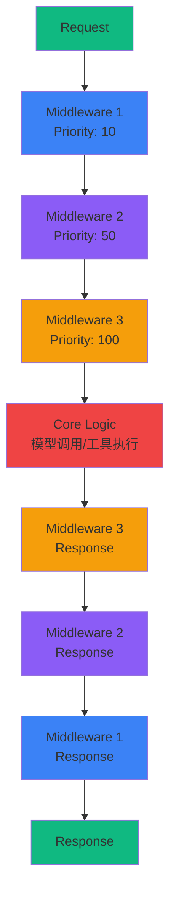
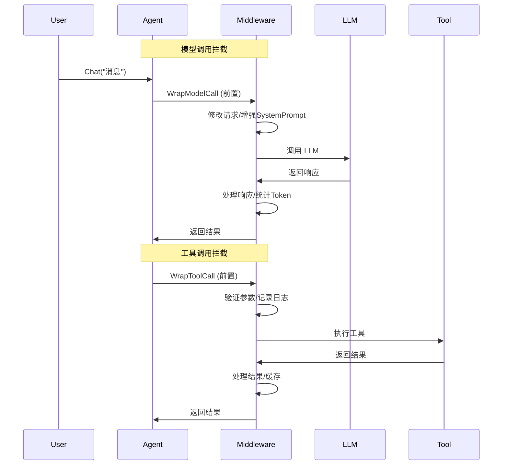

# 中间件系统示例

AgentSDK 采用**洋葱模型 (Onion Model)** 中间件架构，允许你在 Agent 执行流程的关键节点插入自定义逻辑，无需修改核心代码即可扩展功能。

## 🧅 洋葱模型架构



### 执行流程

```
请求 → 中间件1 (前) → 中间件2 (前) → 中间件3 (前) → 核心逻辑
                                                           ↓
响应 ← 中间件1 (后) ← 中间件2 (后) ← 中间件3 (后) ←─────────┘
```

**特点：**
- ✅ **顺序执行** - 按优先级从小到大执行
- ✅ **双向拦截** - 请求和响应都可以处理
- ✅ **链式调用** - 每层调用下一层的 handler
- ✅ **灵活扩展** - 添加/移除中间件不影响其他层

## 🎯 中间件能力

### 1. 拦截点



AgentSDK 提供两个核心拦截点：

**1. WrapModelCall - 模型调用拦截**

```go
type ModelCallHandler func(ctx context.Context, req *ModelRequest) (*ModelResponse, error)

WrapModelCall(ctx context.Context, req *ModelRequest, handler ModelCallHandler) (*ModelResponse, error)
```

**用途：**
- 修改发送给 LLM 的消息
- 增强 SystemPrompt
- 自动总结历史消息
- 统计 Token 使用
- 缓存模型响应

**2. WrapToolCall - 工具调用拦截**

```go
type ToolCallHandler func(ctx context.Context, req *ToolCallRequest) (*ToolCallResponse, error)

WrapToolCall(ctx context.Context, req *ToolCallRequest, handler ToolCallHandler) (*ToolCallResponse, error)
```

**用途：**
- 验证工具调用参数
- 人工审批工具执行
- 缓存工具结果
- 记录工具调用日志
- 自动重试失败的调用

### 2. 工具注入

中间件可以注入自定义工具到 Agent：

```go
func (m *MyMiddleware) Tools() []tools.Tool {
    return []tools.Tool{
        NewCustomTool1(),
        NewCustomTool2(),
    }
}
```

### 3. 生命周期回调

```go
type Middleware interface {
    OnAgentStart(ctx context.Context, agentID string) error
    OnAgentStop(ctx context.Context, agentID string) error
}
```

**用途：**
- 初始化资源（数据库连接、缓存等）
- 加载持久化数据
- 释放资源
- 保存状态

### 4. 优先级控制

```go
func (m *MyMiddleware) Priority() int {
    return 100  // 数值越小，优先级越高
}
```

**优先级范围：**
- **0-100**: 系统核心中间件
- **100-500**: 功能中间件
- **500-1000**: 用户自定义中间件

## 📦 内置中间件

| 中间件 | 优先级 | 功能 | 用途 |
|--------|--------|------|------|
| [Summarization](/examples/middleware/builtin#summarization) | 40 | 自动总结 | 压缩对话历史 |
| [Filesystem](/examples/middleware/builtin#filesystem) | 100 | 文件系统增强 | 注入文件工具 |
| [SubAgent](/examples/middleware/builtin#subagent) | 200 | 子Agent | 任务委托 |
| [AgentMemory](/examples/middleware/builtin#memory) | 150 | 记忆管理 | 跨会话记忆 |
| [HumanInTheLoop](/examples/middleware/builtin#hitl) | 50 | 人工干预 | 审批工具调用 |
| [TodoList](/examples/middleware/builtin#todolist) | 120 | 任务列表 | 任务跟踪 |
| [PatchToolCalls](/examples/middleware/builtin#patch) | 300 | 工具修复 | 补丁和兼容 |

## 🚀 快速开始

### 基本使用

```go
package main

import (
    "context"
    "log"

    "github.com/wordflowlab/agentsdk/pkg/agent"
    "github.com/wordflowlab/agentsdk/pkg/middleware"
    "github.com/wordflowlab/agentsdk/pkg/types"
)

func main() {
    ctx := context.Background()

    // 1. 创建中间件
    summaryMW, _ := middleware.NewSummarizationMiddleware(&middleware.SummarizationMiddlewareConfig{
        MaxTokensBeforeSummary: 150000,
        MessagesToKeep:         6,
    })

    filesMW := middleware.NewFilesystemMiddleware(&middleware.FilesystemMiddlewareConfig{
        Backend:    myBackend,
        TokenLimit: 20000,
    })

    // 2. 注册中间件
    middlewareStack := middleware.NewStack()
    middlewareStack.Use(summaryMW)
    middlewareStack.Use(filesMW)

    // 3. 创建 Agent
    deps := &agent.Dependencies{
        // ... 其他依赖
        MiddlewareStack: middlewareStack,
    }

    ag, err := agent.Create(ctx, config, deps)
    if err != nil {
        log.Fatal(err)
    }
    defer ag.Close()

    // 4. 使用 Agent（中间件自动生效）
    result, _ := ag.Chat(ctx, "请读取 config.json 文件")
    // → FilesystemMiddleware 注入了 fs_read 工具
    // → SummarizationMiddleware 管理对话历史
}
```

### 中间件执行顺序

```go
// 创建中间件（优先级: Priority() 返回值）
mw1 := NewMiddleware1()  // Priority: 10
mw2 := NewMiddleware2()  // Priority: 50
mw3 := NewMiddleware3()  // Priority: 100

// 注册顺序无关紧要，自动按优先级排序
stack := middleware.NewStack()
stack.Use(mw3)  // 后注册
stack.Use(mw1)  // 先注册
stack.Use(mw2)  // 中间注册

// 实际执行顺序（按 Priority 从小到大）:
// Request:  mw1 → mw2 → mw3 → Core
// Response: mw3 → mw2 → mw1
```

## 💡 使用场景

### 场景 1: 对话历史管理

**需求**: 长对话导致 Token 超限

**解决方案**: Summarization Middleware

```go
summaryMW, _ := middleware.NewSummarizationMiddleware(&middleware.SummarizationMiddlewareConfig{
    MaxTokensBeforeSummary: 150000,  // 超过 150k tokens 触发总结
    MessagesToKeep:         6,       // 保留最近 6 条消息
    Summarizer: func(ctx context.Context, messages []types.Message) (string, error) {
        // 自定义总结逻辑
        return "Previous conversation summary: ...", nil
    },
})
```

**效果**:
- 自动监控消息历史的 Token 数
- 超过阈值时，总结旧消息
- 用总结替换历史，释放上下文空间

### 场景 2: 文件操作能力

**需求**: Agent 需要读写文件

**解决方案**: Filesystem Middleware

```go
filesMW := middleware.NewFilesystemMiddleware(&middleware.FilesystemMiddlewareConfig{
    Backend:    backends.NewLocalBackend("./workspace"),
    TokenLimit: 20000,  // 大于 20k tokens 的结果保存到文件
})
```

**效果**:
- 自动注入 `fs_read`, `fs_write`, `fs_edit`, `glob`, `grep` 工具
- 大结果自动驱逐到文件
- 路径安全验证

### 场景 3: 复杂任务委托

**需求**: 主 Agent 需要委托子任务给专门的 Agent

**解决方案**: SubAgent Middleware

```go
subagentMW, _ := middleware.NewSubAgentMiddleware(&middleware.SubAgentMiddlewareConfig{
    Factory: mySubAgentFactory,
    Specs: []middleware.SubAgentSpec{
        {
            Name:        "data-analyst",
            Description: "数据分析专家",
            Prompt:      "你是数据分析专家...",
            Tools:       []string{"python_exec", "pandas_query"},
        },
        {
            Name:        "code-reviewer",
            Description: "代码审查专家",
            Prompt:      "你是代码审查专家...",
            Tools:       []string{"fs_read", "grep"},
        },
    },
})
```

**效果**:
- 注入 `task` 工具启动子 Agent
- 子 Agent 独立上下文，任务隔离
- 支持专业化分工

### 场景 4: 人工审批

**需求**: 敏感操作需要人工审批

**解决方案**: HumanInTheLoop Middleware

```go
hitlMW, _ := middleware.NewHumanInTheLoopMiddleware(&middleware.HumanInTheLoopMiddlewareConfig{
    ApprovalRequired: []string{"bash_run", "http_request"},  // 需要审批的工具
    ApprovalHandler: func(ctx context.Context, req *middleware.ToolCallRequest) (bool, error) {
        fmt.Printf("工具调用请求: %s(%v)\n", req.ToolName, req.ToolInput)
        fmt.Print("是否批准? (y/n): ")
        var answer string
        fmt.Scanln(&answer)
        return answer == "y", nil
    },
})
```

**效果**:
- 拦截指定工具的调用
- 人工审批后才执行
- 可记录审批日志

### 场景 5: 工具调用缓存

**需求**: 相同参数的工具调用避免重复执行

**解决方案**: 自定义 Cache Middleware

```go
type CacheMiddleware struct {
    *middleware.BaseMiddleware
    cache map[string]interface{}
}

func (m *CacheMiddleware) WrapToolCall(ctx context.Context, req *middleware.ToolCallRequest, handler middleware.ToolCallHandler) (*middleware.ToolCallResponse, error) {
    // 生成缓存键
    cacheKey := fmt.Sprintf("%s:%v", req.ToolName, req.ToolInput)

    // 检查缓存
    if cached, ok := m.cache[cacheKey]; ok {
        return &middleware.ToolCallResponse{Result: cached}, nil
    }

    // 执行工具
    resp, err := handler(ctx, req)
    if err != nil {
        return nil, err
    }

    // 缓存结果
    m.cache[cacheKey] = resp.Result
    return resp, nil
}
```

## 🎨 中间件组合

中间件可以自由组合，实现复杂功能：

```go
// 组合示例: 全功能 Agent
stack := middleware.NewStack()

// 1. 人工审批（优先级最高，最外层）
stack.Use(hitlMW)  // Priority: 50

// 2. 自动总结（管理上下文）
stack.Use(summaryMW)  // Priority: 40

// 3. 文件系统（注入工具）
stack.Use(filesMW)  // Priority: 100

// 4. 任务列表（任务管理）
stack.Use(todoMW)  // Priority: 120

// 5. 子Agent（任务委托）
stack.Use(subagentMW)  // Priority: 200

// 执行顺序（Request）:
// User → HITL → Summary → Files → Todo → SubAgent → LLM

// 执行顺序（Response）:
// LLM → SubAgent → Todo → Files → Summary → HITL → User
```

## 📊 中间件状态监控

```go
// 获取中间件统计信息
stack := middlewareStack.(*middleware.Stack)

for _, mw := range stack.List() {
    fmt.Printf("Middleware: %s (Priority: %d)\n", mw.Name(), mw.Priority())

    // 如果中间件提供统计信息
    if statsMW, ok := mw.(interface{ Stats() map[string]interface{} }); ok {
        stats := statsMW.Stats()
        fmt.Printf("  Stats: %+v\n", stats)
    }
}
```

## 💡 最佳实践

### 1. 优先级设计

```go
// ✅ 好的优先级设计
const (
    PrioritySecurity     = 10   // 安全检查（最先执行）
    PriorityLogging      = 20   // 日志记录
    PriorityRateLimit    = 30   // 频率限制
    PrioritySummarization = 40  // 自动总结
    PriorityHITL         = 50   // 人工干预
    PriorityFilesystem   = 100  // 功能性中间件
    PrioritySubAgent     = 200  // 任务委托
)

// ❌ 不好的优先级设计
const (
    PriorityAll = 100  // 所有中间件同优先级，无法控制顺序
)
```

### 2. 中间件职责

```go
// ✅ 单一职责
type LoggingMiddleware struct {
    *middleware.BaseMiddleware
}

func (m *LoggingMiddleware) WrapModelCall(...) {
    log.Printf("Model call: %+v", req)
    return handler(ctx, req)  // 只记录，不修改
}

// ❌ 职责混乱
type EverythingMiddleware struct {
    *middleware.BaseMiddleware
}

func (m *EverythingMiddleware) WrapModelCall(...) {
    // 既记录日志
    log.Printf("...")
    // 又总结历史
    summarize(req.Messages)
    // 还注入工具
    req.Tools = append(req.Tools, ...)
    // 职责太多，难以维护
}
```

### 3. 错误处理

```go
// ✅ 正确的错误处理
func (m *MyMiddleware) WrapToolCall(ctx context.Context, req *middleware.ToolCallRequest, handler middleware.ToolCallHandler) (*middleware.ToolCallResponse, error) {
    // 前置处理
    if err := m.validate(req); err != nil {
        return nil, fmt.Errorf("validation failed: %w", err)
    }

    // 调用下一层
    resp, err := handler(ctx, req)
    if err != nil {
        // 可以选择处理错误或直接返回
        log.Printf("Tool call failed: %v", err)
        return nil, err
    }

    // 后置处理
    m.logResult(resp)
    return resp, nil
}

// ❌ 错误被吞掉
func (m *BadMiddleware) WrapToolCall(...) (*middleware.ToolCallResponse, error) {
    resp, err := handler(ctx, req)
    if err != nil {
        return &middleware.ToolCallResponse{Result: nil}, nil  // 错误被隐藏
    }
    return resp, nil
}
```

### 4. 状态管理

```go
// ✅ 线程安全的状态管理
type StatsMiddleware struct {
    *middleware.BaseMiddleware
    mu    sync.RWMutex
    stats map[string]int
}

func (m *StatsMiddleware) IncrementCounter(key string) {
    m.mu.Lock()
    defer m.mu.Unlock()
    m.stats[key]++
}

func (m *StatsMiddleware) GetStats() map[string]int {
    m.mu.RLock()
    defer m.mu.RUnlock()
    // 返回副本
    result := make(map[string]int)
    for k, v := range m.stats {
        result[k] = v
    }
    return result
}
```

## 📚 学习路径

1. **[内置中间件](/examples/middleware/builtin)** - 学习如何使用现有中间件
2. **[自定义中间件](/examples/middleware/custom)** - 创建自己的中间件

## 🔗 相关资源

- [中间件接口规范](/api-reference/middleware) - API 详细文档
- [Agent 架构](/core-concepts/architecture) - 理解 Agent 内部结构
- [工具系统](/examples/tools) - 工具和中间件的配合

## ❓ 常见问题

### Q: 中间件和工具的区别？

| 特性 | 中间件 | 工具 |
|------|--------|------|
| 执行时机 | 自动执行（每次调用） | LLM 决定调用 |
| 作用范围 | 全局（所有请求） | 单次工具调用 |
| 功能 | 拦截、增强、控制流程 | 具体功能实现 |
| 使用场景 | 横切关注点 | 业务功能 |

### Q: 多个中间件如何执行？

按 `Priority()` 返回值从小到大执行（洋葱模型）：

```
Request:  M1(Pri:10) → M2(Pri:50) → M3(Pri:100) → Core
Response: M1         ← M2         ← M3          ← Core
```

### Q: 中间件可以修改请求吗？

可以！中间件可以修改请求和响应：

```go
func (m *MyMiddleware) WrapModelCall(ctx context.Context, req *ModelRequest, handler ModelCallHandler) (*ModelResponse, error) {
    // 修改请求
    req.SystemPrompt += "\n\n额外指令: ..."
    req.Messages = append(req.Messages, extraMessage)

    // 调用下一层
    resp, err := handler(ctx, req)
    if err != nil {
        return nil, err
    }

    // 修改响应
    resp.Message.Content += "\n\n后处理: ..."
    return resp, nil
}
```

### Q: 如何禁用某个中间件？

从 Stack 中移除：

```go
stack := middleware.NewStack()
stack.Use(mw1)
stack.Use(mw2)

// 移除 mw1
stack.Remove("mw1-name")
```

或者条件性添加：

```go
if enableSummarization {
    stack.Use(summaryMW)
}
```
